# Core Revenue Engine — Discovery and Implementation Map

**Date:** 2026-09-25 · **Branch:** `system-mesh-audit-and-p0-fixes` @ `5266da2` (plus a large
uncommitted working tree, see §0.3) · **Migrations:** 0001–0104 · **Status:** discovery only.
**No production code has been changed by this document.**

This is the mandatory first step of the 112-section "Core Revenue Engine" brief: inspect, map,
find duplicates and gaps, *then* build. It answers four questions:

1. What already exists, section by section? (§2)
2. What is broken right now — not missing, *broken*? (§1)
3. What must be merged rather than rebuilt? (§3)
4. In what order should it be built, and what needs a decision first? (§4, §5)

The research and evidence register the brief requires (§§1, 2, 21–24, 83–88, 100) is in
[01-evidence-register.md](01-evidence-register.md).

---

## 0. Method and confidence

### 0.1 How this was produced

Six parallel code audits, each scoped to one slice of the pipeline, each told to verify against
the current code rather than trust `docs/system-mesh/` (dated 2026-09-07, ~40 migrations ago):

| Slice | Brief sections |
|---|---|
| Ingest, identity, provenance | 9–11, 21–31 |
| Contactability, suppression, deletion, send-time safety | 12–15, 83–87, 98 |
| Scoring, qualification, method, taxonomy, knowledge, voice | 4–8, 16–20, 32–39, 59 |
| AI runtime, tokens, Copilot, MCP | 48–52, 60, 67–74, 80–81, 107 |
| Channels, booking, closing, handoff | 40–47, 53–58 |
| Events, analytics, experiments, UI, admin, tests | 61–66, 75–79, 82 |

Plus one external-research pass (provider terms, ICO/PECR, SIC, sales-science evidence).

### 0.2 Verification labels used below

- **✔ verified** — I opened the cited lines myself and confirmed the behaviour.
- **◐ reported** — a code audit found it with file:line evidence; not independently re-read.
  Every ◐ item gets a reproducing test before it is fixed (brief §102), so none is fixed on
  trust alone.

### 0.3 Working-tree warning

`git status` shows ~125 modified or untracked paths that are not this session's work, including
migrations `0099`–`0103`, `providers/calendly.ts`, `providers/google-calendar.ts`, and new Slack
handlers. A parallel session is active in this repo. Before any build step:
`ls supabase/migrations | sort | tail`, stage explicit paths only, never `git add -A`.

### 0.4 Where the older audits are now wrong

| Old claim (`docs/system-mesh`, 2026-09-07) | Current truth |
|---|---|
| Copilot contains no model call | ✔ It runs a tool-calling loop (`copilot/loop.ts:144`) over the service registry |
| MCP approval queue is a dead end | ◐ `executeApproval` consumes it (`mcp/provisioning.ts:328`) |
| `variants.ts` bypasses the model router | ◐ It calls `runTask` |
| Prospect→lead promotion is broken | ◐ Fixed in `0063`, reworked in `0100`–`0102` |
| Two contactability engines | ◐ One policy core now (`policy/channel-policy.ts:131`) — but callers can override its inputs (see B1) |

---

## 1. Defects found during discovery

These are **existing behaviours that are wrong**, distinct from missing features. The brief's
release gates (§101) apply directly to most of them. Grouped by the gate they breach.

### 1.1 Consent, suppression and send safety (§101: "suppression bypass", "consent bypass", "AI can send after opt-out", "duplicate send")

| ID | Defect | Evidence | Status |
|---|---|---|---|
| **B1** | **Cold email ignores the stored subscriber type.** Dispatch passes `subscriberType:"CORPORATE"` and `relationshipType:"FOUND_BY_US"` explicitly; `evaluate()` prefers caller-supplied values over `contact_permissions`. A contact later classified SOLE_TRADER or INDIVIDUAL still passes as corporate. This defeats CLAUDE.md resolved-conflict 5, which exists precisely to separate those. | [dispatch.ts:306](../../src/lib/outreach/dispatch.ts#L306), [service.ts:228](../../src/lib/policy/service.ts#L228) | ✔ |
| **B2** | **Two send paths never call the policy engine at send time.** Social partner execute has no suppression, contactability or workspace-active check; Meta private replies have no `evaluate()` or entitlement check. Compose treats `REVIEW_REQUIRED` as permitted. | `jobs/handlers/social-execute.ts:94`, `social/private-replies.ts:150-300`, `social-scheduler.ts:692` | ◐ |
| **B3** | **A one-word "start" reply on any channel lifts suppression across ALL channels**, deleting `OPT_OUT`, `MANUAL`, `INVALID` and `BOUNCE` rows. A workspace's manual suppression and a hard bounce are undone by the recipient typing "Start" in an email. | [message-inbound.ts:551](../../src/lib/jobs/handlers/message-inbound.ts#L551), [0069_unify_suppression.sql:110-111](../../supabase/migrations/0069_unify_suppression.sql#L110) | ✔ |
| **B4** | **Provider opt-out signals are not captured.** Twilio 21610 (recipient unsubscribed) and invalid-number failures write no suppression; cold hard bounces set prospect BOUNCED but write no suppression row; no complaint (FBL) ingestion. | `api/webhooks/twilio/route.ts:128-170`, `dispatch.ts:488-494` | ◐ |
| **B5** | **One-click unsubscribe (RFC 8058) has no POST handler.** The `List-Unsubscribe-Post` header is advertised but unsubscribe runs on GET in a page component — Gmail/Yahoo one-click will fail, and link-scanner prefetch can trigger it. | `email/smtp.ts:194-195`, `app/unsubscribe/[token]/page.tsx` | ◐ |
| **B6** | **Duplicate-send window.** `performSend` checks status is QUEUED but claims no SENDING state before the provider call; reschedules use a distinct job key; manual send uses a random idempotency key per click. | `jobs/send-core.ts:188`, `send-store.ts:557`, `leads/actions.ts:519` | ◐ |
| **B7** | **Approved agent drafts are sent without checking for a newer inbound message.** | `agent/actions.ts:289-325` | ◐ |
| **B8** | **Follow-up "test send" lets any member SMS any number with arbitrary text**, with no suppression or policy check. | `follow-up/actions.ts:135` | ◐ |
| **B9** | **The "someone will pick this up" acknowledgement is blocked by its own handover.** `requestHumanHandover` sets `human_takeover` first; the acknowledgement is then sent with an `agent` origin, which `guardedLead` does not exempt, so stop conditions abort it. The lead is left in silence. | [orchestrator.ts:593-601](../../src/lib/agent/orchestrator.ts#L593), [send-core.ts:69-84](../../src/lib/jobs/send-core.ts#L69) | ✔ path read; needs a test to prove the abort |

### 1.2 Booking (§57: "Never say a meeting is booked until provider confirms it")

| ID | Defect | Evidence | Status |
|---|---|---|---|
| **B10** | **The agent tells the lead "that is booked" when the calendar write failed.** On a Google Calendar error the booking is still inserted as `scheduled`, the lead is set BOOKED, and only a note records the failure. Calendly mode creates no Calendly booking at all. Availability is not re-checked at booking time; the Google event has no attendee, so the lead receives no invite; nothing prevents two leads taking one slot. | [tools.ts:684-728](../../src/lib/agent/tools.ts#L684), `providers/google-calendar.ts:167-172` | ✔ |

### 1.3 Data integrity (§101: "corrupted lead", "materially wrong score")

| ID | Defect | Evidence | Status |
|---|---|---|---|
| **B11** | **Every lead from an ad form inherits the *first* lead's campaign, ad set and ad.** `resolveSource` reuses one `lead_sources` row per (provider, form). Campaign- and ad-level attribution — the product's headline promise — is wrong for all but the first lead per form. | [lead-process.ts:39-50](../../src/lib/jobs/handlers/lead-process.ts#L39) | ✔ |
| **B12** | **A failed Google Ads insert loses the lead permanently.** The upsert error is never read and the cursor still advances past it. | [google-ads.ts:207-254](../../src/lib/integrations/providers/google-ads.ts#L207) | ✔ |
| **B13** | **Meta, LinkedIn and TikTok ingest swallow any non-duplicate insert error.** Pattern `if (error?.code==="23505" \|\| !created) return;` returns silently on every error. | `meta-lead-ads.ts:376`, `linkedin-ads.ts:333`, `tiktok-ads.ts:156` — all pollers now go through `ingestLead`, which throws on a database failure so the poll retries (verified in the business-stories run, 2026-09-26) | ✔ |
| **B14** | **Agent reply classifications are rejected by the database.** The agent writes `POSITIVE`, `QUESTION`, `BOOKING_INTENT`, `NOT_INTERESTED`, `WRONG_NUMBER`; the CHECK allows `POSITIVE_INTEREST`, `NEUTRAL_QUESTION`, …; the error is not read. Reply analytics silently lose most agent-handled replies. | [agent/types.ts:204](../../src/lib/agent/types.ts#L204), [tools.ts:1037](../../src/lib/agent/tools.ts#L1037), [0029:479](../../supabase/migrations/0029_v4_outreach_comms.sql#L479) | ✔ |
| **B15** | **`automation.step_blocked` is emitted but not in the event CHECK list**, so every insert fails; `try/catch` cannot see it because the Supabase client returns errors rather than throwing. | [automation-advance.ts:339](../../src/lib/jobs/handlers/automation-advance.ts#L339), [0021:11-21](../../supabase/migrations/0021_automation_events.sql#L11), [events.ts:58](../../src/lib/automation/events.ts#L58) | ✔ |
| **B16** | **Provenance is overwritten or mislabelled.** Promotion always stamps `intake_method=CLIENTTURN_SOURCING` even for CSV, connector and manual prospects; `insertProspect` never sets `source_provider`, so the first-party-source check never matches; company upserts overwrite name/description. | `0102:147-148`, `sourcing-run.ts:728-750, 578-596` | ◐ |

B14 and B15 share a root cause worth fixing as a class: **Supabase writes whose `{ error }` is
never read.** A repository-wide sweep is part of Phase 0.

### 1.4 Billing and AI cost (§101: "broken billing", "uncontrolled token spending")

| ID | Defect | Evidence | Status |
|---|---|---|---|
| **B17** | **Cached input tokens are billed twice.** Azure's `prompt_tokens` already includes cached tokens; the allowance is debited `input + cached + output`, and cost is `input × rate + cached × cached_rate`. Customers are overcharged on exactly the traffic that should be cheapest. | [azure-client.ts:121](../../src/lib/ai/azure-client.ts#L121), [model-router.ts:136-137](../../src/lib/ai/model-router.ts#L136), [usage-meter.ts:115-117](../../src/lib/ai/usage-meter.ts#L115) | ✔ |
| **B18** | **One global price-book cache for both deployments** — a nano call within 5 minutes of a mini call is priced at mini rates, and vice versa. | `ai/usage-meter.ts:49-57` | ◐ |
| **B19** | **Retried jobs debit tokens again.** `idempotencyKey` defaults to a random UUID; only the agent passes a stable one. | `model-router.ts:139` | ✔ (line read) |
| **B20** | **Token ledger rows are unlinked** (`ai_run_id`, `agent_run_id` always null) and `conversation_agent_runs` token/cost columns are never written, although `AGENT_RUNTIME.md` says they are. | `model-router.ts:135`, `agent/audit.ts:237` (no caller) | ◐ |
| **B21** | **Overdraw is unbounded** (`allow_overdraw: true`). There is no emergency ceiling. | `billing/token-service.ts:257` | ◐ |

### 1.5 Permission boundaries (§101: "agent permission escalation")

| ID | Defect | Evidence | Status |
|---|---|---|---|
| **B22** | **Copilot can resume a campaign** through the legacy `resumeCampaign` tool although the service registry excludes COPILOT from `campaign.resume`. Two unreachable tools (`createSearchSession`, `startSourcingRun`) are offered to the model; legacy tool parameters are unvalidated; the user's message is sent to the model twice. | `copilot/tool-service.ts:297-331, 445`, `registry.ts:442`, `copilot/actions.ts:127,145` | ◐ |
| **B23** | MCP approval execution does not check the approver's membership `status`. | `mcp/provisioning.ts:372` | ◐ |

### 1.6 Provider terms and channel law (§101: "provider terms breach built into core workflow")

Found by checking the external evidence ([01](01-evidence-register.md)) against the code.

| ID | Defect | Evidence | Status |
|---|---|---|---|
| **B24** | **Google Places data is stored in breach of the Maps Platform terms.** The provider maps each place's display name, address components and lat/lng into a `CompanyCandidate`, which is persisted to `prospect_companies`. ToS §3.2.3(a) forbids saving business names and addresses; lat/lng may be cached for at most 30 days; only `place_id` may be stored indefinitely. This is cost-rank 0, so it runs first in every sourcing waterfall. | [google-places.ts:106-122](../../src/lib/find-leads/server/providers/google-places.ts#L106); [Maps ToS](https://cloud.google.com/maps-platform/terms) | ✔ code read; the terms reading is in 01 §4 |
| **B25** | **A lead-form mobile number is treated as WhatsApp-contactable.** Meta requires an explicit WhatsApp opt-in that names the business. There is no per-channel WhatsApp consent flag. | 01 §5; `policy/types.ts:58` (one consent status, not per channel) | ◐ needs a code check of how WhatsApp eligibility is derived |
| **B26** | **A one-way alphanumeric SMS sender cannot receive STOP.** If a workspace sends from an alphanumeric ID, the opt-out route disappears. | 01 §5 | ◐ needs a code check of sender configuration |

Two existing defects are made more serious by the research:

- **B1** is a real PECR exposure. The ICO confirms sole traders and ordinary partnerships are individual subscribers.
- **B2** affects social DMs, which the ICO confirms are "electronic mail" under PECR.

---

## 2. Brief section → current state

Verdicts: **BUILT** (wired end to end) · **PARTIAL** (real, with listed gaps) · **SCAFFOLD**
(schema/types, nothing reaches it) · **MISSING**.

### 2.1 Foundations (§§4–15)

| § | Topic | Verdict | What exists | Principal gap |
|---|---|---|---|---|
| 4 | Industry taxonomy | SCAFFOLD | `businesses.industry` free text; a 10-item home-service `INDUSTRIES` list; Companies House name search only | No SIC table, no codes, no aliases; home-service vocabulary still hard-coded in `business-analyse.ts:206-246` and prompts |
| 5 | Business archetypes | MISSING | `business_profiles.sales_model` (SERVICE/SAAS/ECOMMERCE/MARKETPLACE/AGENCY/OTHER) is the only proto-archetype | Everything |
| 6 | Sales motion | SCAFFOLD | `sales_model` + `conversion_goals.type` (BOOK_APPOINTMENT…DIRECT_PURCHASE) | Nothing branches on either |
| 7 | Sales knowledge base | PARTIAL | `business_memory_facts` (with provenance), `business_analysis_facts`, `business_playbooks`, `services.public_price_text` | The agent receives only name, 600-char description, service names/prices, tone. No FAQs, claims, competitors, case studies, discount authority. `business_playbooks` has no reader or writer |
| 8 | Brand voice | PARTIAL, fragmented | Four stores: AI settings tone, `business_profiles.outreach_*`, `business_playbooks`, signatures | Generators read only the tone. `outreach_*` (value prop, proof points, "claims we cannot make") is edited in the UI and read by nothing |
| 9 | Lead master record | PARTIAL | `leads`, `prospects`, `prospect_companies`; atomic promotion in SQL | No unified contact; no company FK on leads; no opportunity; customer is a flag |
| 10 | Source provenance | PARTIAL | `lead_sources`, `prospect_data_sources`, `lead_source_evidence`, `intake_method`/`created_via` | Three provenance homes; B11, B16; no lead UTMs; submission time stripped |
| 11 | Identity resolution | PARTIAL | `findDuplicates` (wizard + MCP only); prospect uniques on email and social id; company dedupe key | No cross-source lead dedupe (Meta + Google = two leads); no merge engine, confidence or history; `classifyContactMatch` has no callers |
| 12 | Contactability ≠ score | BUILT | Separate tables `contactability_results`, `compliance_decisions` | Cold eligibility mixes score and contactability in one verdict |
| 13 | Contactability states | PARTIAL | Relationship, consent, suppression reason, ELIGIBLE/CONSENT_REQUIRED/REVIEW/SUPPRESSED | No SOFT_OPT_IN, LI_REVIEWED, REPLY_WINDOW_OPEN, TEMPORARILY_PAUSED, LEGAL_HOLD; no hard/soft bounce split |
| 14 | Global suppression | PARTIAL | One destination-keyed `suppression_entries`, survives deletion, single SQL checker, fail-closed | B2–B5; phone not checked at CSV import; stored plaintext |
| 15 | Delete lead | MISSING | Archive/restore only; Meta data-deletion callback built | No delete/anonymise/erasure; retention settings saved but never enforced; `privacy_requests` has no intake |

### 2.2 Scoring and tagging (§§16–20)

| § | Verdict | What exists | Principal gap |
|---|---|---|---|
| 16–18 Scoring | PARTIAL (prospects only) | `prospects/scoring.ts` v1.2026.09: six weighted factors × confidence, grades, per-factor evidence in `prospect_score_factors`, explanation UI | **Leads have no score at all.** Intent share is always 0 (stage 11 runs after stage 10, boost never passed); NEED is a constant 0.15; weights never configured; no missing-info output |
| 19 Recalculation | SCAFFOLD | History table exists | Only a sourcing run scores; no event triggers |
| 20 Auto-tags | MISSING | `conversations.interest`, `messages.reply_classification` (unlabelled, no reason) | Everything |

### 2.3 Sources (§§21–31)

| Source | Verdict | Path | Gap |
|---|---|---|---|
| A. LinkedIn standard | PARTIAL, compliant by design | **Sending** is ASSISTED only — tasks, deep links, invite-note caps, 30-day withdrawal, 7-day email fallback. **Receiving works** (corrected 2026-09-26): Lead Gen Forms via the Marketing API (`providers/linkedin-ads.ts`, inbound leads with email), and company-page engagement is **not offered**: LinkedIn's Restricted Uses terms forbid using member data to identify prospects or create leads, and its comments/reactions APIs return identifiers only (checked 2026-09-26; the provider was removed) | Email fallback set a flag nothing read (fixed in Phase 3) |
| B. Sales Navigator | CORRECTED 2026-09-26 | SNAP partner route **not viable and removed**: LinkedIn is not accepting new SNAP partners and SNAP offers no lead/account search. Sales Navigator is used for InMail allowances and limits only. Prospect lists come from the customer's own lists (LinkedIn's native Connections export or their own CSV), never extension exports | InMail allowances now follow the account tier; list import writer built (8.27) |
| C. Google Ads lead forms | PARTIAL | Poller | B11, B12; submission time lost |
| D. Business discovery | PARTIAL | `google_places`, `companies_house`, `website_contacts`, Hunter, Apollo, Clearbit via a cost-ordered registry | Places storage terms need checking against the register (01) |
| E. Meta Lead Ads | BUILT | Webhook → poll | B11, B13 |
| F. Manual / CSV | BUILT, duplicated | Two CSV importers (reactivation + v4) | Merge |
| G–I. HubSpot / Salesforce / Pipedrive | Push-only (HubSpot/SF/Zoho); Pipedrive via app-event RPC | — | No CRM pull |
| J. Zapier / webhook | BUILT | `receive_workspace_app_event` → one RPC | Always returns `202 queued`, never the outcome |
| K. Public API | MISSING | `POST /api/v1/leads` deliberately returns 400 | — |
| M. MCP | BUILT | `create_lead` with dedupe | No suppression check, no audit row, no outcome enum |
| §31 One pipeline | **MISSING** | 10 direct `leads` insert sites, 6 `prospects` insert sites | The central structural gap |

### 2.4 Qualification and method (§§32–39)

| § | Verdict | Note |
|---|---|---|
| 32–35 Qualification | BUILT (deterministic), fixed-order | Sound engine: rules, hard_fail/review, AI extraction constrained to configured options. Next question = first unanswered by position; known lead fields don't pre-answer; no dependencies; `DEFAULT_QUESTIONS` never seeded |
| 36–39 SPIN / Challenger / MEDDPICC / router | MISSING | The agent resolves one of 11 modes (`lifecycle.ts:82`) — **but the mode is never passed to the model**, so every mode gets the same prompt |

### 2.5 Channels (§§40–47)

| Channel | Verdict | Principal gap |
|---|---|---|
| LinkedIn | ASSISTED (correct) | InMail |
| Instagram / Messenger | BUILT (agent) | Manual/automation sends don't pre-check the 24h window; `withinMetaMessagingWindow` unused |
| Email | PARTIAL | One SMTP mailbox per workspace; sender identity doesn't change the From address; nothing writes SPF/DKIM/DMARC health, so health reads HEALTHY by default; warm-up never starts; B4, B5 |
| WhatsApp | PARTIAL | 24h window enforced (free text blocked outside it) — but **templates are never sent**, so a business-initiated WhatsApp conversation is impossible |
| SMS | PARTIAL | STOP/START built (B3); no segment/encoding calculation; `StatusCallback` not set on send; one platform Twilio account |
| §47 Channel router | PARTIAL | Fixed opt-in fallback order; no scoring |

### 2.6 Conversation, closing, handoff (§§48–60)

| § | Verdict | Note |
|---|---|---|
| 48 Memory | BUILT (structured) | Last 8 messages + rolling summary + qualification + lead row. No opportunity memory, no retrieval |
| 49–50 Human-sounding / QA | PARTIAL | Agent validator is strong (money, times, booking/area/response-time claims, links, "I'm human"). No question-count or style lint; `restyleMessage` and reactivation copy get length checks only |
| 51 Engagement state machine | PARTIAL | `leads.status` any-to-any (CHECK only); agent lifecycle is derived, not stored; only `outreach_campaigns` has a real transition map |
| 52 Reply classification | BUILT | Deterministic binding verdicts first, model second, confidence thresholds. B14 loses the result. Four vocabularies (§3) |
| 53–56 Closing / direct close | MISSING | Pricing is deny-by-default (correct). No checkout, quote, proposal or commercial-authority policy |
| 57 Booking | PARTIAL | Slot proposal good (hours, buffer, timezone, 24h staleness). B10; reminders never triggered; no Microsoft calendar; no meeting types or rep routing |
| 58 Handoff pack | PARTIAL | Deterministic summary (intent, answers, issue). No 30-second brief; no round-robin or specialisms |
| 59 Objections | SCAFFOLD | Classified in three places; `OBJECTION_HANDLING` mode has no behaviour |
| 60 Escalation | BUILT | Binding verdicts, low confidence, validation failure → handoff; B9. `HIGH_VALUE`, `PRICING_NOT_CONFIGURED` declared but never raised |

### 2.7 Learning, analytics, UI (§§61–82)

| § | Verdict | Note |
|---|---|---|
| 61–63 Learning / experiments | PARTIAL (cold email only) | `campaign_experiments`/`campaign_variants`, min-sample guards, 20%-per-pass optimiser. Nothing for warm follow-up, reactivation or AI replies; no holdouts; `business_learning_events` has no writer |
| 64–65 Funnel / metrics | PARTIAL | Metric registry (`v4-metrics.ts`, 26 metrics, null on zero denominator) is authoritative for Analytics — **the Dashboard ignores it** and returns 0 for empty booking rate. No low-sample flag outside the optimiser |
| 66 Attribution | PARTIAL | Ad metadata only (and B11). No lead UTMs, touches, or models |
| 67–74 AI economics | PARTIAL | See §1.4. Two tiers, env-configured, Azure only; monthly allowance only; no per-lead / pre-reply / opportunity budgets; no value-aware routing; every prompt `version: 1`; two prompt-version tables, neither written |
| 75–76 Lead detail | PARTIAL | A 3-tab drawer, not a page. Missing: company, score, tags, consent detail, next action, AI reasoning, audit, attribution, AI cost; actions for task, book, note, re-score, enrich, suppress, archive, delete |
| 77 Dashboard | PARTIAL | Missing hot leads, booking-ready, stalled, deliverability, budget, compliance cards |
| 79 Admin | PARTIAL | Good job/event/error/provider/economics views with step-up + audit. Missing stuck leads, duplicates, per-workspace AI spend, provider quotas |
| 80 Copilot | BUILT | 33 registry ops + 14 legacy tools, role-filtered. B22 |
| 81 MCP | BUILT | 40 ops + `create_lead`, scope ∧ live role, approvals. B23; ~15 dead handler cases |
| 82 Automation events | PARTIAL | Three event systems, no bus; `automation_events` has zero readers; 6 outgoing webhook types. Missing lead.scored, booking_ready, no_show, opportunity.*, integration.failed |

### 2.8 Quality and release (§§89–111)

| § | Verdict | Note |
|---|---|---|
| Unit / integration tests | BUILT | 67 files, ~1,900 cases, `node:test`; 5 e2e suites against real Postgres + RLS |
| 93–94 Conversation / adversarial evals | PARTIAL | `agent-adversarial.test.ts` (40) tests the validator and gates **without a model**. No golden conversations, no live-model evals |
| 95 Token QA | MISSING | No prompt-size snapshots or token regression |
| 97 Concurrency | PARTIAL | Turn lock (`claim_agent_turn`), `SKIP LOCKED` job claim; B6, B7 |

---

## 3. Duplicates to merge, not rebuild

The brief says "do not create parallel architectures". These already exist in parallel:

| # | Duplication | Resolve to |
|---|---|---|
| D1 | 10 lead-insert + 6 prospect-insert sites; 4 copy-pasted ad-ingest functions | One `ingest()` service with an outcome enum (§4, Phase 1) |
| D2 | Two CSV importers | `imports/actions.ts` |
| D3 | Three dedupe rule sets (+ one unused) | One resolver in `lib/identity/` used by `ingest()` |
| D4 | Three provenance homes | `lead_sources` = the *form* (static); per-lead touch rows carry campaign/ad/UTM |
| D5 | Four voice/guidance stores | One `voice_profile`, read by every generator |
| D6 | Four reply-classification vocabularies | One canonical enum + mapping table; migrate the CHECK |
| D7 | Four confidence policies | One policy module |
| D8 | Two prompt-version tables (neither written) + in-code registry | Registry stays the source; persist versions to one table |
| D9 | Three agent/AI run tables with no join | `ai_runs` keyed back to `agent_run_id` |
| D10 | Three event systems | One event outbox; `automation_events` and webhooks become consumers |
| D11 | Two lead-status writers | `lead.set_status` service op (stamps timestamps) behind a transition guard |
| D12 | Two 24h-window helpers; two Twilio status maps; two email preset lists | Keep one each |
| D13 | Grade bands defined twice | `prospects/scoring.ts` |
| D14 | Legacy Copilot tools overlapping registry ops; dead MCP handler cases | Delete after porting |

---

## 4. Target architecture — the deltas, not a rewrite

The existing spine is right and stays: one conversation model, one job queue, one send core,
one policy core, one suppression list, one service registry, one model router, deterministic
qualification. The target adds seven things around it.

```mermaid
flowchart LR
  subgraph Sources
    META[Meta Lead Ads] & GADS[Google Ads] & LI[LinkedIn/TikTok ads] & CSV[CSV] & API[API v1] & MCP[MCP] & HOOK[Zapier/webhook] & CRM[CRM pull] & SRC[Find Leads sourcing] & MAN[Manual]
  end
  Sources --> ING["ingest() — NEW<br/>validate · provenance · idempotency"]
  ING --> ID["identity resolver — NEW<br/>exact → normalised → conservative; merge queue"]
  ID --> SUP{suppression +<br/>contactability}
  SUP -->|blocked| OUT1[outcome: suppressed/review]
  SUP --> SCORE["scoring v2 — NEW for leads<br/>profile by industry×archetype×motion"]
  SCORE --> ROUTE["strategy router — NEW<br/>motion · method · channel · budget"]
  ROUTE --> AGENT[agent runtime<br/>existing, staged]
  AGENT --> GATE["send-time gate<br/>existing, made universal"]
  GATE --> SEND[send core<br/>existing]
  AGENT --> BOOK[booking — provider-confirmed]
  AGENT --> HAND[handoff brief]
  SEND & BOOK & HAND --> BUS["event outbox — NEW<br/>analytics · webhooks · automations · learning"]
```

The seven additions:

1. **`ingest()`** — every source converges; returns `created | merged | duplicate | rejected | suppressed | invalid | review`.
2. **Identity resolver** — deterministic first, conservative probabilistic second, never silent merges, reversible merge history.
3. **Lead scoring v2** — the prospect scorer generalised: dimensions from §16, weights from a profile keyed by industry × archetype × motion, evidence + missing-info + confidence + version, event-driven re-score with history.
4. **Sales library + strategy router** — SIC taxonomy, archetypes, motions, qualification/objection/closing profiles as versioned data; the router chooses a method and passes it (and the mode) to the model.
5. **Universal send-time gate** — the existing `evaluate()` + send guard, made mandatory on every path in the §4 send-path table with no caller overrides.
6. **Lifecycle AI budgets + tiered model router** — per-lead / pre-reply / opportunity / workspace / emergency ceilings; value-aware tier selection; versioned prompts; token regression tests.
7. **Event outbox** — one append-only table with consumers, replacing three write-only logs.

Supporting entities: `opportunities` (deal value, stage, won/lost reason), `lead_touches`
(attribution), `lead_scores` + `lead_score_factors`, `lead_tags`, `industries` /
`industry_codes` / `business_archetypes` + profile tables, `voice_profiles`, `merge_events`.

---

## 5. Phased build order

Each phase ends with typecheck + lint + unit + e2e green and an evidence entry. Phase 0 is
non-negotiable before anything else ships, because it contains release-gate breaches.

| Phase | Content | Size (eng-days, rough) |
|---|---|---|
| **0 — Release blockers** | B1–B26, each: reproduce with a failing test → fix → regression. Plus the "unread Supabase `{error}`" sweep | 8–12 |
| **1 — The spine** | `ingest()` + outcome contract; identity resolver + merge queue; `POST /api/v1/leads` with Idempotency-Key; per-lead touches (fixes attribution properly); event outbox; contactability state expansion; universal send gate | 15–20 |
| **2 — Sales intelligence** | SIC import + archetypes + motions; sales library tables; lead scoring v2 + tags + re-score events; adaptive qualification (information-gain ordering, pre-answer from known facts); method router; mode reaches the prompt; unified voice + knowledge feed; objection library | 15–20 |
| **3 — Channels and closing** | Provider-confirmed booking (Calendly Scheduling API, attendees, slot re-check, slot lock); reminders; WhatsApp templates; social→email fallback that actually enrols; opportunity entity + CRM deal stages; handoff brief; direct close (if approved, see Q2) | 12–18 |
| **4 — AI economics** | Tier config in DB; lifecycle budgets; value-aware routing; persisted prompt versions; ledger linkage; golden-conversation + adversarial live-model evals; token regression gates | 8–12 |
| **5 — Surfaces** | Lead detail page; dashboard revenue-control cards on the metric registry; analytics slicing + low-sample flags; attribution models; experiments beyond cold email; admin stuck/duplicate/spend views; Copilot + MCP tools for the new capabilities | 12–18 |
| **6 — Data rights** | Delete / anonymise / suppress distinction; DSAR intake + export; enforced retention; profiling transparency | 5–8 |

**Total: roughly 75–110 engineering-days.** This is a multi-week programme, not a single pass.
The brief's final report (Parts A–Z and the scores) can only honestly be produced after the
phases it grades have been built and tested; producing it now would mean inventing results.

---

## 6. Decisions (taken 2026-09-25)

The product owner delegated these to engineering on 2026-09-25 and asked for the whole brief to
be built. Each decision records its reasoning so it can be challenged later.

| # | Decision | Reasoning |
|---|---|---|
| Q1 | **Manual booking mode:** ClientTurn records a booking as **pending the business's confirmation**. The lead is told it has been *requested* and is awaiting confirmation, never that it is booked. The lead is not set to BOOKED until a person, or a connected calendar, confirms it. | §57 forbids claiming a booking before confirmation. With no calendar provider, the business's own confirmation is the only real one available. |
| Q2 | **Direct close:** off by default. A workspace may enable it and register **approved checkout URLs** per product or plan. The agent may only send a link from that list, and only with the approved price text. No discount authority is granted unless the workspace sets an explicit maximum. **No Stripe Connect.** | §56 requires policy-based commercial authority. Customer-supplied links need no new provider relationship and cannot invent a price. |
| Q3 | Introduce an **`opportunities`** table. Won/lost, value, stage and reason move there; lead status keeps its current meaning for compatibility. | Needed for §§9, 38, 53, 64 and CRM deal sync. Keeping deals on the lead cannot represent a second deal with the same person. |
| Q4 | **Subscriber types for cold outreach (UK):** CORPORATE allowed; LLP and Scottish partnership mapped to CORPORATE; **SOLE_TRADER, PARTNERSHIP (ordinary or English limited) and INDIVIDUAL blocked** (not "review"); UNKNOWN goes to review, which sends nothing until it is resolved. | ICO: corporate subscribers are companies, LLPs, Scottish partnerships and government bodies. Sole traders and other partnerships are individual subscribers. "Review" for a sole trader let a human approve an unlawful cold send. |
| Q4a | **Warm contact with individual-type subscribers** (sole trader, individual, ordinary partnership, or unknown): see §6.1. | The product owner's point: sole traders who follow you, or who accepted a connection, are reachable. That is right for *conversation*, not for *marketing*. |
| Q5 | **Suppression storage:** plaintext while the contact exists. On erasure, the address is replaced by a salted hash, and `check_suppression` matches either form. | Keeps suppression working after deletion (§14, §15) without keeping readable personal data of someone who asked to be forgotten. |
| Q6 | Build in phase order, committing one defect per commit in Phase 0, staging explicit paths only. | Another session edits this repo concurrently. |
| Q7 | **Google Places:** discovery at query time only. Persist `place_id` and nothing else from Places. Company identity (name, domain, location) comes from the company's own website or Companies House. | Maps Platform ToS §3.2.3. Place IDs are the one field exempt from caching limits. |

### 6.1 Contacting individual-type subscribers (sole traders and similar)

Two facts from the ICO decide this ([01 §2](01-evidence-register.md)):

- Social-media DMs are "electronic mail" under PECR.
- An individual subscriber needs consent or a soft opt-in for unsolicited marketing.

Accepting a connection, or following a business, is a real act by the person. But it is not
consent to receive marketing. The engine therefore separates the **relationship** from the
**purpose of the message**:

| Relationship with an individual-type subscriber | Non-promotional message (thanks, a relevant question, continuing their thread) | Promotional message (offer, pitch, booking or sales CTA, pricing) |
|---|---|---|
| They contacted us / requested information | ✅ | ✅ within the scope of what they asked, with an opt-out |
| Existing customer (sale or negotiation) | ✅ | ✅ soft opt-in: similar products, opt-out in every message |
| Explicit marketing consent with evidence | ✅ | ✅ |
| **Accepted our connection / follows us** | ✅ one opener; further messages only if they reply | ❌ until they reply or engage, which moves them to "they contacted us" |
| Referral, imported, other | ❌ needs consent | ❌ needs consent |
| Found by us / unknown relationship | ❌ | ❌ |

Enforcement:

- The policy engine returns `ALLOWED` with a `NON_PROMOTIONAL_ONLY` requirement.
- The message QA lint rejects a draft carrying that requirement if it contains an offer, a price,
  a booking/checkout link or a sales CTA. The rejection is deterministic, not model judgement.
- A reply from the person upgrades the relationship.
- Corporate subscribers are unaffected. Marketing to them relies on legitimate interests, with the
  right to object honoured in every message.
