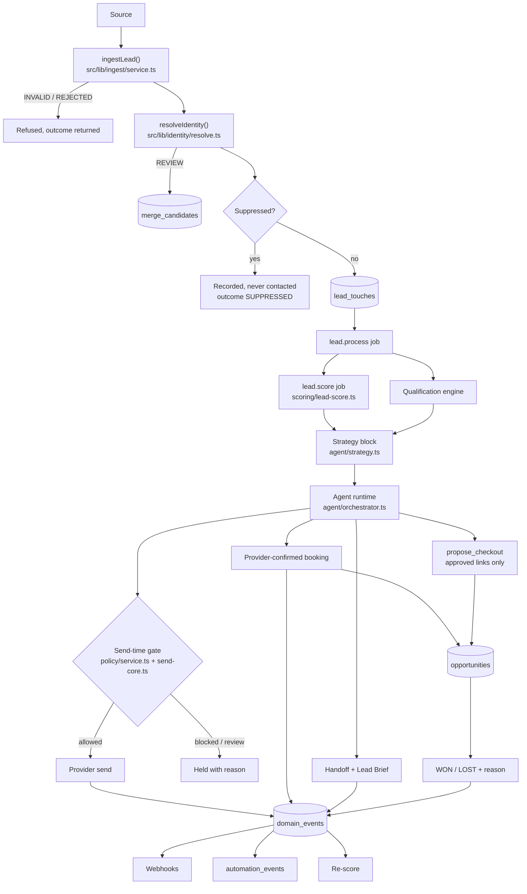
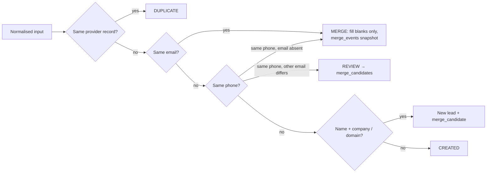
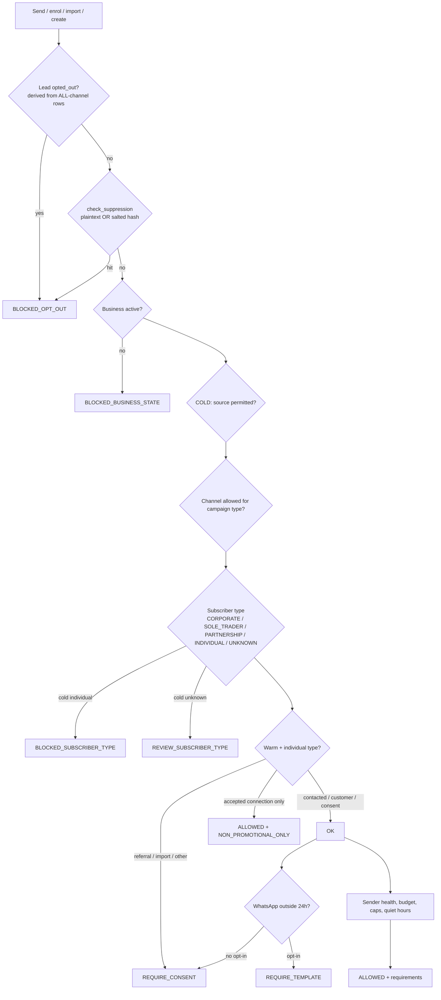
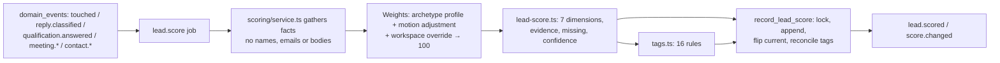
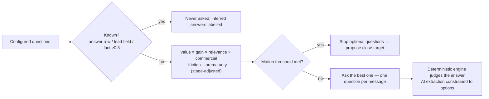
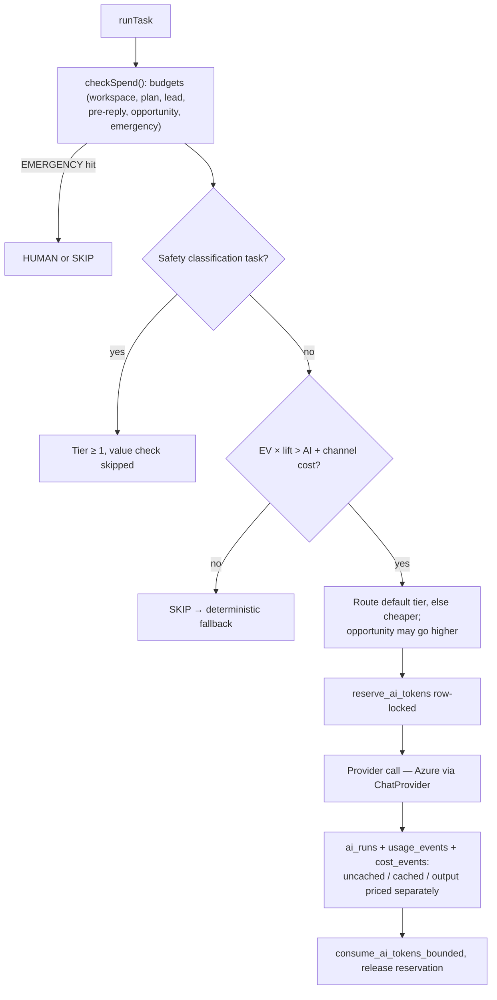
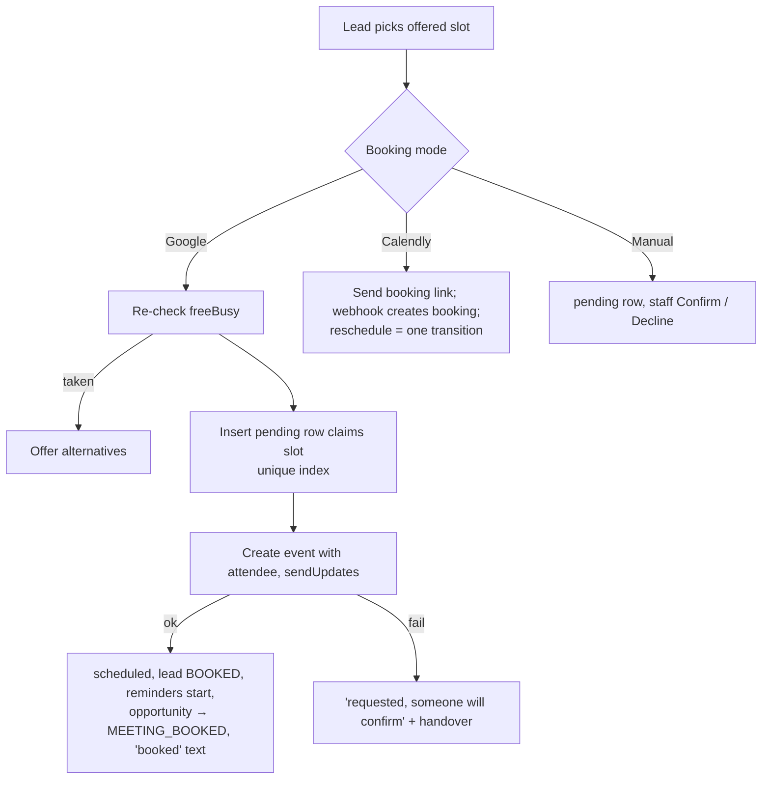
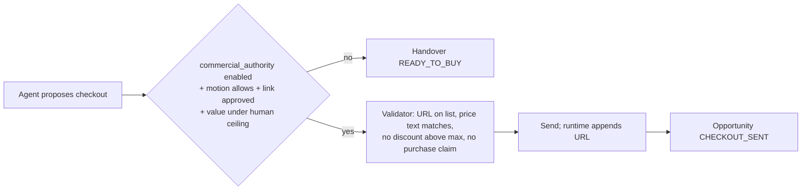
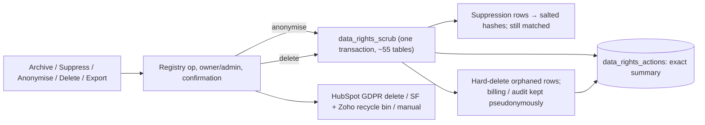

# Core Revenue Engine — flow diagrams, database map, site map

Brief §§103–105. Every diagram shows the code as built (September 2026), not the design as intended.
Paths are relative to the repo root.

---

## 1. Master revenue lifecycle (§103.1)

## 2. Sources (§103.2)

| Source | Entry point | Converges on | Idempotency |
|---|---|---|---|
| Meta Lead Ads | `api/webhooks/meta` → `lead_source.poll` → `providers/meta-lead-ads.ts` | `ingestLead` | provider record id, touch unique key |
| Google Ads | poller `providers/google-ads.ts` **and** `api/webhooks/google-ads` (google_key, constant-time) | `ingestLead` (via `ingest.webhook` job) | `lead_id` / resource id |
| LinkedIn / TikTok lead forms | pollers | `ingestLead` | provider record id |
| Manual (Add Lead wizard) | `leads/add-lead/actions.ts` | `ingestLead` | wizard duplicate check + identity |
| CSV (v4 and reactivation) | `imports/actions.ts`, `campaigns/actions.ts` | `ingestLead` | row id |
| Public API | `POST /api/v1/leads` (`leads:write`, `Idempotency-Key` required) | `lead.create` registry op → `ingestLead` | `ingest_requests` |
| MCP | `create_lead` | `ingestLead` | none sent by MCP clients; a retry adds a touch, not a lead |
| Zapier / Pipedrive / webhook | `api/apps/[id]/events` → `process_workspace_app_event` | prospects (RPC) | install + event id |
| Meta DMs | `social/meta-inbound.ts` | `ingestLead` (thread id is the identity) | thread id |
| Find Leads sourcing | `jobs/handlers/sourcing-run.ts` | prospects; promotion via `promote_reviewed_prospect` (links rather than duplicates) | company dedupe key, email |
| LinkedIn / Sales Navigator | ASSISTED only: tasks, deep links, InMail credit log | — | — |

## 3. Identity resolution (§103.3)

Unique partial indexes `leads_identity_email_key` and `leads_identity_phone_key` make the rules
race-safe. Admin can undo a merge (`identity/merge.ts`).

## 4. Contactability and suppression (§103.4, §103.13)

Subscriber type comes from the stored `contact_permissions` record, or otherwise from the
company's Companies House verdict. It is never taken from a caller's claim (defect B1).

Suppression is written at these points:

- STOP, per channel (carrier keyword) or all channels (plain English)
- one-click unsubscribe (RFC 8058 POST)
- Twilio 21610 and invalid-number errors
- email bounces and ARF complaints
- the agent's opt-out verdict
- data-rights suppress and restrict

## 5. Lead scoring (§103.5)

## 6. Qualification (§103.6)

## 7. Conversation AI (§103.7, §107)

```mermaid
flowchart LR
  IN[Inbound] --> P1[Perception: deterministic binding verdicts<br/>opt-out, complaint, human request]
  P1 --> S1[State: lifecycle, memory,<br/>qualification, booking]
  S1 --> PO[Policy: run gate, takeover, window]
  PO --> ST[Strategy: motion, method router,<br/>next question, objection playbook]
  ST --> BU[Budget: checkSpend → tier / skip / human]
  BU --> M[One model call: agent_decision]
  M --> AC[Action candidates validated;<br/>extraction allow-list]
  AC --> QA[QA: validator + style lint<br/>one retry → handover]
  QA --> EX[Execute via send gate]
  EX --> OB[Observe: run record,<br/>strategy + reason, usage]
  OB --> LE[Learning: outcome events<br/>governed, see §§61–63 status]
```

Inbound lead text is wrapped as untrusted content. Method names never reach the prompt.

## 8. Model routing and token budgeting (§103.8, §103.9)

## 9. Booking (§103.10)

## 10. Direct close (§103.11)

## 11. Human handoff (§103.12)

Triggers:

- binding verdicts
- low confidence
- security, legal, contract or procurement objection
- validation failure
- booking failure
- budget → `BUDGET_EXCEEDED`
- checkout gate refused → `READY_TO_BUY`

Then:

1. `agent_handoffs` row.
2. `human_takeover`, which throws if it fails to persist.
3. Acknowledgement to the lead (origin `agent_handover`, exempt from takeover).
4. `handoff.brief` job: Lead Brief, plus a validated 30-second brief, plus a CRM note.

## 12. Deletion (§103.14)

## 13. Analytics, MCP, automation, failure and recovery (§103.15–18)

- **Analytics.** Data is read from `domain_events`, `lead_touches` and the attribution views, then
  goes through the metric registry (`rate()`, where a zero denominator returns null) into the
  dashboard revenue control and the analytics breakdown. Any denominator under 30 shows a
  small-sample flag.
- **MCP.** A token or API key is checked against the user's live membership and role, and against
  scope. Calls then go through the services runtime: role, zod, confirmation, audit, meter. High
  impact calls wait in `mcp_approvals` until a person approves them. MCP never bypasses the
  policy gate, because `message.send` re-checks suppression and contactability.
- **Automation.** Every change to lead data writes a `domain_events` row in the same transaction,
  through SQL triggers and `emitDomainEvent`. A `event.dispatch` job then fans it out to webhooks,
  the `automation_events` projection and re-scoring. Loop guard: events past depth 3 are dropped.
- **Failure and recovery:**
  - Jobs are claimed with `SKIP LOCKED` and retried with backoff.
  - Sends are claimed QUEUED → SENDING; a stuck SENDING row is reconciled, never resent.
  - An inbound message is resumed from the stored message after a mid-way failure.
  - A failed Stripe event can be reclaimed.
  - Pollers do not advance their cursor past a failed insert.
  - Suppression lookups fail closed.
  - Writes that matter to correctness throw (`assertWrite`); observability writes are logged
    instead (`logWriteError`).

---

## 14. Database map (§104)

New or changed sources of truth. Each change is listed with its migration.

| Concern | Source of truth | Key constraints and triggers | RLS |
|---|---|---|---|
| Industry | `industry_codes`, `industry_code_mappings`, `industry_aliases` (0120) | PK (system, code) | server-only |
| Classification | `business_profiles.{primary_industry_code, archetype_key, sales_motions}` (0121); `prospect_companies.subscriber_type` (0080) | — | existing |
| Sales library | code (`src/lib/sales-library`, `LIBRARY_VERSION`) + `workspace_sales_overrides` | unique (business, kind, key) | members read |
| Lead identity | `leads` + `email_normalized` (generated) | unique partial `leads_identity_email_key` / `_phone_key` | existing |
| Provenance / attribution | `lead_touches` (0123); `lead_sources` = form registry (0114 unique tuple) | unique (business, provider, provider_record_id) | members read |
| Ingest idempotency | `ingest_requests` | unique (business, idempotency_key) | server-only |
| Merges | `merge_events` (reversible), `merge_candidates` | — | members read |
| Score | `lead_scores` (append-only, current flag), `lead_tags` | unique (lead, trigger, version); `record_lead_score()` | members read |
| Opportunity | `opportunities` (0121/0125) | `ensure_lead_opportunity`, `close_opportunity` | members read |
| Consent / relationship | `contact_permissions` (authoritative over caller claims) | — | existing |
| Contactability | `contactability_results.state` (trigger-derived), `compliance_decisions` (append) | — | existing |
| Suppression | `suppression_entries` + `*_hash` (0124) | `check_suppression`, `suppressed_emails`; opt-out triggers | existing |
| Opt-out flag | `leads.opted_out` **derived** from ALL-channel rows (0123) | `leads_derive_opted_out`, `suppression_entries_sync_leads` | — |
| Events | `domain_events` (0123) | unique `dedupe_key`; `emit_domain_event[_safe]` | server-only |
| Sends | `messages.status` + SENDING (0112) | conditional claim | existing |
| Bookings | `bookings` + `pending`, reschedule columns | unique active slot (0113) | existing |
| AI economics | `ai_model_tiers`, `ai_task_routes`, `ai_budgets`, `ai_budget_decisions` (append-only), `ai_token_reservations` | `reserve_ai_tokens`, `consume_ai_tokens_bounded`, `ai_spend_snapshot` | budgets members read |
| Direct close | `commercial_authority` | — | members read |
| Data rights | `data_rights_actions`, `privacy_requests`, `platform_secrets` | `data_rights_scrub/anonymise/delete`, `suppression_hash` | server-only |
| LinkedIn | `inmail_sends` | — | members read |

**Redundancies resolved:**

- Reply-classification vocabularies are now one canonical list (0115).
- The warm and cold contactability callers now obey stored facts (B1).
- The four ad-ingest copies became `ingestLead`.
- The two CSV importers now share one intake path.

**Still open:** `automation_events` is only partly a projection of `domain_events`, and the old
direct emitters remain. `agent_prompt_versions` is still unused.

---

## 15. Site map (§105): page → component → service → database → events → AI → analytics

| Page | Components | Services / ops | Tables | Events | AI | Analytics |
|---|---|---|---|---|---|---|
| `/app` Dashboard | revenue-control-section, pending-bookings-card, funnel | `dashboard/queries.ts`, `revenue-control.ts` | lead_scores, lead_tags, opportunities, agent_handoffs, ai_budgets, domain_health_snapshots | — | — | metric registry `rate()` |
| `/app/leads` + drawer | lead-drawer, lead-data-rights | `lead.*` ops, data-rights ops | leads, contact_permissions | lead.* | — | — |
| `/app/leads/[id]` | *Phase 5b* | `lead.*`, `opportunity.*`, `lead.rescore` | as above + lead_touches, conversation_agent_runs | — | strategy shown | score history |
| `/app/inbox` | agent-panel (handoff briefs), inbox-controls (nonce) | `message.send/draft` | conversations, messages, agent_handoffs | reply.received | agent runtime | — |
| `/app/follow-up` | follow-up settings | channel router | automations | — | restyle (budgeted) | — |
| `/app/reactivation` | wizard | ingest (CSV) | campaigns, campaign_contacts | — | reactivation_copy (budgeted, linted) | — |
| `/app/find-leads` | social queue (InMail) | sourcing, `inmail-actions.ts` | prospects, prospect_companies, inmail_sends | prospect.created | research, social_message | acquisition funnel |
| `/app/analytics` | slices-panel (breakdown + attribution switcher) | `analytics/slices.ts` | lead_touches, views | — | — | small-sample flags |
| `/app/settings` | business profile (direct close), data controls (privacy requests, retention preview), *AI & selling (Phase 5b)* | `saveCommercialAuthority`, privacy ops | commercial_authority, privacy_requests, ai_budgets | — | — | — |
| `/privacy-request` (public) | request form, verify | privacy-requests | privacy_requests | — | — | — |
| `/admin/system/*` | lead ops, AI spend, domain events, audit log | `admin/revenue-ops*.ts` (step-up + audit) | merge_*, ai_runs, domain_events, audit_log | — | — | spend per task |
| `/api/v1/leads` | — | `lead.create` | ingest_requests | lead.created | — | — |
| `/api/webhooks/google-ads` | — | ingest.webhook | webhook_events | — | — | — |
| `/api/unsubscribe/[token]` | — | email/unsubscribe | suppression_entries | contact.unsubscribed | — | — |
