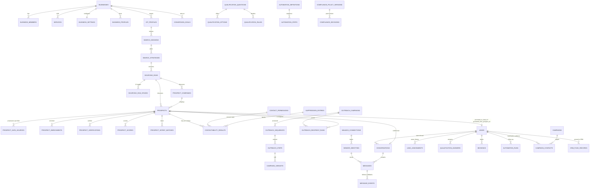

# 04 · Database Audit

**Shape:** 174 tables · 302 indexes · 360 foreign keys · 74 triggers · 98 jsonb columns ·
57 SQL functions · 65 migrations. All figures counted from `supabase/migrations/`, not from the
deployed database.

---

## 0. The core entity mesh

The 30 tables that carry the conversion journey. Platform, admin, affiliate and support tables are
omitted for legibility — see §2 for the full 174-row register.



The single `|o--o|` edge between `PROSPECTS` and `LEADS` is the whole product thesis, and it is
the edge that is broken — see 4.1.

---

## 1. Findings first

### 4.1 · P0 — `promote_reviewed_prospect()` inserts an invalid lead status

[`supabase/migrations/0047_agent_promotion.sql`](../../supabase/migrations/0047_agent_promotion.sql)

```sql
insert into public.leads(business_id,first_name,last_name,email,phone,status,agent_id,automation_active)
values(p.business_id,p.first_name,p.last_name,p.email,p.phone_e164,'new',p.agent_id,false)
```

`leads.status` carries a CHECK constraint declared in
[`0003_leads.sql:40`](../../supabase/migrations/0003_leads.sql) permitting only
`'NEW','CONTACTED','RESPONDED','QUALIFIED','BOOKED','WON','LOST'`. No later migration drops or
replaces it — verified by grepping every migration for `leads_status_check`.

The function passes `'new'` in lower case, so **every call raises a check-constraint violation**.

Both promotion paths go through this function:

- [`find-leads/actions.ts:911`](../../src/lib/find-leads/actions.ts) — the manual
  "Promote to lead" button;
- [`outreach/campaigns/replies.ts:239`](../../src/lib/outreach/campaigns/replies.ts) — automatic
  promotion when a cold prospect replies positively.

Both swallow the error. The manual path returns
`"Only engaged, unsuppressed prospects can move to Leads. Review the conversation first."`, which
tells the operator something untrue and hides the real cause. The automatic path returns `null`
silently.

**Consequence:** the prospect→lead arrow — the centre of the whole product thesis — does not
work, and no test covers it (`tests/` contains no reference to `promote_reviewed_prospect`; the
RLS suites run against a real database but never exercise promotion).

**Fix:** `'NEW'`, plus the missing fields below. Marked **P0** in
[19](19-missing-architecture-register.md).

### 4.2 · P0 — the promotion routine drops the provenance it exists to preserve

`0038_v4_core_extensions.sql` added `leads.promoted_from_prospect_id`, `leads.promoted_at`,
`leads.company_name`, `leads.source_campaign_id`, `leads.sourcing_run_id`,
`leads.intake_method`, `leads.relationship_type`, `leads.subscriber_type` and
`leads.conversion_goal_id`, with a partial index `leads_promoted_from_idx` built specifically to
query them.

`promote_reviewed_prospect()` writes **none of them**. It also does not set
`leads.phone_normalized`, which duplicate detection and SMS addressing both depend on.

So the columns are permanently null, the index is dead, and a promoted lead cannot be traced back
to the prospect, the company, the campaign or the sourcing run that produced it — which is
exactly what §5 of the brief requires promotion to preserve.

### 4.3 · P0 — two disjoint suppression lists

| List | Table | Written by | Read by |
|---|---|---|---|
| Warm | `contact_suppressions` | SMS `STOP` handling (`message-inbound.ts:127`), `leads/actions.ts`, `agent/tools.ts`, unsubscribe page | `jobs/handlers/shared.ts:280` (the warm send guard), `campaigns/queries.ts` |
| Cold | `suppression_entries` | `policy/suppression.suppress()`, cold reply handling, admin compliance, prospect actions, unsubscribe page | `check_suppression()` → `policy/suppression.checkSuppression()` → cold dispatch, sourcing, imports, add-lead |

`src/lib/policy/suppression.ts` opens with the claim that it is *"Checked before EVERY send,
whatever the source — warm follow-up, reactivation campaign, cold acquisition sequence or a
message a human typed by hand."* That is not what the code does: the warm send path queries
`contact_suppressions` directly and never reaches this module.

`suppressProspect()` in `outreach/campaigns/replies.ts` deliberately writes channel `ALL` with
the comment *"An opt-out is a person saying do not contact me, not not by email — it applies to
every channel."* The warm path cannot see that row, so the stated intent is defeated.

**Only the `/unsubscribe/[token]` page writes both tables.** An SMS `STOP` does not suppress cold
email; a cold-email opt-out does not suppress warm SMS or the follow-up automation.

For a UK product under PECR and UK GDPR this is the highest-consequence finding after 4.1.

## 2. Table register

`ref?` = the table name appears in application code. `NO` means no read and no write anywhere in
`src/` (checked against every `.ts`/`.tsx` file, excluding the generated `database.types.ts`).

### Core tenancy — `0001`–`0002`

| Table | Purpose | ref? |
|---|---|---|
| `profiles` | user profile + `platform_role` | yes |
| `businesses` | workspace | yes |
| `business_members` | membership + role + status | yes |
| `business_settings` | quiet hours, timezone, notification prefs, onboarding step | yes |
| `services` | what the business sells | yes |
| `qualification_questions` / `_options` / `_rules` | deterministic qualification config | yes |

### Leads and messaging — `0003`–`0006`

| Table | Purpose | ref? |
|---|---|---|
| `lead_sources` | ad-platform sources | yes |
| `leads` | warm lead. 40+ columns after four rounds of extension | yes |
| `lead_assignments` | assignment history | yes |
| `qualification_answers` | per-lead answers | yes |
| `contact_suppressions` | **warm** suppression list | yes |
| `conversations` | one thread; lead and/or prospect; 7 channels | yes |
| `messages` | one message table for every channel | yes |
| `message_events` | provider delivery callbacks | yes |
| `automation_definitions` / `_versions` / `_steps` / `_runs` | follow-up engine | yes |
| `bookings` | booking record | yes |

### Reactivation campaigns — `0007`

| Table | Purpose | ref? |
|---|---|---|
| `campaigns` | warm bulk campaign (extended by `0022` for Reactivation) | yes |
| `campaign_contacts` | membership + per-contact send state | yes |
| `imports` | legacy CSV import | yes |

### Platform — `0008`–`0018`, `0024`

`integrations`, `integration_secrets`, `integration_objects`, `field_mappings`,
`integration_oauth_states`, `webhook_events`, `jobs`, `usage_events`, `subscriptions`,
`notifications`, `audit_log`, `marketing_sessions`, `marketing_events`, `usage_counters`,
`rate_limits`, `crm_push_records`, `lead_source_cursors`, `business_ai_settings`, `ai_runs`,
`provider_price_book`, `cost_events`, `business_cost_daily`, `business_margin_monthly`,
`plan_entitlements`, `platform_provider_checks`, `platform_error_triage` — **all referenced**
except:

| Table | ref? | Note |
|---|---|---|
| `ai_prompt_versions` | **NO** | Superseded by the in-code `PROMPT_REGISTRY` |
| `rate_limits` | **NO (direct)** | Reached only through the `consume_rate_limit()` / `prune_rate_limits()` RPCs. Not dead |

### Conversational agent runtime — `0024a`

`conversation_agent_runs`, `conversation_agent_actions`, `conversation_agent_extractions`,
`conversation_summaries`, `agent_handoffs` — all referenced.

### AI tokens — `0024c`

`ai_token_balances`, `ai_token_ledger`, `ai_token_purchases` — all referenced, all mediated by
`consume_ai_tokens()` / `credit_ai_tokens()`.

### V4 business profile — `0025`

| Table | ref? |
|---|---|
| `business_profiles`, `business_memory_facts`, `business_knowledge_sources`, `business_learning_events`, `icp_profiles`, `conversion_goals` | yes |
| `business_playbooks` | **NO** |
| `icp_segments` | **NO** |

### V4 prospects — `0026`

All six referenced (`prospect_companies`, `prospects`, `prospect_data_sources`,
`prospect_enrichments`, `prospect_verifications`, `prospect_scores`, `prospect_score_factors`).
`prospect_data_sources` is the strongest table in the schema: field-level provenance with
provider, source type, source URL, confidence, cost and `policy_tags` travelling with the value.

### V4 search and sourcing — `0027`, `0048`

Referenced: `search_sessions`, `search_messages`, `search_strategies`,
`search_strategy_versions`, `sourcing_runs`, `sourcing_run_queries/results/issues/stages`,
`recurring_searches`, `business_analysis_jobs/facts`.
**Not referenced:** `search_feedback` — the learning loop back into search planning was never
built.

### V4 outreach — `0029`, `0053`, `0058`

Referenced: `outreach_campaigns`, `outreach_campaign_versions`, `outreach_sequences`,
`outreach_steps`, `outreach_recipient_runs`, `campaign_experiments`, `campaign_variants`,
`optimization_actions`, `mailbox_connections`, `sender_identities`, `domain_health_snapshots`,
`mailbox_health_snapshots`, `outreach_campaign_costs/usage/events`.
**Not referenced:** `outreach_runs` (per-day run rollup — the dispatcher never opens or closes
one), `campaign_learnings` (the "Learn" quarter of "Find · Convert · Reactivate · Learn").

### V4 compliance — `0030`

All referenced: `contact_permissions`, `contactability_results`, `suppression_entries`,
`compliance_decisions`, `privacy_notice_events`, `lead_source_evidence`,
`compliance_policy_versions`.

### V4 imports — `0031`

`lead_imports`, `lead_import_rows` referenced. `lead_import_mappings` **not referenced** — the
saved column-mapping feature was never built.

### V4 agents and usage — `0032`, `0043`

Referenced: `agents`, `agent_sources`, `agent_queue_items`, `agent_activity_events`,
`agent_runs`, `agent_prompt_versions`, `economics_alerts`, `business_entitlement_grants`,
`customer_usage_allocations`.
**Not referenced:** `agent_tool_calls` (worker-agent tool audit — no equivalent of the
conversational runtime's `conversation_agent_actions`), `agent_budgets` (per-agent spend cap),
`usage_reservations` (though `expire_usage_reservations()` is called every day by the daily cron,
against a table nothing writes).

### Support, affiliates, MCP, apps, copilot, admin — `0033`–`0057`

All referenced except `mcp_scopes` (scopes are a hard-coded list in `mcp/tools.ts`),
`external_entity_links` and `sync_conflicts` (the bidirectional-sync half of the external
connector model was never built), and `workspace_app_events` (written only inside
`receive_workspace_app_event()`, read by nothing).

### Realtime — `0055`

`workspace_stream_events` — written by trigger functions (`emit_stream_event`,
`prospects_stream_notify`, `outreach_campaigns_stream_notify`, `intent_events_stream_notify`),
read by exactly one client hook,
[`use-find-leads-stream.ts`](../../src/components/find-leads/use-find-leads-stream.ts), over
Supabase Realtime. Correct and working — but it is the **only** realtime surface in the product.
Inbox, Leads and Dashboard all poll or re-render on navigation.

## 3. Constraint and index observations

**Good:**

- `prospect_companies` deduped by a partial unique index on `(business_id, domain)` plus a total
  unique index on `(business_id, dedupe_key)`, with the normalisation rule kept in one place
  (`lib/prospects/dedupe.ts`) so code and constraint agree.
- `conversations` keeps per-lead-per-channel uniqueness as a *partial* index excluding `'multi'`,
  so a prospect thread and a lead thread can coexist and merge on promotion. Genuinely elegant.
- `jobs.idempotency_key` unique-while-pending, with a `23505` on insert treated as success.
- `messages.send_key` prevents a retried send from duplicating a message.
- `sender_identities_default_idx` — one default sender per workspace, enforced by a partial
  unique index rather than application code.

**Problems:**

| # | Issue | Impact |
|---|---|---|
| C1 | `messages` carries no FK from `automation_run_id` (declared `uuid`, no `references`) | Orphaned run references survive automation deletion |
| C2 | `leads` has no unique constraint on `(business_id, lower(email))` or `(business_id, phone_normalized)` | Duplicate leads are prevented only by an application-side `checkLeadDuplicates`, which the MCP `create_lead` path does not call |
| C3 | Soft delete is inconsistent: `archived_at` (3), `is_archived` (3), `revoked_at` (7), and hard delete elsewhere | Retention and export logic must special-case each |
| C4 | 98 jsonb columns, several load-bearing (`audience_json`, `filter_config`, `factor_json`, `snapshot_json`) with no jsonb path indexes | Audience previews and score explanations will scan as volume grows — see [37 · Performance](19-missing-architecture-register.md) |
| C5 | `conversations.assigned_user_id`, `conversations.snoozed_until`, `conversations.external_thread_id`, `conversations.counterparty_avatar_url`, `messages.read_at`, `messages.attachments`, `messages.inbox_channel_id`, `conversations.inbox_channel_id` are all **never written** | Dead columns from the unbuilt unified-inbox work |

## 4. RLS — verified

**All 174 tables have RLS enabled**, applied through `DO`-loop blocks in `0010_rls.sql`,
`0036_v4_rls.sql` and per-feature migrations. Verified programmatically against the full
migration text.

The model is stated in `0010_rls.sql` and holds up:

- browser-exposed tenant tables: RLS on, explicit policies, `select` granted to `authenticated`,
  everything revoked from `anon`;
- server-only tables (`integration_secrets`, `field_mappings`, `webhook_events`, `jobs`,
  `usage_events`, `audit_log`, …): RLS on with **no policies at all**, so PostgREST returns
  nothing to any browser session and only the service role can reach them;
- helpers (`is_business_member`, `has_business_role`, `is_platform_admin`,
  `current_affiliate_id`, `is_active_affiliate`) are `security definer` with a pinned
  `search_path`, and revoked from `public`/`anon`.

No policy anywhere uses `using (true)`. No table grants anything to `anon`. Column-level grants
are used where they should be (`grant update (first_name, last_name, phone, avatar_url) on
profiles`).

`tests/rls.test.ts` and `tests/rls-v4.test.ts` run cross-tenant assertions against the real
Supabase project rather than mocks, which is the only way this can be proved.

**This is the strongest part of the system and needs no work.**

## 5. Migration hygiene

- Numbering is mostly sequential with three out-of-band inserts (`0024a`, `0024b`, `0024c`) —
  harmless but it means lexical ordering is load-bearing.
- `9999_qa_seed_temp.sql` is untracked (`git status` shows it as new) and named as temporary. It
  must not be applied to production. See [20](20-dead-code-register.md).
- Migrations are additive and idempotent (`if not exists`, `drop constraint if exists` before
  `add constraint`), which makes them safely re-runnable. Good discipline.
