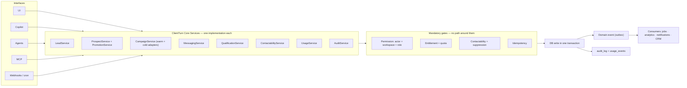

# 05 · Global System Mesh

The whole of ClientTurn as one connected system: interfaces at the top, the service layer in the
middle, storage and background work below, providers at the edge.

Dashed red edges are **defects** — paths that exist in the code but bypass something they should
not, or that are declared and unimplemented. Every one is numbered and explained below the
diagram.

---

## A · Global mesh

```mermaid
flowchart TB
  subgraph IF["Interfaces"]
    UI["Customer UI<br/>9 routes"]
    CP["Copilot<br/>regex router, no AI"]
    AG["Worker Agents<br/>agents + ticks"]
    CAG["Conversation Agent<br/>lib/agent orchestrator"]
    MCP["MCP gateway<br/>/api/mcp"]
    ADM["Admin shell"]
    WH["Webhooks<br/>stripe · twilio · linkedin"]
    CRON["pg_cron -> /api/cron/worker"]
  end

  subgraph SVC["Service layer (lib/*)"]
    LEAD["Lead actions"]
    PROS["Prospect + Sourcing"]
    OUT["Outreach campaigns"]
    RECT["Reactivation campaigns"]
    FU["Follow-Up automation"]
    QUAL["Qualification engine"]
    BOOK["Bookings"]
    POL["ChannelPolicyService"]
    ENT["Entitlements V3 + V4"]
    USE["Usage + cost"]
    INT["Integration framework"]
    AI["Model router + prompt registry"]
  end

  subgraph JOBS["Job queue (30 types)"]
    Q["jobs table<br/>SKIP LOCKED"]
    JSRC["sourcing.run"]
    JOUT["outreach.tick / dispatch"]
    JCAM["campaign.expand / send"]
    JAUT["automation.advance"]
    JMSG["message.send / process_inbound"]
    JEML["email.poll"]
    JCRM["crm.push"]
    JAGT["agent.run"]
  end

  subgraph DB["Postgres · 174 tables · RLS on all"]
    D1[("prospects + prospect_*")]
    D2[("leads")]
    D3[("conversations + messages")]
    D4[("outreach_* / campaigns")]
    D5[("compliance + suppression")]
    D6[("usage + cost + tokens")]
    D7[("audit_log")]
  end

  subgraph EXT["Providers"]
    P1["Sourcing: Google Places · Apollo · Hunter · Clearbit"]
    P2["Messaging: Twilio · SMTP/POP3"]
    P3["Ads: Meta · Google · Microsoft · TikTok · LinkedIn"]
    P4["CRM: HubSpot · Zoho"]
    P5["Booking: Calendly · Google Calendar"]
    P6["Azure OpenAI EU"]
    P7["Stripe · Cloudflare R2 · Resend · Slack"]
  end

  UI --> LEAD & PROS & OUT & RECT & FU & QUAL & BOOK
  ADM --> ENT & USE & INT
  CP -.->|"X1 own writes"| D2
  MCP -.->|"X2 own writes"| D2
  CP --> QUAL & OUT
  AG --> RECT & FU & POL
  CAG --> QUAL & BOOK & POL
  WH --> Q
  CRON --> Q

  LEAD --> D2 & D7
  PROS --> D1
  OUT --> D4
  RECT --> D4
  POL --> D5
  USE --> D6
  AI --> P6

  Q --> JSRC & JOUT & JCAM & JAUT & JMSG & JEML & JCRM & JAGT
  JSRC --> P1 --> D1
  JSRC --> POL
  JOUT --> POL --> D5
  JOUT --> P2 --> D3
  JCAM -.->|"X3 skips POL"| D3
  JMSG -.->|"X3 skips POL"| D3
  JAUT --> JMSG
  JEML --> P2
  JCRM --> P4
  JAGT --> AG
  INT --> P3 & P4 & P5 & P7

  D1 -->|promote_reviewed_prospect| D2
  D1 -.->|"X4 check violation"| D2
  D3 --> QUAL --> BOOK

  classDef bad stroke:#c00,stroke-width:2px,color:#c00
  class CP,MCP bad
```

### Defect edges

| # | Edge | What is wrong | Detail |
|---|---|---|---|
| **X1** | Copilot → `leads` | `copilot/tool-service.ts` writes `leads.assigned_user_id` and `needs_attention` directly instead of calling `leads/actions.ts`, so `lead_assignments` history and `audit_log` are skipped | [18 · D1](18-duplication-bloat-register.md) |
| **X2** | MCP → `leads` | `mcp/handlers.ts` writes `assigned_user_id` and `status` directly. Status writes skip the lifecycle timestamps, the `qualification_state` sync, the `automation_active` shutdown, the audit row and the CRM push | [18 · D2](18-duplication-bloat-register.md) |
| **X3** | `campaign.send` / `message.send` → `messages` | Warm sends never reach `ChannelPolicyService`. They use the older `send-core` guard and query `contact_suppressions`, so no `compliance_decisions` row is written and cold-side opt-outs are invisible | [11](11-compliance-permission-mesh.md) |
| **X4** | `prospects` → `leads` | `promote_reviewed_prospect()` inserts `status='new'` against an uppercase-only CHECK constraint | [04 · 4.1](04-database-audit.md) |

## B · Interface parity

The brief requires that the same journey work identically from the UI, Copilot, an autonomous
agent, and MCP. Measured against the real code:

| Capability | UI | Copilot | Worker agent | Conversation agent | MCP |
|---|---|---|---|---|---|
| Create lead | full | — | — | — | partial — no duplicate check, no automation start |
| Assign lead | full | **divergent** | — | — | **divergent** |
| Change lead status | full | — | — | via tools | **divergent** |
| Send message | full | — | via follow-up re-arm | full, guarded | **parks forever** |
| Approve prospect | full | — | full | — | full |
| Promote prospect | broken (X4) | — | broken (X4) | — | — |
| Launch campaign | full | draft only | draft only | — | **parks forever** |
| Pause/resume campaign | full | full | — | — | full |
| Start sourcing run | full | **declared, unreachable** | full | — | **parks forever** |
| Change overage cap | full | — | — | — | **parks forever** |
| Qualification decision | full | — | — | full | — |
| Booking | full | — | re-arm only | full | — |

Every "divergent" cell is a place where the same business action produces a different set of side
effects depending on which door it came through. "Parks forever" means the MCP gateway correctly
refuses to execute the tool inline and writes an `mcp_approvals` row instead — but nothing in the
product ever reads that table, so the request is never approved or carried out.

## C · What the mesh should look like

The difference between the two diagrams is the whole recommendation of this audit: today
interfaces reach storage by four different routes with four different sets of gates; they should
reach it by one.

Target detail in [22](22-final-target-architecture.md); sequencing in
[21](21-consolidation-migration-plan.md).

## D · Page → data → action ownership

The rule that should hold — and mostly does — is that **a page owns rendering and nothing else**.
Where it is broken:

| Page | Owns rendering | Owns logic it should not |
|---|---|---|
| `/app` Dashboard | yes | Computes funnel counts and rates itself instead of using `analytics/v4-metrics` |
| `/app/analytics` | yes | none — correct |
| `/app/leads` | yes | none |
| `/app/find-leads` | yes | none |
| `/app/reactivation` | yes | `campaigns/reactivation-types.ts` defines `replyRate` / `qualificationRate` / booking rate locally, in percentage points, returning 0 rather than null |
| `/app/follow-up` | yes | none |
| `/app/inbox` | yes | Channel capability copy lives in `lib/inbox/types.ts` and is not derived from `inbox_channels` or the integration catalog, so it can claim a channel the workspace cannot use |
