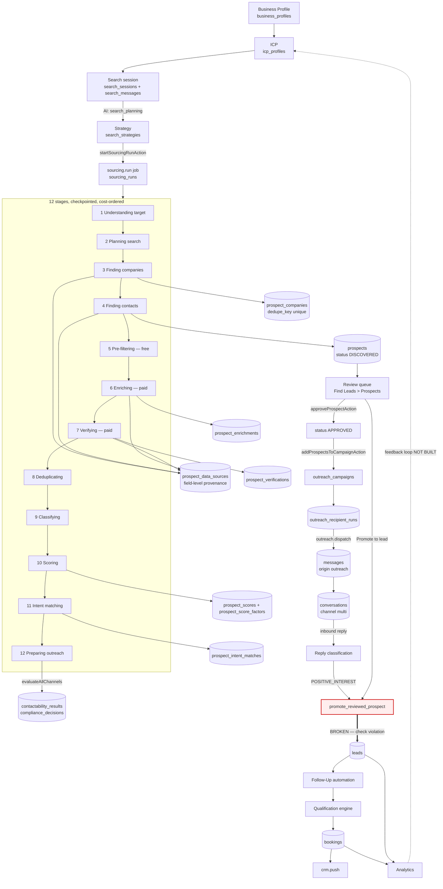

# 06 · Prospect → Lead Data Flow

The canonical customer journey, arrow by arrow, with the action, service, table mutation, event
and downstream consumer for each. Where an arrow is broken, it says so.

---

## A · The journey as built



## B · Arrow-by-arrow trace

| # | Arrow | Action | Service | Table mutation | Event | Consumers |
|---|---|---|---|---|---|---|
| 1 | Business → Profile | `analyseWebsite`, `analyseBusinessAction` | `business-profile/actions`, `business.analyse` job | `business_profiles`, `business_analysis_facts` | none | ICP builder, prompts, campaign copy guard |
| 2 | Profile → ICP | `saveIcpProfile`, `setIcpActive` | `business-profile/actions` | `icp_profiles` | none | Search planner, campaign audience |
| 3 | ICP → Search session | `createSearchSessionAction` | `find-leads/server/sessions` | `search_sessions` | none | Discover view |
| 4 | Session → Plan | `sendSearchMessageAction` → AI `search_planning` | `find-leads/server/search-agent` → `runTask` | `search_messages`, `search_strategies`, `ai_runs`, `ai_token_ledger` | none | Plan panel |
| 5 | Plan → Run | `startSourcingRunAction` | `find-leads/server/runs` + `enqueue("sourcing.run")` | `sourcing_runs`, `usage_events` | none | Run page (Realtime) |
| 6 | Run → Companies | stage 3 | `providers/router` → Google Places / Apollo | `prospect_companies` (upsert on `dedupe_key`), `prospect_data_sources`, `cost_events` | `workspace_stream_events` (trigger) | Run page |
| 7 | Run → Contacts | stage 4 | providers | `prospects` (DISCOVERED), `prospect_data_sources` | trigger stream | Prospects view |
| 8 | Pre-filter | stage 5 | pure arithmetic, no provider | `prospects.status` | none | — |
| 9 | Enrich | stage 6 | provider waterfall + budget guard | `prospect_enrichments`, `cost_events`, `customer_usage_allocations` | none | — |
| 10 | Verify | stage 7 | verification provider | `prospect_verifications`, `prospects.verification_status` | none | — |
| 11 | Dedupe | stage 8 | `prospects/dedupe.ts` + unique indexes | merge/drop | none | — |
| 12 | Score | stage 10 | `prospects/scoring.ts` — deterministic, versioned | `prospect_scores`, `prospect_score_factors` | none | Scoring explain page |
| 13 | Intent match | stage 11 | `intent/queries` | `prospect_intent_matches` | trigger stream | Intent view |
| 14 | Contactability | stage 12 | `policy/service.evaluateAllChannels` | `contactability_results`, `compliance_decisions` | none | Prospect eligibility badge |
| 15 | Approve | `approveProspectAction` / `approveProspectsAction` | `find-leads/*` | `prospects.status=APPROVED`, `approved_by`, `approved_at`, `audit_log` | none | Campaign eligibility |
| 16 | Enrol | `addProspectsToCampaignAction` | `find-leads/actions` | `prospects.campaign_id` | none | `outreach.audience` |
| 17 | Materialise audience | `outreach.audience` job | `outreach/campaigns/materialize` | `outreach_recipient_runs` | none | dispatcher |
| 18 | Dispatch | `outreach.dispatch` job | `outreach/dispatch` → `policy.evaluate` → sender slot → SMTP | `messages`, `conversations`, `compliance_decisions`, `sender_identities.sent_today`, `outreach_campaign_usage` | none | Inbox, campaign detail |
| 19 | Reply in | `email.poll` job | `email/pop3` + `email/inbound` | `messages` (inbound), `conversations.last_inbound_at` | `automation_events` (write-only) | reply classifier |
| 20 | Classify | `outreach/campaigns/replies` | deterministic rules first, AI assist second | `messages.reply_classification`, `outreach_recipient_runs.status` | none | stop/continue decision |
| 21 | **Promote** | `promoteProspectToLeadAction` or auto-on-reply | `promote_reviewed_prospect()` | **fails** — see below | `audit_log` (never reached) | Leads |
| 22 | Follow-up | `automation.advance` | `automation/scheduler` + `send-core` | `automation_runs`, `messages` | `automation_events` | — |
| 23 | Qualify | `qualify` handler | `qualification/engine` — deterministic | `qualification_answers`, `leads.qualification_state` | `automation_events` | routing, CRM |
| 24 | Book | agent tool / `sendBookingLink` | `bookings/actions`, `booking.sync` | `bookings` | `automation_events` | Calendar |
| 25 | CRM | `crm.push` | `crm-registry` adapter | `crm_push_records` | none | HubSpot / Zoho |
| 26 | Analytics | read-only | `analytics/v4-queries` | none | — | Analytics page |
| 27 | Feedback → ICP | **not built** | — | `search_feedback` and `campaign_learnings` tables exist and are never written | — | — |

## C · Arrow 21 is broken

```
prospects.status = READY/APPROVED, replied_at set
        │
        ▼
promote_reviewed_prospect(business, prospect, user)
        │
        ├─ SELECT … FOR UPDATE            ✅ prevents a double-click double lead
        ├─ if already promoted → return   ✅ idempotent
        ├─ if suppressed → raise          ✅ correct refusal
        ├─ if replied_at is null → raise  ✅ enforces "engagement before promotion"
        ├─ INSERT INTO leads (… status='new' …)
        │        ▲
        │        └── ✗ leads_status_check permits only 'NEW'|'CONTACTED'|…
        │            → 23514 check_violation, transaction aborts
        ├─ UPDATE prospects  … (never reached)
        ├─ UPDATE conversations SET lead_id (never reached)
        └─ UPDATE messages SET lead_id      (never reached)
```

Both callers swallow the exception. `find-leads/actions.ts:914` converts it to
*"Only engaged, unsuppressed prospects can move to Leads."*, which is a plausible-sounding
message for a completely different cause — the worst kind of error handling, because it makes the
bug look like correct behaviour.

**The rest of the routine is well designed** and should be kept: the row lock, the idempotent
early return, the suppression and engagement refusals, and the re-stamping of `conversations` and
`messages` so cold history appears in the Lead drawer immediately.

### What the fixed routine must also do

| Column | Source | Why |
|---|---|---|
| `status` | `'NEW'` | constraint |
| `phone_normalized` | `p.phone_e164` | duplicate detection + SMS addressing |
| `promoted_from_prospect_id` | `p.id` | the lineage link `0038` created an index for |
| `promoted_at` | `now()` | " |
| `company_name` | `prospect_companies.name` via `p.company_id` | leads currently lose the company entirely |
| `source_campaign_id` | `p.campaign_id` | attribution |
| `sourcing_run_id` | `p.source_run_id` | attribution |
| `intake_method` | `'CLIENTTURN_SOURCING'` | intake analytics split by method |
| `created_via` | `'SOURCING'` | " |
| `relationship_type` / `subscriber_type` | carried from the prospect | the warm-send permission basis |
| `agent_id` | already carried | ✅ |

It must also insert a `contact_permissions` row for the new lead. Today a promoted lead has no
permission record at all, so `evaluateAllChannels` returns UNKNOWN for it and the warm path — which
does not consult permissions — proceeds anyway.

## D · Prospect / Lead separation — verdict

**The separation is correct and must be kept.** Verified:

- No cold record is ever written to `leads`. `insertProspect()` in the sourcing worker writes
  only `prospects`.
- The MCP `create_lead` tool explicitly refuses a cold `relationshipType`:
  *"A contact you found or imported must be added as a prospect and reviewed before contact."*
- The Add Lead wizard has a separate `createProspectFromWizard` branch for the same reason.
- `promote_reviewed_prospect` is the only writer of `leads.promoted_to_lead_id` linkage.

What is wrong is not the boundary, it is that **crossing it loses data**. See §C.

## E · Duplication between Find Leads and Leads — checked, mostly absent

The brief asks where Find Leads and Leads duplicate each other. Findings:

| Concern | Status |
|---|---|
| Contact identity duplicated in both tables | **By design** — a snapshot at promotion. Acceptable, but the link must exist |
| Two dedupe implementations | **No.** `prospects/dedupe.ts` for cold, `leads/add-lead/duplicate-check.ts` for warm. Different inputs, different rules. Keep both |
| Two filter/search implementations | **Yes, and correctly.** `prospects/filters.ts` + `filter-sql.ts` vs `leads/filters.ts`. Different columns |
| Two "approve" actions on prospects | **Yes, duplicate.** `approveProspectAction` (singular, `find-leads/actions.ts`) and `approveProspectsAction` (plural, `find-leads/prospect-actions.ts`). Same for `suppressProspectAction` / `suppressProspectsAction`. MERGE — see [18 · D8](18-duplication-bloat-register.md) |
| Sourcing creating lead records | **No.** Verified — sourcing never touches `leads` |

## F · The missing feedback loop

`search_feedback` (`0027`) and `campaign_learnings` (`0029`) were created for the "Learn" quarter
of the V4 thesis. Neither is written by any code. `optimization_actions` *is* written
(`outreach.optimize`), so campaign-level self-tuning exists, but nothing feeds back into ICP
definition, search planning or prospect scoring.

Ranked **P2** in [19](19-missing-architecture-register.md): the product is sold on a learning
loop that is currently open at both ends.
