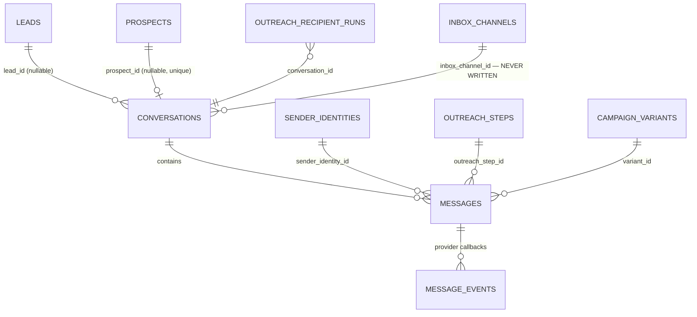
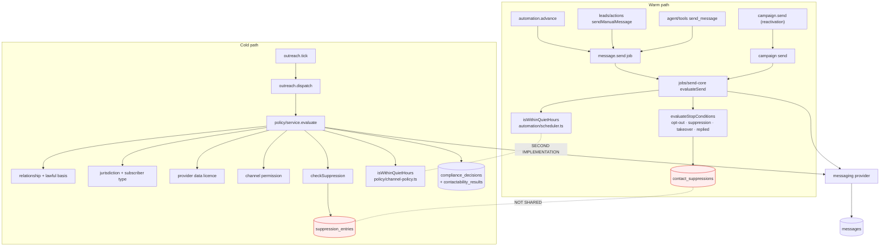

# 07 · Messaging and Conversation Mesh

---

## A · The good news: the conversation model is already canonical

There is **one** conversation table and **one** message table for every channel, both linked to a
lead, a prospect, or both.



Constraint design worth preserving verbatim:

| Constraint | Effect |
|---|---|
| `conversations_subject_present` — `lead_id is not null or prospect_id is not null` | A thread always has a subject |
| `conversations_lead_channel_idx` — partial unique on `(lead_id, channel)` where `lead_id is not null and channel <> 'multi'` | One warm thread per lead per channel, while a cross-channel prospect thread (`channel='multi'`) can coexist |
| `conversations_prospect_uniq_idx` — partial unique on `prospect_id` | One cold thread per prospect |
| `messages_subject_present` | Same rule for messages |
| `messages_external_id_idx` — partial unique on `(business_id, channel, external_message_id)` | Inbound de-duplication |
| `messages_message_id_header_idx` | RFC-822 threading for email |

On promotion, `promote_reviewed_prospect()` stamps `lead_id` onto the existing conversation and
every message in it, so the cold history appears in the Lead drawer without any copying. That is
the right answer to the "one conversation model" requirement and **no consolidation work is
needed here**.

`channel` accepts `sms · whatsapp · email · multi · messenger · instagram · linkedin`.
`status` accepts `QUEUED · SENT · DELIVERED · FAILED · RECEIVED · BOUNCED · COMPLAINED`.
`origin` accepts `automation · manual · campaign · system · outreach`.

## B · The bad news: three send paths and two guards



### B1 · Two suppression lists

Detailed in [04 · 4.3](04-database-audit.md). Summary: an SMS `STOP` writes only
`contact_suppressions`; a cold-email opt-out writes only `suppression_entries` (with channel
`ALL`, explicitly intending to cover every channel); neither path reads the other. Only
`/unsubscribe/[token]` writes both.

### B2 · Two quiet-hours implementations

| | `automation/scheduler.ts:87` | `policy/channel-policy.ts:86` |
|---|---|---|
| Signature | `(at: Date, quiet: QuietHours)` | `({hour, minute}, {start, end})` |
| Timezone | resolves the workspace zone itself via `minutesInZone` | expects the caller to have converted |
| Wrap-past-midnight | handled | handled |
| Roll-forward | `nextPermittedSendTime()` steps in 15-minute increments, bounded to 24h | `quietHoursEndMinutes()` returns minutes only |
| Used by | warm send core, campaign expand, campaign launch, agent policy | cold policy service |

Two correct implementations of one rule. They agree today; nothing keeps them agreeing.

### B3 · No compliance decision for warm sends

`compliance_decisions` and `contactability_results` are only ever written by
`policy/service.ts`, which the warm path never calls. So for a UK workspace, the audit trail
answering *"why was this message allowed to go out?"* exists for cold email and does not exist for
SMS, WhatsApp, follow-up or reactivation.

That is not a modelling gap — the tables and the pack machinery already exist. It is a wiring
gap.

## C · Inbox

`/app/inbox` presents six channel tabs from `CHANNEL_DEFINITIONS` in `lib/inbox/types.ts`.

| Channel | Ingestion | Reply from Inbox | Reality |
|---|---|---|---|
| SMS | `api/webhooks/twilio` → `message.process_inbound` | ✅ `inboxAction("reply")` → `sendManualMessage` | Working |
| WhatsApp | same | ✅ | Working |
| Email | `email.poll` job → POP3 → `email/inbound` | ❌ | **Receive-only.** `canReplyOn()` returns false for email |
| Messenger | **none** | ❌ | Tab exists; nothing can ever appear in it |
| Instagram | **none** | ❌ | Same |
| LinkedIn | **none** | ❌ | The copy is honest — it says LinkedIn has no inbox API — but the tab still ships |

```ts
// src/lib/inbox/types.ts:133
export function canReplyOn(channel: string, hasLead: boolean): boolean {
  return hasLead && (channel === "sms" || channel === "whatsapp");
}
```

Consequences:

0. **The transport is not the blocker.** `messaging/registry.ts` already routes `channel==="email"`
   to the workspace SMTP provider, and `send-core` is channel-agnostic. The block is in the
   action: `sendManualMessage` declares `channel: z.enum(["sms","whatsapp"])` and requires a
   usable `phone_normalized`. So the fix is a widening of one action plus `canReplyOn`, not new
   infrastructure.
1. **Email is the primary cold channel and cannot be replied to from the Inbox.** The operator is
   told to "open the original provider to reply", which breaks the whole premise of a unified
   inbox and means the reply is not recorded in `messages`, does not stop the sequence, and does
   not appear in analytics.
2. **A prospect conversation cannot be replied to at all** — `canReplyOn` requires `hasLead`, and
   a cold conversation has no `lead_id` until promotion (which is itself broken, see
   [06](06-prospect-lead-data-flow.md)).
3. **`0044_v4_unified_inbox.sql` is schema without software.** `inbox_channels`,
   `conversations.inbox_channel_id`, `external_thread_id`, `counterparty_*`, `snoozed_until`,
   `conversations.assigned_user_id`, `messages.inbox_channel_id`, `external_message_id`,
   `sender_name/handle`, `attachments`, `read_at` — none is written by any code.
4. **`inboxAction` is the entire Inbox API**: four verbs (`read`, `archive`, `restore`, `reply`)
   in a 24-line file written in a compressed style that does not match the rest of the codebase.
   There is no assign, no snooze, no close, no internal note, no unsubscribe — although
   `conversations` has columns for assignment and snooze.
5. **Marking read sets `unread_count = 0` but never sets `messages.read_at`**, so per-message read
   state is unrecoverable.

The Agent Panel beside the thread is the exception: it is fully wired
(`acknowledgeHandoff`, `resolveHandoff`, `cancelHandoff`, `updateDraft`, `sendDraft`,
`discardDraft`, `takeOverConversation`, `returnConversationToAi`) — though `assignHandoff` is
declared and never called from anywhere.

## D · Recommendation

| Action | Type | Priority |
|---|---|---|
| Merge `contact_suppressions` into `suppression_entries`; make `checkSuppression()` the only reader; keep a view named `contact_suppressions` during the transition | **MIGRATION REQUIRED** | P0 |
| Delete `automation/scheduler.isWithinQuietHours`; have it call the `policy/channel-policy` version after zone conversion | MERGE REQUIRED | P1 |
| Route the warm send path through `policy/service.evaluate()` with a WARM pack, so every send writes a `compliance_decisions` row | MERGE REQUIRED | P1 |
| Implement email reply from the Inbox and allow reply on a prospect conversation | **MISSING** | P1 |
| Either build Messenger/Instagram ingestion or remove the three tabs and their empty-state copy | DEPRECATE FIRST | P1 |
| Add assign, snooze and close to `inboxAction`, or drop the unused columns | KEEP + FIX | P2 |
| Rewrite `lib/inbox/actions.ts` in the house style | KEEP + FIX | P3 |
