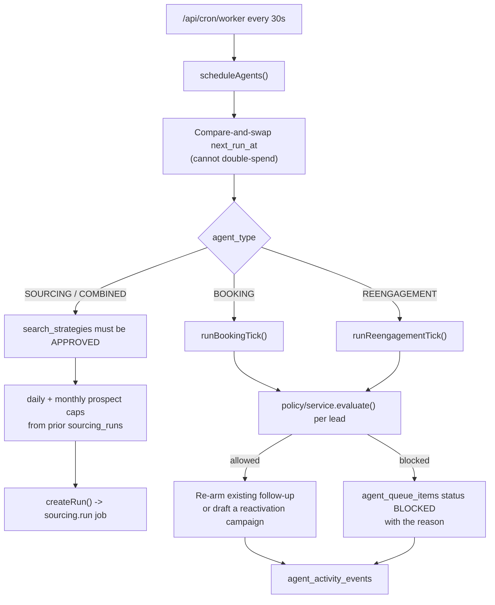
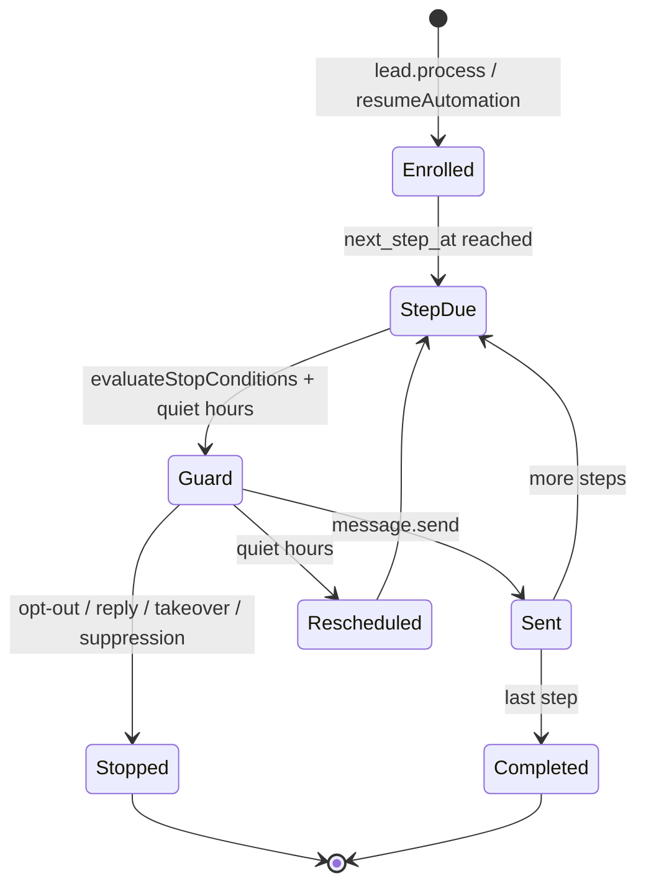

# 08 · Agent and Automation Mesh

Four distinct kinds of "automation" ship in ClientTurn. They are genuinely different and should
stay separate — but three of them are called some form of "agent" and two directories are called
`agent` and `agents`, which makes the codebase far harder to reason about than the design is.

| # | Thing | Directory | Trigger | Unit of work | Tables |
|---|---|---|---|---|---|
| 1 | **Conversation agent** — answers one lead's messages | `lib/agent` | inbound message → `agent.run` job | one bounded turn | `conversation_agent_runs/actions/extractions`, `agent_handoffs`, `conversation_summaries` |
| 2 | **Worker agents** — customer-configured background workers | `lib/agents` | cron → `scheduleAgents()` | one tick | `agents`, `agent_sources`, `agent_queue_items`, `agent_runs`, `agent_activity_events` |
| 3 | **Follow-Up automation** — the per-lead sequence | `lib/automation` + `lib/automations` | `automation.advance` job | one step | `automation_definitions/versions/steps/runs` |
| 4 | **Job queue** — everything else | `lib/jobs` | `pg_cron` → `/api/cron/worker` | one job | `jobs` |

---

## A · Conversation agent (`lib/agent`)

```mermaid
flowchart LR
  IN["Inbound message<br/>message.process_inbound"] --> EV["AgentEvent"]
  EV --> JOB["agent.run job<br/>(off the webhook path)"]
  JOB --> ORCH["runAgentTurn()<br/>orchestrator.ts"]
  ORCH --> LOCK["claim_agent_turn RPC<br/>one turn per conversation"]
  LOCK --> CTX["context.ts<br/>business + lead + history"]
  CTX --> POL1["agent/policy.ts<br/>quiet hours · takeover · opt-out"]
  POL1 --> AI["runTask('agent_decision')<br/>model router"]
  AI --> VAL["validate.ts<br/>schema + tool allow-list"]
  VAL --> TOOLS
  subgraph TOOLS["12 tools"]
    T1["check_service_area"]
    T2["get_calendar_availability"]
    T3["record_qualification_answer"]
    T4["update_lead_fields"]
    T5["send_message"]
    T6["draft_message"]
    T7["send_booking_link"]
    T8["create_booking"]
    T9["request_human_handover"]
    T10["apply_suppression"]
    T11["stop_follow_up"]
    T12["record_reply_classification"]
  end
  TOOLS --> SVC["Existing services:<br/>qualification engine · bookings · send-core · suppression"]
  SVC --> DB[("DB")]
  ORCH --> AUD["conversation_agent_actions<br/>+ audit.ts"]
  ORCH --> REL["release_agent_turn RPC"]
  AI --> USE["ai_runs + ai_token_ledger"]
```

**Verdict: this is the best-built subsystem in the product.** It does real work, it calls
existing services rather than reimplementing them, every tool call is recorded, the turn is
locked so two events cannot answer at once, the model output is schema-validated and the tool
list is an allow-list. Draft mode (`draft_message` + `updateDraft`/`sendDraft`/`discardDraft`)
gives the human-approval path the product promises.

Gaps:

- `assignHandoff` is exported and never called — the Inbox agent panel offers acknowledge,
  resolve and cancel but not assign.
- `agent/availability/index.ts` is an orphan barrel file.

## B · Worker agents (`lib/agents`)

Four types: `SOURCING`, `BOOKING`, `REENGAGEMENT`, `COMBINED`. Autonomy `REVIEW_ALL` /
`REVIEW_NEW` / `AUTO`. Cadence `MANUAL` / `HOURLY` / `DAILY` / `WEEKLY`.

**Verdict: correct orchestration discipline.** The module header states the governing rule and
the code keeps it: *"these agents orchestrate the engines that already exist, they do not
reimplement them."* The booking agent re-arms the existing follow-up automation rather than
opening a second send path; the re-engagement agent uses the same `resolveAudience()` the
Reactivation wizard uses and only drafts a campaign unless autonomy is `AUTO`. Every candidate is
run through `ChannelPolicyService` first, and a blocked candidate is queued **with its reason**
so the operator learns why rather than seeing nothing happen.

This is the one place in the codebase where the warm path *does* consult `policy/service` — which
proves the integration is straightforward and strengthens the recommendation in
[07](07-messaging-conversation-mesh.md).

Gaps:

- `agent_tool_calls` and `agent_budgets` tables exist for worker agents and are never written.
  The conversational runtime has `conversation_agent_actions`; worker agents have only
  `agent_activity_events`, which is narrative rather than structured, so "which tool did this
  agent call and what did it cost" cannot be answered.
- `scheduleAgents()` claims at most 3 due agents per 30-second tick with no fairness ordering.
  At a few hundred active agents this becomes a starvation risk. Flagged in
  [19 · P2](19-missing-architecture-register.md).

## C · Follow-Up automation

One `automation_definitions` row per workspace, versioned into `automation_versions`, with
ordered `automation_steps`, executed per lead as an `automation_runs` row advanced by the
`automation.advance` job.

**Verdict: correct.** Follow-Up is a lead lifecycle automation, not a campaign, and the code
treats it that way. `resolveFallback()` in `follow-up/channel-policy.ts` handles channel fallback
(email → SMS etc.) — badly named, but the logic belongs here.

## D · Job queue

30 registered types, all enumerated in `JobType` and all registered in
`jobs/register.ts` — verified one-to-one, no unregistered type and no orphan handler (`parse.ts`,
`payloads.ts`, `qualify.ts`, `send-store.ts`, `shared.ts` are shared helpers, not handlers).

| Property | Implementation | Verdict |
|---|---|---|
| Claiming | `claim_jobs()` RPC with `FOR UPDATE SKIP LOCKED` | correct |
| Idempotency | unique `idempotency_key` while pending; `23505` on insert returns `null` and is treated as success | correct |
| Retry | `[30, 120, 600, 3600, 21600]` second backoff, `max_attempts` default 5 | correct |
| Permanent failure | `PermanentJobError` skips retry entirely | correct |
| Dead letter | `jobs.state='dead_letter'` + admin retry/cancel/move actions | correct |
| Stalled workers | `reap_stalled_jobs('5 minutes')` at the top of every tick | correct |
| Time-boxing | worker stops *starting* new jobs after 10s of a 60s budget, leaving headroom for the last handler | correct |
| Scheduling | `pg_cron` → `/api/cron/worker` every 30s (`vercel.json` crons is deliberately empty) | correct, documented in `docs/CRON.md` |
| Fan-out | `scheduleEmailPolls()`, `scheduleAgents()`, `scheduleOutreachTick()` at the top of each tick, each idempotency-keyed | correct |

**Verdict: the queue is production-grade.** No changes recommended.

One observation: claiming **one job at a time** (`claimJobs(1, workerId)`) inside a loop means one
round-trip per job. At the current volume this is fine and the comment explains the trade-off
correctly (a batch claim would leave unstarted work locked when the invocation ends). Worth
revisiting only if job throughput becomes the constraint.

## E · Which "agents" only generate text?

The brief asks this explicitly. Answer:

| Surface | Does real work? |
|---|---|
| Conversation agent | **Yes.** Records qualification answers, creates bookings, sends messages, applies suppression, stops follow-up |
| Sourcing agent | **Yes.** Creates real sourcing runs that spend real provider budget |
| Booking agent | **Yes.** Re-arms follow-up automations, subject to policy |
| Re-engagement agent | **Yes**, up to a point — it *drafts* campaigns and only launches under `AUTO` autonomy. That is a deliberate safety choice, not a stub |
| **Copilot** | **No AI at all.** `answerFrom()` is a regex router; the sentences are template strings built from tool results. It *does* run real read and write tools, so it is not a stub — but it is not a model-driven assistant either. See [10](10-ai-copilot-mcp-mesh.md) |

Nothing here is a text-only fake. The one honesty gap is Copilot's framing, not its behaviour.

## F · Naming remediation (no behaviour change)

| Current | Proposed |
|---|---|
| `lib/agent` | `lib/conversation-agent` |
| `lib/agents` | `lib/worker-agents` |
| `lib/automation` + `lib/automations` | `lib/follow-up/engine` + `lib/follow-up/api` |
| `lib/follow-up/channel-policy.ts` | `lib/follow-up/channel-availability.ts` |
| `conversation_agent_runs` vs `agent_runs` | leave the tables; document the split |

Mechanical, low risk, and it removes the single largest source of reader confusion in the
repository.
