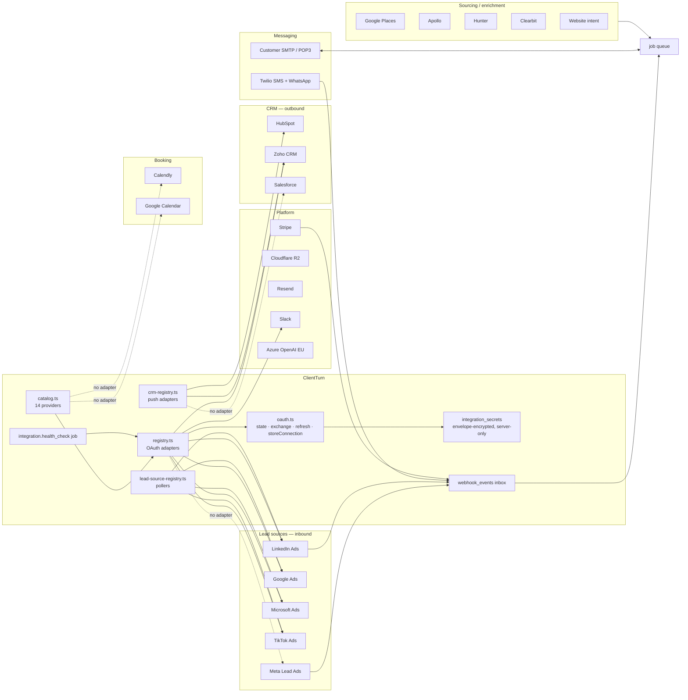

# 09 · Integration Mesh

---

## A · The mesh

## B · What is shared, and it is a lot

The brief warns against "ten provider implementations repeating identical infrastructure". That
is **not** what happened here. `integrations/oauth.ts` is a genuine shared framework:

| Concern | Shared implementation |
|---|---|
| CSRF state | `createOAuthState()` / `consumeOAuthState()` → `integration_oauth_states` |
| Authorize URL | `buildAuthorizeUrl()` with per-provider `extraAuthorizeParams` |
| Code exchange | `exchangeCodeForToken()` |
| Refresh | `refreshAccessToken()`, keeping the old refresh token when the provider omits one (Google) |
| Storage | `storeConnection()` upserting on `(business_id, provider_type)` |
| Live token | `getLiveAccessToken()` — refreshes if expired or near expiry |
| Redirect URI | one function, `/api/integrations/<provider>/callback` |
| Secrets | `security/secret-box.ts` envelope encryption into `integration_secrets`, server-only |
| Health | `runIntegrationHealthChecks()`, shared by the queued job **and** the Settings "Refresh" button, explicitly so the two can never drift |
| Webhooks | one `webhook_events` inbox with unique `(provider, external_event_id)`, verify → store → ack → enqueue |
| Route | one dynamic `[provider]` connect/callback pair |

A provider adapter is therefore small: `registerOAuthProvider(type, { getConfig, identify })`,
plus optionally `registerLeadSourcePoller(type, { poll })` or
`registerCrmProvider(type, { push })`.

**This is the abstraction the rest of the codebase should be modelled on.**

## C · Registered adapters vs catalogue

| Provider | In catalogue | OAuth adapter | Lead poller | CRM push | Status |
|---|---|---|---|---|---|
| Google Ads | ✅ | ✅ | ✅ | — | Working |
| Microsoft Ads | ✅ | ✅ | ✅ (raises `PermanentJobError`) | — | **Connect-only.** The poller deliberately refuses: Microsoft publishes no lead-retrieval API. Honest, and the code says so |
| TikTok Ads | ✅ | ✅ | ✅ | — | Working |
| LinkedIn Ads | ✅ | ✅ | ✅ + webhook | — | Working |
| Slack | ✅ | ✅ | — | — | Working (`notification.slack`) |
| HubSpot | ✅ | — (pasted private-app token, deliberately) | — | ✅ | Working |
| Zoho CRM | ✅ | ✅ | — | ✅ | Working |
| **Salesforce** | ✅ | ❌ | — | ❌ | **Catalogue entry with no implementation.** `0023_salesforce_provider.sql` added the provider type; no adapter was ever registered |
| **Meta** | ✅ | ❌ | — | — | No `registerOAuthProvider("meta")`. Meta Lead Ads is the *headline* lead source in the product spec |
| Calendly | ✅ | ❌ | — | — | No adapter |
| Google Calendar | ✅ | ❌ | — | — | No adapter |
| Twilio SMS / WhatsApp | ✅ | n/a (account credentials) | — | — | Working |
| Email (SMTP/POP3) | ✅ | n/a (credentials) | — | — | Working |

**Correction (verified 2026-09-07).** An earlier draft of this document claimed these four
providers render a Connect button that dead-ends on a raw 503. **That is wrong.** Every provider
without an adapter also carries `connectPath: null`, and two independent guards act on it:
`integrations/queries.ts:130` blocks the card as `{ kind: "unavailable" }` with a "Not yet
available" panel, and `connection-setup-drawer.tsx:161` disables the Connect button outright. The
customer-visible behaviour is correct today.

`/api/integrations/[provider]/connect` is the third layer: `getOAuthProviderConfig()` returns null
and the route responds `503 {"error":"This integration is not yet available."}` — a backstop that
should never be reached through the UI.

**The real risk is the inverse**, and nothing guarded it: giving a provider a `connectPath`
*before* registering its adapter renders an enabled button that does dead-end on the 503.
`tests/wiring.test.ts` now asserts both directions — every `connectPath` has an adapter, and every
adapter is reachable from the catalogue.

## D · Missing integration architecture

| # | Gap | Consequence | Priority |
|---|---|---|---|
| I1 | **Meta Lead Ads has no implementation at all** — no `registerOAuthProvider("meta")`, no `registerLeadSourcePoller("meta")`, and no `/api/webhooks/meta` route. Yet it is in the catalogue with `META_APP_ID`/`META_APP_SECRET`, has an admin provider-config panel (`admin/providers.ts:90`), is a Dashboard health tile (`dashboard/queries.ts:597`), is checked by the onboarding "Connect Leads" step (`checkMetaConnection`), gates the `META_LEAD_ADS` agent source, and `admin/jobs.ts` maps `lead_source.poll` to it | The product is described end to end around Meta Lead Ads and no lead can arrive from it | **P0 if Meta is in scope for launch** |
| I2 | `sync_runs`, `sync_conflicts`, `external_entity_links` are never written | The bidirectional-sync model was designed and not built. CRM integration is push-only, one-way | P2 |
| I3 | No token-refresh failure → `ACTION_REQUIRED` notification path for lead pollers | A silently expired Google Ads token stops lead ingestion; the health job flags it, but only Twilio and token probes are implemented in `probe()` | P1 |
| I4 | `field_mappings` and `integration_objects` exist but CRM push uses a fixed `CrmLeadInput` shape | Field mapping is advertised in the catalogue copy and not configurable | P2 |
| I5 | `crm.push` writes `crm_push_records` but there is no compensation path if the CRM accepts the contact and rejects the deal | Partial state in the external system, invisible here | P2 |
| I6 | Booking providers (Calendly, Google Calendar) have no adapter, yet `booking.sync` is a registered job and `bookings` has an external id | Booking sync is scaffolding | P1 |

## E · Health and observability

`runIntegrationHealthChecks()` probes each live connection and writes `status`,
`last_success_at`, `last_error_code`, `last_error_message` back to `integrations`, and raises a
notification on the HEALTHY → ACTION_REQUIRED transition only (correctly — it does not re-notify
on every tick).

`probe()` currently implements: Twilio (real API call), and a generic token probe. Every other
provider falls through to a default. So "healthy" for Google Ads, TikTok, LinkedIn, Zoho and
Slack means *"we hold a token that has not obviously expired"*, not *"the integration works"*.
That is worth stating in the UI rather than showing a green pill.

**Admin surface:** `/admin/system` exposes provider health (`platform_provider_checks`,
`platform_providers`), webhook replay (`safeRetryEvent`), error triage
(`platform_error_triage`) and job control (`retryJob`, `cancelJob`, `moveJobToDeadLetter`). This
is a good operator toolkit and covers most of the questions in §38 of the brief.

## F · Workspace connectors (`0045_app_installs`)

A second, newer integration model: `workspace_app_installs` + `workspace_app_events`, with
`/api/apps/[id]/events` receiving pushes into `receive_workspace_app_event()` and the `app.ingest`
job processing them. Secret generation is `generateConnectorSecret`; failures go through
`record_workspace_app_failure()`.

This is a clean design and does **not** duplicate the OAuth framework — it serves a different
case (a third party pushing to us, rather than us pulling from them). Keep both.
`workspace_app_events` has no reader outside the RPC, so the admin surface for connector event
history does not exist yet.
