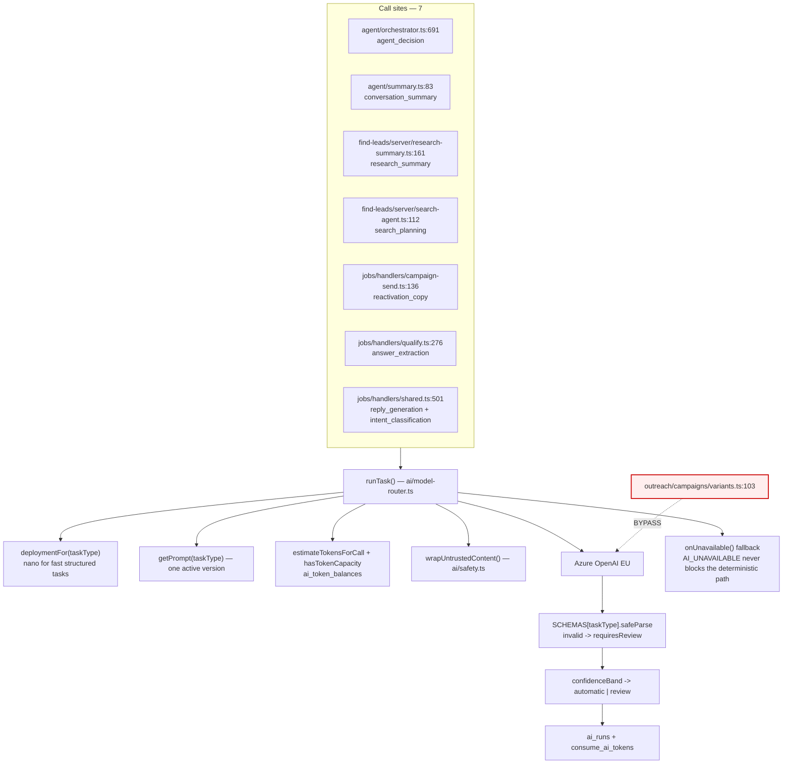
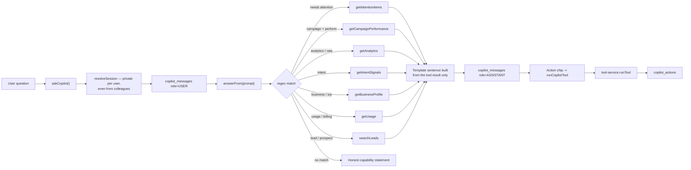
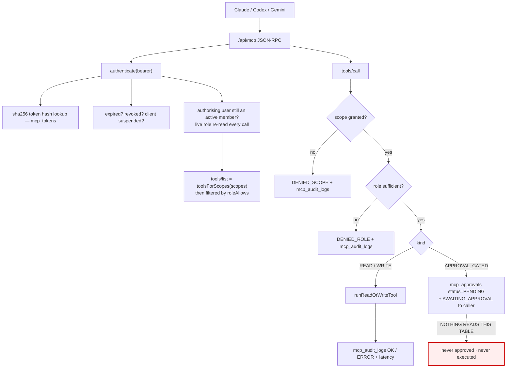
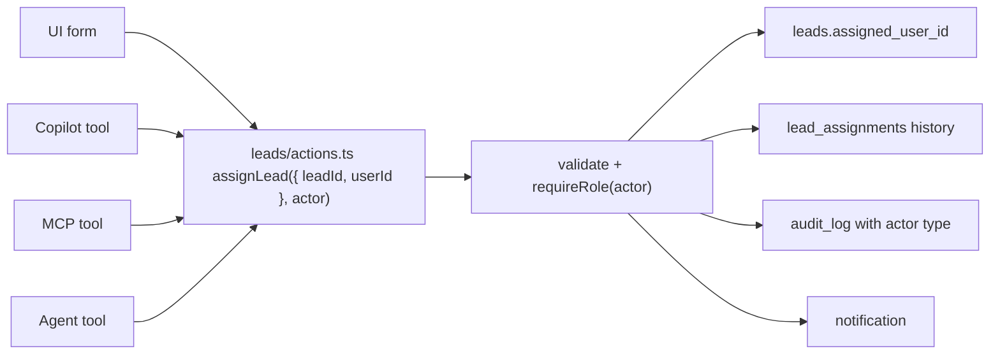

# 10 · AI, Copilot and MCP Mesh

---

## A · Every AI call in the product

There are exactly **nine** AI tasks, all declared in `ai/schemas.ts`, all prompted from
`ai/prompts.ts` via the single-version `PROMPT_REGISTRY`, and all executed through one function.



| Task | Where | What it decides | Deterministic system of record |
|---|---|---|---|
| `intent_classification` | inbound message | intent label + confidence | rules run first; low confidence → REVIEW |
| `answer_extraction` | qualification | candidate value for a *configured* question | `qualification/engine.ts` makes the decision |
| `reply_generation` | conversation agent | wording of a reply | tools and policy decide whether to send |
| `agent_decision` | conversation agent | which allowed tool to call | `agent/validate.ts` enforces the allow-list |
| `conversation_summary` | inbox | summary text | none needed |
| `handover_reasoning` | handoff | reason text | none needed |
| `research_summary` | prospect research | prose summary | scoring is deterministic |
| `search_planning` | Find Leads chat | proposed search plan | plan must be APPROVED by a human before a run |
| `reactivation_copy` | campaign send | message personalisation | template + merge fields are fixed |

**This satisfies CLAUDE.md resolved-conflict 1.** AI never composes a binding promise, quote,
availability or service area; the deterministic engines remain the system of record; low
confidence produces REVIEW and human handover; and `AiUnavailableError` degrades to a fallback
rather than blocking.

### A1 · The one bypass — P1

[`src/lib/outreach/campaigns/variants.ts:103`](../../src/lib/outreach/campaigns/variants.ts)
calls `chat()` on the Azure client directly:

```ts
import { chat, isAzureConfigured, AiUnavailableError } from "@/lib/ai/azure-client";
```

Consequences, all verified by reading the file:

| Lost | Because |
|---|---|
| Prompt versioning | Its system prompt is a local `const SYSTEM`, not a `PROMPT_REGISTRY` entry, so a change is untracked and unrollbackable |
| Token capacity check | `hasTokenCapacity()` is never called — variant generation can run a workspace past its AI allowance |
| Usage metering | No `ai_runs` row, no `consume_ai_tokens`. This AI spend is invisible to Billing & Usage *and* to `/admin/economics` margin reporting |
| Model routing | Hard-coded deployment rather than `deploymentFor(taskType)` |
| Confidence banding | No structured confidence, so no automatic REVIEW |

What it *does* do well and should be kept: `wrapUntrustedContent()` on inputs, a merge-field
allow-list, and a blunt `PROHIBITED` regex list that rejects rather than edits any proposal
containing a price, a guarantee, an accreditation or a response-time claim. That guard is the
right shape and directly implements the "never fabricate customer proof" rule.

**Fix:** register `variant_generation` as a tenth task and route it through `runTask()`, keeping
the merge-field and prohibited-claim guards as post-validation.

## B · Copilot



**There is no model call anywhere in Copilot.** The header comment says so plainly:
*"There is no free-text generation here at all. Every sentence below is built from numbers a tool
returned."* That is a defensible product decision — it makes fabricated insights structurally
impossible — but it should be stated to the user, because the affordance implies a model.

### Copilot tool table

18 tools declared in `copilot/types.ts`; 18 branches in `tool-service.execute()`. Cross-checked:

| Declared | Implemented | Note |
|---|---|---|
| 10 read tools | ✅ all | `searchLeads`, `getLead`, `getProspects`, `getCampaign`, `getCampaignPerformance`, `getAnalytics`, `getBusinessProfile`, `getIntentSignals`, `getUsage`, `getAttentionItems` |
| `pauseCampaign`, `resumeCampaign`, `updateCampaignPriority`, `createCampaignDraft` | ✅ | Delegate to `outreach/campaign-actions.ts` — **correct pattern** |
| `updateBusinessFact` | ✅ | Delegates to `saveFact`, which refuses to overwrite a locked fact — **correct** |
| `createSupportTicket` | ✅ | Delegates to `createSupportTicket` — **correct** |
| `assignLead` | ⚠️ **reimplemented** | Writes `leads.assigned_user_id` directly; skips `lead_assignments` and `audit_log` |
| `markNeedsAttention` | ⚠️ **reimplemented** | Writes `leads.needs_attention` directly; skips `setNeedsAttention`'s audit row |
| `createSearchSession` | ❌ **unreachable** | Declared in `types.ts`, no `case` in `execute()` → falls to `"That action is not available yet."` |
| `startSourcingRun` | ❌ **unreachable** | Same. Declared `requiresConfirmation: true`, so the UI will offer a confirmation dialog for an action that cannot run |

So Copilot is **16 of 18 working, 2 divergent, 2 unreachable**. The two divergent ones are the
same defect as MCP's — see [18 · D1](18-duplication-bloat-register.md).

`runCopilotTool` handles the confirmation flag correctly: it does not trust the client's
`confirmed`, it checks it against the tool's own `requiresConfirmation`, and it logs the
invocation either way.

## C · MCP



### What MCP gets right

- Token is stored **hashed**; a leaked row cannot be replayed.
- The authorising user's **live** role is re-read on every call, so a demotion takes effect
  immediately rather than at token expiry.
- Scope is checked *before* the tool runs and a denial is **audited with the reason** rather than
  returning an empty result.
- `tools/list` is filtered by both scope and role, so an assistant is never shown a tool it cannot
  use.
- Every call — allowed, denied or failed — writes an `mcp_audit_logs` row with latency.
- High-impact tools (`send_message`, `launch_campaign`, `start_sourcing_run`,
  `change_overage_cap`) never execute inline; they park, and the caller is told plainly that
  nothing has been done.
- `create_lead` enforces the Prospect/Lead boundary at the API edge and records a
  `contact_permissions` row via the shared `recordPermission()`.

This is a well-designed gateway.

### What MCP gets wrong

| # | Problem | Evidence |
|---|---|---|
| **M1** | **The approval queue has no consumer.** `mcp_approvals` is written in `gateway.ts:197` and read by nothing — no page, no action, no job. Four of the fifteen tools are permanently inert, and the requester receives a promise ("queued for review") the product cannot keep | grep for `mcp_approvals` returns one hit |
| **M2** | **The module header is false.** It claims *"It calls the same domain services the UI does. There is no path from here to a raw table write."* `handlers.ts` contains direct `db.from("leads").update(...)` calls for `assign_lead` and `update_lead_status`. A false safety claim in a comment is worse than no comment | `mcp/handlers.ts:173`, `:199` |
| **M3** | `update_lead_status` writes `status` only — no `won_at`/`booked_at`/`qualified_at`/`lost_at`, no `qualification_state` sync, no `automation_active` shutdown on WON/LOST, no `audit_log`, no `enqueueCrmPushes` | compare with `leads/actions.ts:130` |
| **M4** | `assign_lead` writes `assigned_user_id` only — no `lead_assignments` history row, no `audit_log` | compare with `leads/actions.ts:57` |
| **M5** | `create_lead` does not call `checkLeadDuplicates`, and `leads` has no unique constraint on email or phone, so MCP is the easiest way to create duplicate leads | `mcp/handlers.ts:122` |
| **M6** | `mcp_scopes` table exists; scopes are a hard-coded union in `tools.ts`. Either make the table authoritative or drop it | [20](20-dead-code-register.md) |
| **M7** | No rate limiting on `/api/mcp`. `security/rate-limit.ts` exists and is used elsewhere | [19 · P2](19-missing-architecture-register.md) |

## D · The target: one action, four doors



The only change needed to the actions themselves is an explicit `actor` parameter —
`{ type: "user" | "copilot" | "mcp" | "agent"; userId: string; clientId?: string }` — so
`recordAudit` can attribute correctly without the action having to resolve a session. `recordAudit`
already accepts `actorType`, so most of the work is done.

Effort estimate: `assignLead`, `updateLeadStatus`, `setNeedsAttention` and `createManualLead` are
the four actions involved. Roughly 200 lines changed across three files, plus tests. This is the
single highest-value change identified by this audit.
