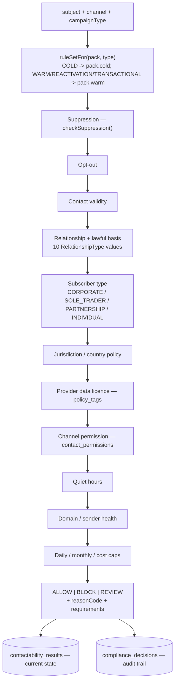
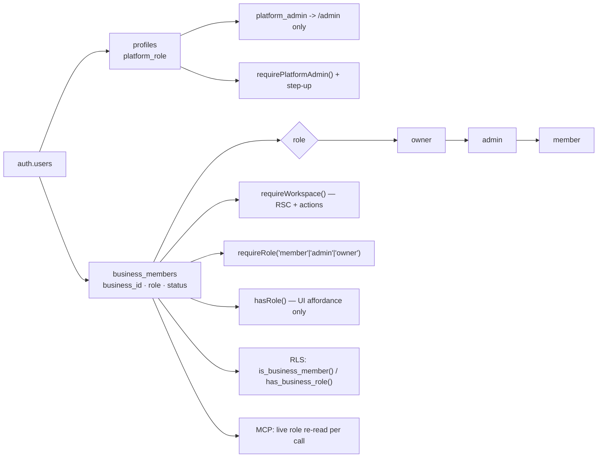
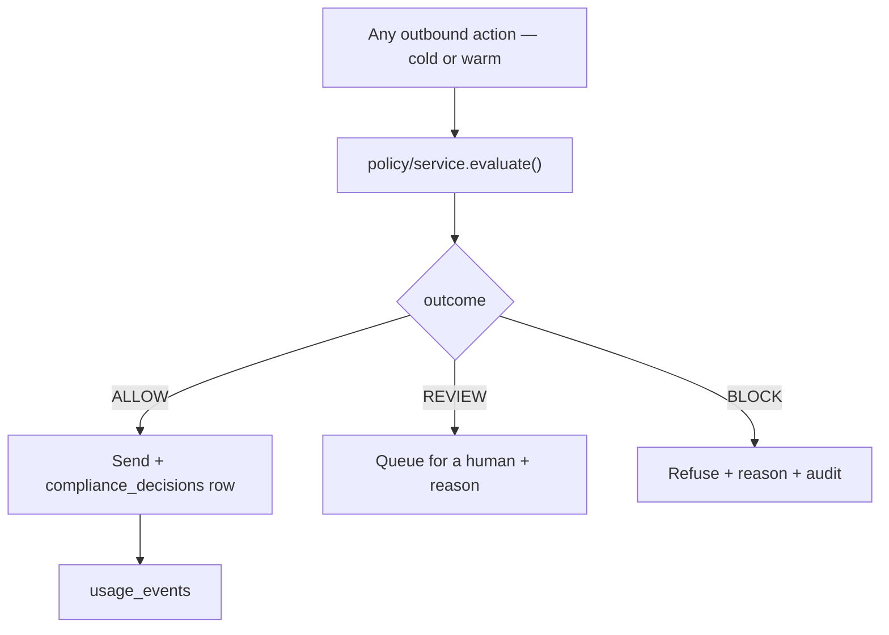

# 11 · Compliance and Permission Mesh

---

## Part 1 · Contactability

### 1.1 · The engine that exists

`lib/policy/` implements a full contactability engine, split correctly into a pure decision core
and an I/O shell:

- **`channel-policy.ts`** — pure, no Supabase, no `server-only`. `canSend(input)` runs the rules
  cheapest-and-most-absolute first, so a suppressed contact is never evaluated against a budget
  and no decision is ever "allowed on a technicality because an earlier rule was skipped".
- **`service.ts`** — gathers inputs, calls `canSend()`, and records the decision **with its policy
  version and an evidence snapshot**, so an audit can reconstruct why a send was permitted even
  after the pack changes.
- **`packs.ts` / `compliance_policy_versions`** — the rules are versioned database rows, so
  counsel can change policy without a deploy and a past decision can be replayed against the pack
  that produced it.
- **`suppression.ts`** — destination-scoped (not record-scoped), so suppressing an address also
  stops a *different* lead or prospect that shares it. Platform-wide rows (`business_id is null`)
  outrank workspace rows.

Requirements travel with the decision — `UNSUBSCRIBE_LINK`, `POSTAL_FOOTER`, `PRIVACY_NOTICE`,
and a WhatsApp approved-template requirement for any business-initiated conversation.

**The warm rule set already exists.** `ruleSetFor()` maps `REACTIVATION` and `WARM` to
`pack.warm` and the comment explains why: *"Reactivation is warm by definition — it only ever
targets leads the business already has a relationship with."*

### 1.2 · The engine is not connected to the warm path

| Caller | Uses `policy/service` |
|---|---|
| `outreach/dispatch.ts` (cold send) | ✅ `evaluate()` |
| `jobs/handlers/sourcing-run.ts` (stage 12) | ✅ `evaluateAllChannels()` |
| `agents/ticks.ts` (booking + re-engagement agents) | ✅ `evaluate()` |
| `leads/add-lead/contactability.ts` (Add Lead wizard) | ✅ `evaluateAllChannels()` |
| `imports/actions.ts` (CSV import) | ✅ `recordPermission()` |
| `mcp/handlers.ts` (create_lead) | ✅ `recordPermission()` |
| **`jobs/handlers/message-send.ts`** | ❌ |
| **`jobs/handlers/campaign-send.ts`** (reactivation) | ❌ |
| **`jobs/handlers/automation-advance.ts`** (follow-up) | ❌ |
| **`leads/actions.ts sendManualMessage`** | ❌ |

The warm path instead uses `jobs/send-core.ts evaluateSend()`, which checks four things:
stop conditions (opt-out, suppression flag, human takeover, has-replied), quiet hours, origin
exemptions, and nothing else.

**Consequences:**

1. No `compliance_decisions` row is written for any SMS, WhatsApp, follow-up or reactivation
   message. The question *"why was this message allowed to go out?"* has an answer for cold email
   and no answer for everything else.
2. The warm path reads `contact_suppressions`; the cold path reads `suppression_entries`. They are
   never joined. See 1.3.
3. `contact_permissions` — the consent record — is written by the Add Lead wizard, imports and
   MCP, and is **never read by the warm send path**. A workspace can therefore record that a lead
   has no marketing consent and still have follow-up SMS sent to them.
4. WhatsApp template requirements are enforced only on the cold path, which never uses WhatsApp.

The fix is not new architecture. It is passing `campaignType: "WARM"` into the existing
`evaluate()` from `send-core`, which already has the lead, channel and quiet hours in scope.

### 1.3 · Two suppression lists — P0

| | `contact_suppressions` | `suppression_entries` |
|---|---|---|
| Introduced | `0003_leads.sql` (V3) | `0030_v4_compliance.sql` (V4) |
| Key | `normalized_contact` + `channel` | `email` / `phone_e164` / `social_identifier` + `channel` |
| Scope | workspace | workspace **or platform** (`business_id is null`) |
| Expiry | none | `expires_at` |
| Written by | SMS `STOP` (`message-inbound.ts:127`), `leads/actions.ts`, `agent/tools.ts apply_suppression`, unsubscribe page | `policy/suppression.suppress()`, cold reply opt-out, admin compliance, prospect actions, unsubscribe page |
| Read by | `jobs/handlers/shared.ts:280`, `leads/actions.ts:400`, `campaigns/queries.ts` | `check_suppression()` RPC only |

**Neither list is visible to the other**, except at `/unsubscribe/[token]`, which is the only code
path that writes both.

Concrete failure, both directions:

- A lead texts **STOP**. `contact_suppressions` gets a row. The next cold acquisition campaign
  that happens to include the same email address is **not blocked**.
- A cold prospect replies "unsubscribe". `suppressProspect()` writes `suppression_entries` with
  channel `ALL`, and the code comment states the intent explicitly: *"An opt-out is a person
  saying do not contact me, not not by email — it applies to every channel."* If that person is
  later promoted or imported as a lead, warm follow-up SMS is **not blocked**.

For a UK product this is the most serious compliance finding in the audit.

**Recommendation — MIGRATION REQUIRED:**

1. Backfill `contact_suppressions` into `suppression_entries` (normalising `normalized_contact`
   into `email` or `phone_e164` by shape).
2. Replace `contact_suppressions` with a view of the same name over `suppression_entries` so
   existing readers keep working during the transition.
3. Point `jobs/handlers/shared.ts`, `leads/actions.ts` and `campaigns/queries.ts` at
   `checkSuppression()`.
4. Drop the view.

## Part 2 · Permissions

### 2.1 · The chain

Three roles, one ladder, checked in five places that all resolve from the same
`business_members` row. **No cross-workspace leakage was found**: every server action resolves
`businessId` from the session and never accepts it from the client — verified in
`copilot/actions.ts` (which states this explicitly and does it), `mcp/gateway.ts`, and by
inspection of the action signatures.

### 2.2 · Verified good

| Control | Evidence |
|---|---|
| RLS on all 174 tables | [04 · §4](04-database-audit.md) |
| Server-only tables have RLS and **no policies** | `0010_rls.sql` |
| No `using (true)` policy anywhere | grepped |
| Nothing granted to `anon` | grepped |
| Column-level grants where appropriate | `grant update (first_name, last_name, phone, avatar_url) on profiles` |
| Service-role client is `server-only` | `lib/supabase/admin.ts` |
| Secrets envelope-encrypted | `security/secret-box.ts` → `integration_secrets` |
| SSRF guard on outbound fetches | `security/safe-fetch.ts`, covered by `tests/ssrf.test.ts` |
| Admin uses a separate route, separate session and mandatory step-up | `admin/login`, `admin/step-up.ts`, `requirePlatformAdmin()` |
| `platform_role` checked server-side against the database | `is_platform_admin()` |
| Cross-tenant tests run against the real database | `tests/rls.test.ts`, `tests/rls-v4.test.ts` |

This section of the system is in good shape and needs no remediation.

### 2.3 · Gaps

| # | Gap | Priority |
|---|---|---|
| P1 | **`hasRole()` is used for UI gating and the corresponding server check is not always present.** Spot-checked several actions and they do call `requireRole`, but there is no test that asserts *every* mutating action performs a server-side role check. A `member` calling an admin-only action directly would be the failure mode | P1 — add the test |
| P2 | `mcp_scopes` table is unused; scopes are a hard-coded union. If scope definitions are meant to be operator-editable, the table should be authoritative | P2 |
| P3 | No rate limit on `/api/mcp` even though `security/rate-limit.ts` and a `consume_rate_limit()` RPC exist | P2 |
| P4 | `agent_budgets` (per-agent spend ceiling) is never written, so a worker agent is bounded by the workspace budget but not by its own | P2 |

## Part 3 · Data governance

| Control | State |
|---|---|
| Provenance | **Excellent.** `prospect_data_sources` carries provider, source type, source URL, confidence, cost and `policy_tags` per field. `policy_tags` travels with the value, so a data-use restriction survives into the send decision |
| Consent record | `contact_permissions`, written by wizard/import/MCP, **not read by the warm path** |
| Lawful basis | Encoded as `RelationshipType` (10 values) and `SubscriberType` (4 values), applied only on the cold path |
| Privacy requests | `privacy_requests` + `updatePrivacyRequest` + reference generator. Admin-only surface exists |
| Retention | `retention.cleanup` job, daily. Prunes `message_events` among others |
| Right to erasure | `deleteWorkspace` + `exportWorkspaceData` exist. Per-*subject* erasure is handled through `privacy_requests` manually — there is no automated cascade |
| Audit | `audit_log` written by `recordAudit()`; `mcp_audit_logs` and `copilot_actions` are separate. **Three audit trails** — see [15](15-event-catalogue.md) |
| Privacy notices | `privacy_notice_events` written; used for the "we told them where we got their data" record |
| Sub-processors | Public page exists and is data-driven from `marketing/subprocessors.ts` |

## Part 4 · The compliance gate, as it should be

One gate, one decision table, one suppression list, for every channel and every origin. The
engine to do this already exists and is already correct; three call sites need to be pointed at
it.
