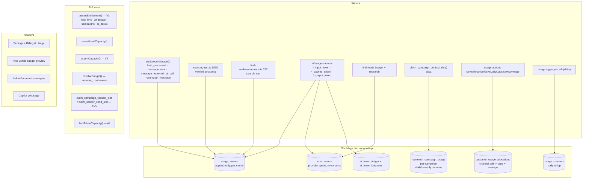

# 12 · Usage and Billing Mesh

---

## A · What exists



## B · Findings

### 12.1 · P0 — the customer-facing meter and the enforced meter are different numbers

| Allowance | What Billing & Usage shows | What the system enforces against |
|---|---|---|
| **Sourcing (`verified_prospect`)** | `usage-service.getPeriodCounts()` — `count(*)` of **every `prospects` row created this period, any status** | `budget.resolveBudget()` — `sum(usage_events.quantity)` where metric = `verified_prospect`, which the worker writes **only for `counters.ready`** |
| **Communication (`email_sent`)** | `usage-service.getChannelUsage()` — `count(*)` of `messages` rows this period | **nothing** — see 12.2 |
| **Search runs** | `count(*)` of `sourcing_runs` rows | `sum(usage_events.search_run)` |
| **Intent monitors** | `count(*)` of ACTIVE monitors | `assertCapacity("intent_monitor")` → `usage_events` |

The sourcing discrepancy is not marginal. A run that discovers 800 companies and produces 120
READY prospects charges **120** against the allowance and displays **800+** on the billing page.
A customer will see themselves over an allowance the system is not enforcing, or under one it is.

**Fix:** one function. `getV4Usage(metric, periodStart)` should be the only reader, and the
billing page should call it.

### 12.2 · P0 — the cold-email allowance is never metered or enforced

`email_sent` is a first-class `V4Metric`: it has a `plan_entitlements` row, a soft limit, a hard
limit, an overage price, and it drives the daily-cap arithmetic and the overage cap on the Billing
page (`usage-service.ts:128`, `:169`; `usage-actions.ts:163`, `:241`).

Verified by grep:

- **No code ever inserts a `usage_events` row with metric `email_sent` or `cold_email_sent`.**
- `assertCapacity("email_sent")` is never called. In fact `assertCapacity` is called from exactly
  **one** place in the entire codebase — `intent/actions.ts:193`, for `intent_monitor`.

What *is* enforced at send time is per-campaign caps (`daily_contact_cap`,
`monthly_contact_cap` via `claim_campaign_contact_slot()`) and the per-sender daily cap
(`claim_sender_send_slot()`). Both are atomic SQL claims with correct release-on-failure, and
both are workspace-configured — **not** plan entitlements.

So a Starter workspace can create ten campaigns, each within its own cap, and send far past the
plan's `email_sent` hard limit. The primary revenue meter of the acquisition product does not
meter.

### 12.3 · P1 — `getV4Usage` can silently under-count

```ts
const { data } = await admin
  .from("usage_events")
  .select("quantity")
  .eq("business_id", businessId)
  .eq("metric", metric)
  .gte("occurred_at", from);

return (data ?? []).reduce((total, row) => total + Number(row.quantity), 0);
```

This fetches every matching row and sums in JavaScript. PostgREST applies a server-side maximum
row count (Supabase default 1,000). Once a workspace exceeds that many usage events for a metric
in a period, **the sum silently truncates and the allowance stops being enforced**.

`usage-service` has the right pattern elsewhere — `{ count: "exact", head: true }` — and the
comment on `getChannelUsage` even says *"counted by Postgres rather than scanned."*
`getV4Usage` should be a `sum()` in SQL.

### 12.4 · P1 — variant generation is unmetered AI spend

See [10 · A1](10-ai-copilot-mcp-mesh.md). `outreach/campaigns/variants.ts` calls Azure directly,
so it writes no `ai_runs`, consumes no tokens from `ai_token_balances`, and produces no
`cost_events`. That spend is invisible to the customer's AI meter **and** to `/admin/economics`
margin reporting, which means gross margin per workspace is overstated by exactly this amount.

### 12.5 · P1 — two plan definitions

| Source | Contents | Read by |
|---|---|---|
| `billing/plans.ts` `PLANS` (code) | price, lead limit, user limit, whatsapp, campaigns, ai_assist, feature copy | pricing page, checkout, upgrade cards |
| `plan_entitlements` (table) | per-metric soft/hard limit, overage flag, overage price, unit | `getV4Entitlements` |
| `subscriptions` columns | `lead_limit`, `user_limit`, `whatsapp_enabled`, `campaigns_enabled`, `ai_assist_allowed` | `getEntitlements` (V3) |

Three places describe what a plan includes. `getV4Entitlements()` layers on `getEntitlements()`,
so the two systems are chained rather than conflicting — but a plan change has to be made in code
*and* in a table *and* on every existing subscription row, and nothing checks that they agree.

**Recommendation:** move the V3 booleans and limits into `plan_entitlements` as metrics
(`lead`, `seat`, `whatsapp_enabled`, `campaigns_enabled`, `ai_assist_enabled`), keep `PLANS` as
marketing copy and Stripe price ids only, and make `plan_entitlements` the single authority.

### 12.6 · P2 — `usage_reservations` is a designed-and-abandoned table

The table exists (`0032`), the `expire_usage_reservations()` RPC exists, and the daily cron calls
it every night — against a table nothing has ever written a row to. Either implement reservations
(the sourcing budget guard reserves against `sourcing_runs.spent_cost_minor` instead, with a
compare-and-swap, which works) or drop the table and the RPC call.

### 12.7 · P2 — no single usage ledger

`usage_events` is *nearly* the single ledger and should become it. Today:

| Ledger | Should be |
|---|---|
| `usage_events` | **KEEP — make canonical** |
| `usage_counters` | KEEP as a derived daily rollup, written only by `usage.aggregate` |
| `cost_events` | KEEP — this is *provider cost*, a different fact from *customer usage*. Correctly separate |
| `ai_token_ledger` / `ai_token_balances` | KEEP — a prepaid balance needs its own double-entry model. But every debit should also emit a `usage_events` row |
| `outreach_campaign_usage` | KEEP — per-campaign rate limiting, not billing. Rename to `outreach_campaign_rate_limits` to stop it reading as a ledger |
| `customer_usage_allocations` | KEEP — configuration, not usage |

## C · Usage-producing events, and whether they are charged

| Event | Should charge | Actually charges |
|---|---|---|
| Search run started | `search_run` | ✅ `usage_events` |
| Prospect verified READY | `verified_prospect` | ✅ `usage_events` |
| Prospect discovered (not ready) | nothing | ✅ nothing (but the billing page counts it) |
| Enrichment provider call | provider cost | ✅ `cost_events` |
| Verification provider call | provider cost | ✅ `cost_events` |
| **Cold email sent** | `email_sent` | ❌ **nothing** |
| SMS sent | `message_sent` + provider cost | ✅ `usage_events` + `messages.cost_amount` |
| WhatsApp sent | `message_sent` | ✅ |
| Reactivation message | `campaign_message` | ✅ |
| Inbound message | `message_received` | ✅ |
| Lead processed | `lead_processed` | ✅ |
| AI call via `runTask` | tokens + cost | ✅ all three ledgers |
| **AI call via `generateVariants`** | tokens + cost | ❌ **nothing** |
| Agent tick | underlying work only | ✅ (correct — the tick itself is free) |
| Copilot tool call | underlying work only | ✅ (correct) |
| MCP tool call | underlying work only | ⚠️ correct in principle, but MCP writes bypass the actions that would record usage |

Double-billing risk: **none found.** `recordUsage` is called once per event at a single site per
metric, and `claim_campaign_contact_slot` releases the slot on any post-claim failure so a
policy block does not consume the day's capacity.

Reset bugs: **none found.** Period boundaries come from `subscriptions.current_period_start`
throughout; daily counters compare a stored date against `now()` and reset to 1 rather than
incrementing a stale count.

## D · Stripe

- Test keys only, per `CLAUDE.md`: `STRIPE_SECRET_KEY_TEST` / `NEXT_PUBLIC_STRIPE_PUBLISHABLE_KEY_TEST`.
- Webhook verifies the signature, writes `webhook_events` with a unique `(provider,
  external_event_id)`, acknowledges, then queues. Correct shape.
- Checkout (`startPlanCheckout`), portal (`openBillingPortal`), AI top-up (`startTokenTopUp`) and
  affiliate Connect payouts all exist and are wired.
- Admin can change plan, apply and reverse credits, grant and revoke entitlements, and extend
  trials — all writing `billing_credit_entries` / `business_entitlement_grants` with audit rows.

No issues found in the Stripe layer.
