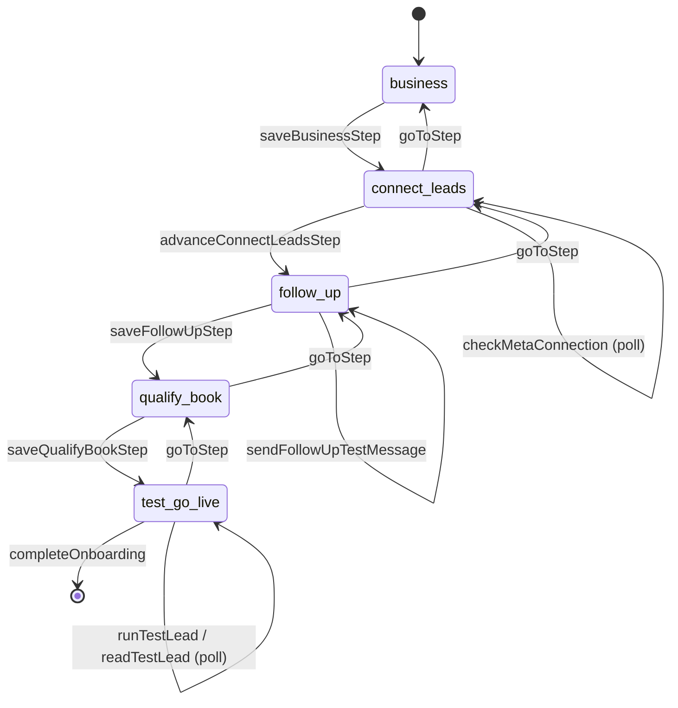

# 14 · Wizard and Multi-Step Flow Audit

Seven wizards ship. For each: the states, where the draft lives, and what happens on refresh,
back, cancel and completion.

---

## Summary

| Wizard | Steps | Draft persistence | Survives refresh | Resume from list | Cancel leaves | Verdict |
|---|---|---|---|---|---|---|
| Onboarding | 5 | **Server** (`business_settings.onboarding_step`) | ✅ | ✅ (`goToStep`) | n/a — blocking | **KEEP** |
| Acquisition campaign | 6 | **Server** (`outreach_campaigns` DRAFT + `outreach_campaign_versions`) | ✅ | ✅ (`findResumableDraft` + `?draft=`) | a DRAFT campaign row | **KEEP** |
| Affiliate onboarding | 3 | `sessionStorage` | ⚠️ same tab only | ❌ | nothing | **KEEP + FIX** |
| Reactivation campaign | 3 | `sessionStorage` (`clientturn:reactivation-wizard-draft`) | ⚠️ same tab only | ❌ | nothing | **KEEP + FIX** |
| Add Lead | 4 | **none** | ❌ | ❌ | nothing | **KEEP** (short flow) |
| Lead import | 4 | partial — `lead_imports` row after step 1 | ⚠️ row orphaned | ❌ | an orphan `lead_imports` row | **KEEP + FIX** |
| Agent setup | 4 | **none** | ❌ | ❌ | nothing | **SIMPLIFY** |

---

## 1 · Onboarding — `/onboarding` — the reference implementation

`business` → `connect_leads` → `follow_up` → `qualify_book` → `test_go_live`



Every transition is a server action that persists the step. `(app)/layout.tsx` redirects to
`/onboarding` while `onboardingIncomplete(workspace)`, so the flow cannot be skipped by URL. Back
navigation is an explicit `goToStep` rather than browser history, so the server and the UI cannot
disagree.

**Two problems:**

1. `checkMetaConnection` polls for a Meta connection that **cannot be established** — there is no
   Meta OAuth adapter ([09](09-integration-mesh.md)). A workspace following the intended path
   waits at step 2 for something that will never happen. `advanceConnectLeadsStep` lets them past,
   but the step is asking for the impossible.
2. `runTestLead` → `readTestLead` polls with no timeout branch. If the `lead.process` job never
   runs, the final step waits indefinitely with no failure state.

## 2 · Acquisition campaign — `/app/find-leads/campaigns/new` — the best of the seven

`goal` → `audience` → `intent` → `outreach` → `budget` → `review`

The draft is a real `DRAFT` row in `outreach_campaigns`, so:

- refresh, tab close, different device — all resume;
- `findResumableDraft()` picks up an in-progress draft;
- the page redirects to `?draft=<id>` **before** reading it back rather than creating and reading
  in the same render, with a comment explaining why (a read after a write in the same render
  returns the pre-write state);
- `saveCampaignDraftAction` writes an `outreach_campaign_versions` snapshot, so the wizard has
  version history;
- `validateCampaignAction` runs launch checks as a distinct step from `launchAcquisitionCampaignAction`;
- `launch_validated_at` records that validation happened.

**Problems:**

| # | Issue |
|---|---|
| W2.1 | Cancelling leaves a DRAFT campaign row. `findResumableDraft` will offer it again, which is arguably right, but nothing ever cleans up abandoned drafts |
| W2.2 | `loadCampaignDraftAction` duplicates the server-side `loadDraft()` the page already uses. Dead — [13 · §4](13-page-action-button-audit.md) |
| W2.3 | The **inline builder** (`campaign-builder.tsx`) creates campaigns through a different action with different validation, and both are rendered by `campaigns-view.tsx`. A workspace has two doors to the same object — [18 · D5](18-duplication-bloat-register.md) |
| W2.4 | `generateVariantsAction` on the outreach step bypasses the model router — [10 · A1](10-ai-copilot-mcp-mesh.md) |

## 3 · Reactivation campaign — `/app/reactivation/new`

`Audience` → `Message & Timing` → `Review & Launch`

> **Correction (verified).** An earlier draft of this document said this wizard held everything in
> React state and lost it on refresh. **That is wrong.** `wizard/state.ts` has
> `readDraft` / `writeDraft` / `clearDraft` over `sessionStorage`, keyed
> `clientturn:reactivation-wizard-draft`, and the wizard writes on every change once hydrated. A
> refresh restores the whole form, including the CSV analysis.
>
> I had read the `useState` list and concluded from its length that nothing was persisted, without
> looking for the mount effect. The real gap is narrower and is described below.

State lives in `sessionStorage`, restored by a mount effect into `boot`, which holds the answers
and "was this restored" as one atomic value rather than three that can disagree — a good detail.
`estimateAtReview` snapshots the audience size at review so the number the operator approved is the
number shown. `confirmCancel` guards the exit.

**What is actually missing:** the draft is per-tab. It does not survive closing the tab, a crash, a
different browser or a different device. That is the same class as the affiliate onboarding wizard,
and it is a **P2**, not the P1 this document previously implied.

**Why it was not simply fixed here.** The obvious move — persist to the DRAFT `campaigns` row the
acquisition wizard uses — does not work as-is, and the reason is worth recording:

`WizardState` is strictly richer than `CampaignDraft`. It carries `audienceSource`
(`existing` | `csv`), `csvUpload` (the analysed file), `followUpChannel`, and `scheduledDate` /
`scheduledTime` as separate fields. `campaigns` has a column for none of them. A server draft built
on the existing columns would therefore **silently drop the analysed CSV** — the single most
expensive thing in the flow — while also creating a second draft mechanism beside the
`sessionStorage` one.

That trades a narrow gap for a lossy duplicate, which is the opposite of what this audit is for.

**The correct fix, when a migration can be deployed:**

```sql
alter table public.campaigns
  add column if not exists draft_state jsonb;
```

One column holding the whole `WizardState`, written on step advance, cleared on launch — one
mechanism, nothing lost. `campaigns.status='DRAFT'` and `deleteDraftCampaign` already exist for the
lifecycle. Sequenced behind the 0054 deploy, since production is currently a migration behind.

## 4 · Add Lead — `/app/leads` drawer

`Contact` → `Enquiry` → `Permission & contactability` → `Route & Start`

In-memory, which is defensible for a four-field flow, but it does real server work mid-flow:

- `checkLeadDuplicates` (step 1→2)
- `checkContactability` (step 2→3) — the full `evaluateAllChannels` policy evaluation
- `addAllowedService` — **a side effect that persists even if the wizard is abandoned**

`createManualLead` or `createProspectFromWizard` at the end. The branch is the important part and
it is correct: a cold relationship type creates a **prospect**, not a lead.

**Problem W4.1:** `addAllowedService` creates a `services` row immediately. Abandon the wizard and
the workspace has an orphan service. Either defer it to submit or make it undoable.

## 5 · Lead import — `/app/leads/import`

`File` → `Columns` → `Relationship` → `Review`

`createImport` writes a `lead_imports` row plus `lead_import_rows` at step 1; `commitImport` at
step 4. Between the two, abandoning leaves a `lead_imports` row in a non-terminal state that
nothing cleans up and nothing lists.

**Problem W5.1:** `setRowClassification` exists as a server action with no UI. Per-row
relationship review is the affordance that lets an operator say *"these 40 rows are existing
customers, these 12 are cold"* — which is a compliance decision, not a convenience. Today the
whole file gets one relationship type.

**Problem W5.2:** the wizard blocks advancing past Columns unless email or phone is mapped
(`import-wizard.tsx:469`) — good — but there is no de-duplication preview against existing leads.

## 6 · Agent setup — `/app/agents/new`

`Role` → `Sources` → `Limits` → `Review`

In-memory, ~15 `useState` hooks, `saveAgent` at the end. No draft, no resume.

**Verdict: SIMPLIFY.** Four steps to set a type, a source list, an autonomy level, a cadence and a
daily cap is a form, not a wizard. A single page with progressive disclosure would remove the
state-loss problem entirely and match the density of the rest of the product.

## 7 · Affiliate onboarding — `/affiliates/onboarding`

`profile` → … → submit, drafted into `sessionStorage` under one key, cleared on success.

**Verdict: KEEP + FIX.** `sessionStorage` survives refresh in the same tab and nothing else. A
partner who starts on a phone and finishes on a laptop loses the lot. `affiliates.status`
already has a pre-active state that could hold a server draft.

---

## Cross-cutting wizard findings

| # | Finding | Applies to |
|---|---|---|
| X1 | **Three different draft models** — server row (acquisition campaign, onboarding), `sessionStorage` (reactivation, affiliate onboarding), nothing (Add Lead, Agent, Import). Pick one pattern — a server row keyed by the draft entity — and apply it to any flow longer than three steps that costs money to redo | all |
| X2 | **Mid-flow side effects that persist after abandonment**: `addAllowedService` (services row), `createImport` (`lead_imports` row), `createDraft` (DRAFT campaign row). None is cleaned up | Add Lead, Import, Campaign |
| X3 | **No wizard emits a completion event.** `campaign.launched`, `lead.created`, `import.committed` and `agent.created` are all knowable moments that nothing publishes — see [15](15-event-catalogue.md) | all |
| X4 | Back behaviour is consistent (`furthest`/`furthestStep` lets a user jump back to any visited step but not forward past validation) and cancel is confirmed in every wizard that holds unsaved state. **This part is done well** | all |
| X5 | The `/dev/wizard-preview` and `/dev/wizard-steps` harnesses exist so wizard steps can be rendered without a database. Good practice; correctly gated to development | Onboarding, Add Lead |

## Recommendation

1. **Reactivation wizard → server draft** (P2, needs `campaigns.draft_state jsonb`). Its
   `sessionStorage` draft survives a refresh but not the tab. See §3 for why the column is
   required rather than optional.
2. **Affiliate onboarding → server draft** (P2).
3. **Agent wizard → single form** (P2).
4. **Clean up abandoned drafts** — a `maintenance.expiry` branch for DRAFT campaigns and
   non-terminal `lead_imports` older than N days (P2).
5. ~~Build the per-row import classification UI~~ — **done**, see [24 · R10](24-remediation-log.md).
