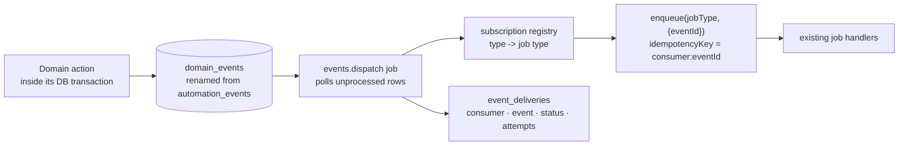

# 15 · Event Catalogue and the Missing Event Bus

---

## A · The headline: there is no event bus

ClientTurn has **twelve append-only tables that look like event logs** and **zero dispatchers**.
Nothing subscribes to anything. Downstream work is coupled directly: a handler finishes and calls
`enqueue()` for the next job by name.

The most striking case is `automation_events`:

| | |
|---|---|
| Emit sites | **16** — `agent/actions.ts`, `agent/orchestrator.ts`, `agent/tools.ts` (×2), `jobs/handlers/automation-advance.ts` (×4), `booking-sync.ts` (×2), `message-inbound.ts` (×3), `qualify.ts`, `shared.ts` (×2) |
| Declared event types | **28** |
| Read sites | **0** |

`emitAutomationEvent()` inserts a row and swallows its own errors. Nothing ever selects from
`automation_events` — not the UI, not a job, not the admin console. It is a write-only table
carrying a well-designed 28-value taxonomy that no consumer has ever used.

That is not a small waste. It means the event names the product already agreed on
(`lead.replied`, `qualification.qualified`, `booking.created`, `campaign.completed`) exist as
strings in a table rather than as a contract anything can subscribe to — so every new consumer
has to be wired by hand into the emitting handler.

## B · The twelve event-ish tables

| Table | Written by | Read by | Real purpose | Verdict |
|---|---|---|---|---|
| `automation_events` | 16 sites | **nothing** | intended domain event log | **the bus, unfinished** |
| `audit_log` | `recordAudit()` + admin modules | admin views, `qualification/queries`, `campaigns/reactivation-queries` | who did what | KEEP — canonical human/system audit |
| `mcp_audit_logs` | `mcp/gateway.ts` | — (no reader found) | MCP call log | MERGE into `audit_log` |
| `copilot_actions` | `copilot/tool-service.ts` | `listCopilotActions` | Copilot call log | MERGE into `audit_log` |
| `agent_activity_events` | `agents/actions.ts`, `agents/scheduler.ts` | `agents/queries.ts` (Activity tab) | narrative agent log | KEEP |
| `conversation_agent_actions` | `agent/*` | agent panel | structured tool-call log | KEEP |
| `outreach_campaign_events` | `outreach/campaigns/lifecycle.ts` | `outreach/campaigns/detail.ts` (Activity tab) | campaign state history | KEEP |
| `message_events` | Twilio webhook, `send-store.ts` | `retention.cleanup` | provider delivery callbacks | KEEP |
| `workspace_stream_events` | SQL triggers (`emit_stream_event`, 3 notify functions) | `use-find-leads-stream.ts` via Realtime | live UI push | KEEP |
| `intent_events` | `sourcing-run.ts`, `research-summary.ts` | `intent/queries.ts`, `prospects/queries.ts` | intent signals | KEEP — a domain entity, not an event |
| `business_learning_events` | — | `business-profile/queries.ts:75` | learning log | **read but never written** |
| `marketing_events` | `/api/marketing/track` | attribution | web analytics | KEEP |
| `usage_events` / `cost_events` | see [12](12-usage-billing-mesh.md) | billing | ledgers | KEEP |
| `workspace_app_events` | `receive_workspace_app_event()` SQL | nothing | connector inbox | needs an admin reader |
| `privacy_notice_events` | compliance flow | admin compliance | notice record | KEEP |

**Three separate audit trails** (`audit_log`, `mcp_audit_logs`, `copilot_actions`) is the single
clearest violation of the "one audit history" principle: an operator investigating "who changed
this lead's owner?" has to look in three places, and which one holds the answer depends on which
door the change came through — which is exactly the information the operator does not have.

## C · The canonical event catalogue

`automation_events` already declares 28 types. The following is that list, extended with the V4
domains it never covered, and marked with what should consume each.

### Prospecting

| Event | Emitted at | Consumers |
|---|---|---|
| `prospect.discovered` | sourcing stage 4 | usage, stream, analytics |
| `prospect.enriched` | stage 6 | cost, analytics |
| `prospect.verified` | stage 7 | usage (`verified_prospect`), analytics |
| `prospect.scored` | stage 10 | stream |
| `prospect.approved` | `approveProspectAction` | campaign eligibility, audit |
| `prospect.promoted` | `promote_reviewed_prospect` | lead onboarding, CRM, analytics, attribution |
| `prospect.suppressed` | `suppressProspect` | **suppression sync**, campaign audience rebuild |
| `search.run_completed` | sourcing run end | notification, usage, learning loop |

### Lead

`lead.created` · `lead.updated` · `lead.assigned` · `lead.stage_changed` · `lead.qualified` ·
`lead.replied` · `lead.opted_out` · `lead.human_takeover` — **all eight already declared**; only
the first four have obvious consumers today (notifications, CRM push, analytics).

### Messaging

`message.scheduled` · `message.sent` · `message.delivered` · `message.failed` ·
`message.bounced` · `message.complained` · `message.replied` — the first five are declared;
bounce and complaint were added to `messages.status` in `0029` and never to the event taxonomy.

### Campaign

`campaign.created` · `campaign.scheduled` · `campaign.started` · `campaign.contact_due` ·
`campaign.completed` are declared for the **warm** engine only. The cold engine has no events at
all — its state history lives in `outreach_campaign_events`, which is a different shape.

### Conversion

`booking.link_sent` · `booking.created` · `booking.cancelled` · `booking.completed` — declared.
`handover.created`, `handover.resolved`, `crm.synced`, `outcome.won`, `outcome.lost` — missing.

### Platform

`integration.connected` · `integration.failed` · `agent.started` · `agent.completed` ·
`usage.recorded` · `entitlement.exceeded` — none declared.

## D · The envelope every event needs

Today `emitAutomationEvent` writes `{ business_id, event_type, entity, payload }`. A usable bus
needs:

```
{
  id            uuid          -- the event's own identity, for dedupe
  version       int           -- schema version of this event type
  business_id   uuid          -- tenancy, always
  type          text          -- 'lead.stage_changed'
  entity_type   text
  entity_id     uuid
  actor_type    text          -- user | system | agent | copilot | mcp | integration
  actor_id      uuid | null
  occurred_at   timestamptz
  payload       jsonb
  correlation_id uuid         -- the user action or job that started the chain
  causation_id   uuid | null  -- the event that directly caused this one
}
```

`correlation_id` and `causation_id` are the pair that makes an event log answerable. Without
them, "why did this message go out?" cannot be traced across a chain of five jobs. Neither exists
today in any of the twelve tables.

## E · Loop prevention

The current design cannot loop, because there are no subscribers. Once a dispatcher exists, three
guards are needed and none is currently present anywhere in the codebase:

1. **Causation depth cap.** Refuse to process an event whose causation chain exceeds N.
2. **Self-emission ban per consumer.** A consumer of `lead.updated` must not emit `lead.updated`.
3. **Idempotent consumption.** `(consumer, event_id)` unique, so a redelivered event is a no-op.
   The job queue already has the machinery for this (`idempotency_key`) — a consumer's job key
   should be `<consumer>:<event_id>`.

## F · Recommendation

The right move is **not** to build a message broker. It is to make the table that already exists
into a real bus with the smallest possible machinery:



This is the **transactional outbox** pattern, and it fits this codebase almost exactly: the
insert happens in the same transaction as the write, and the existing job queue — which already
has SKIP LOCKED claiming, idempotency keys, backoff and dead-lettering — becomes the delivery
mechanism. Roughly one new job handler, one registry map and one table.

**Sequenced as Phase 3** in [21](21-consolidation-migration-plan.md). It is deliberately *after*
the service-layer consolidation, because emitting events from three competing implementations of
`assignLead` would simply triple the bug.

### Immediate, cheap wins that do not need the bus

| Action | Why |
|---|---|
| Add `correlation_id` to `jobs.payload` and thread it through `enqueue()` | Makes "why did this send?" answerable today |
| Merge `mcp_audit_logs` and `copilot_actions` into `audit_log` with an `actor_type` | One audit history, which is a stated principle |
| Either write `business_learning_events` or stop reading it | It is read at `business-profile/queries.ts:75` and never written, so the surface it feeds is permanently empty |
