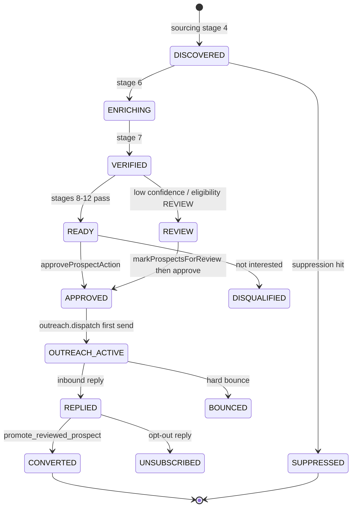
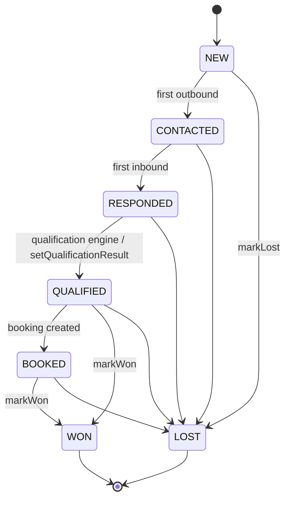
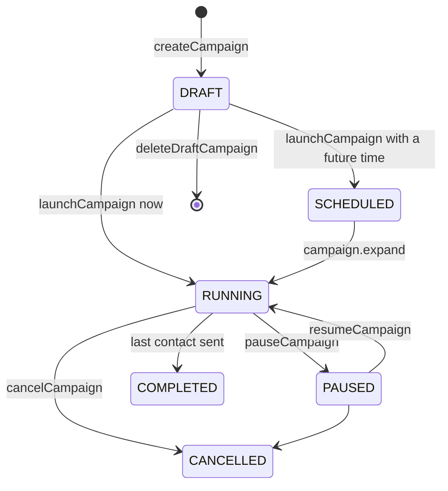
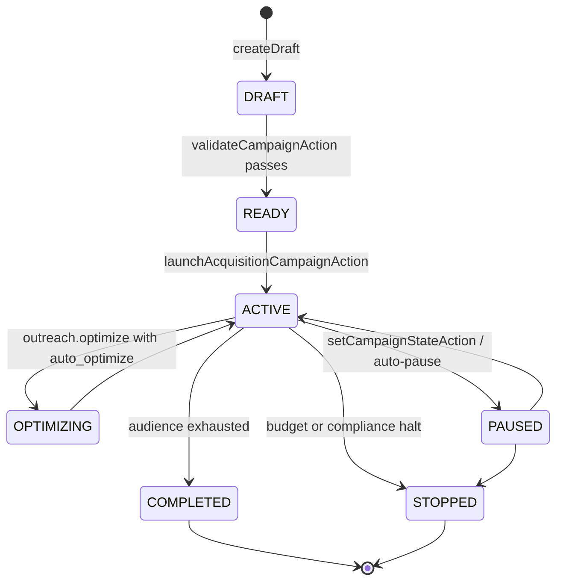
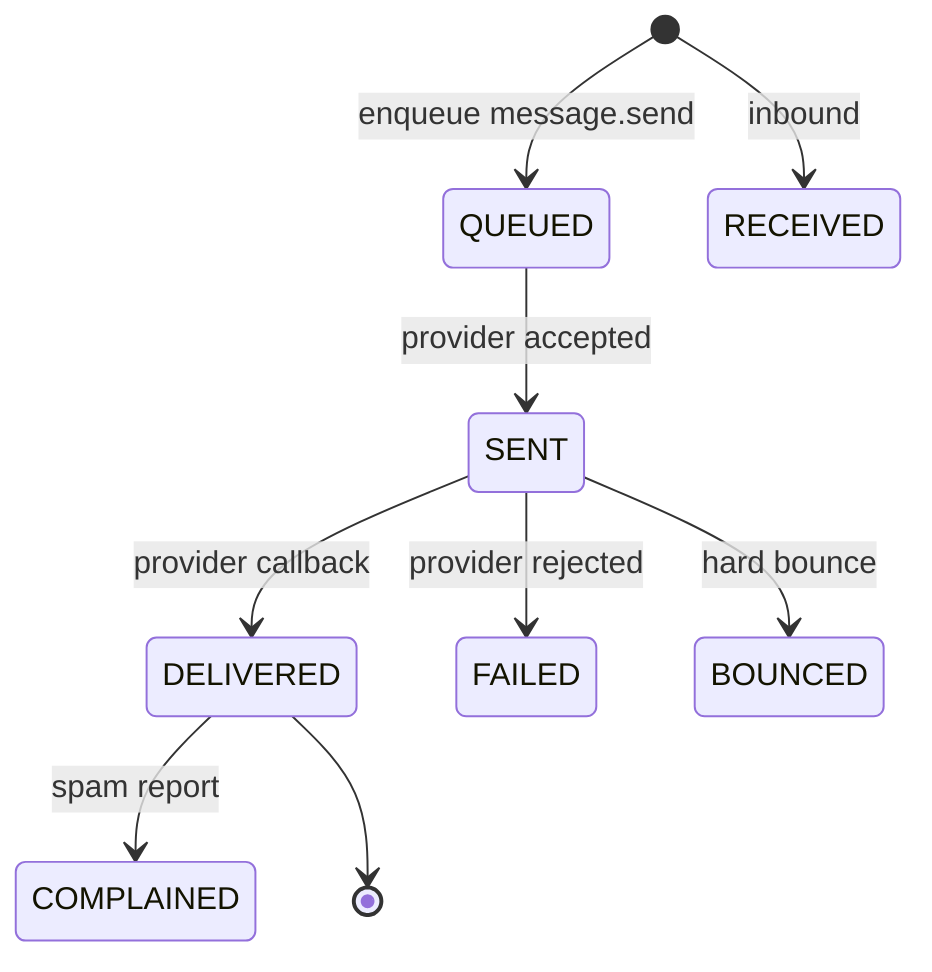
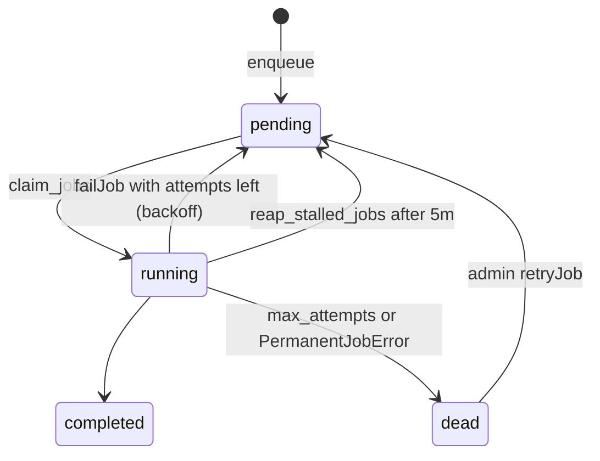
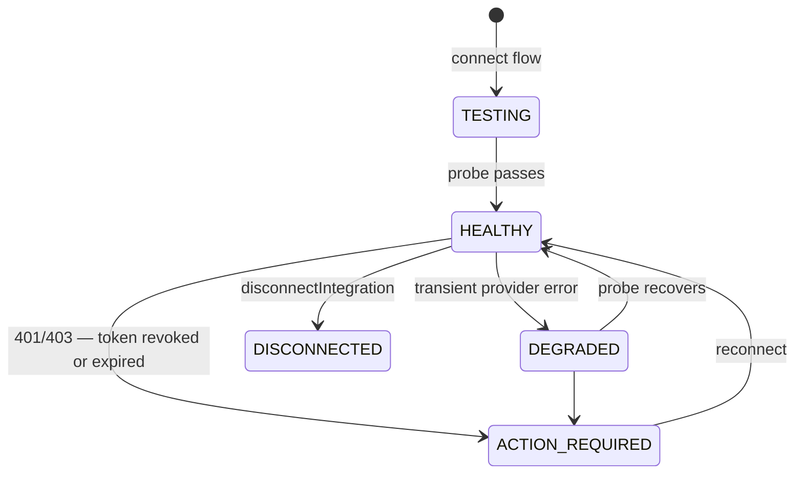

# 16 · State Machines and Impossible States

Every status enum in the schema, drawn as the machine it implies, with the transitions the code
actually performs — and the state combinations the schema permits but the product cannot mean.

---

## 1 · Prospect — `prospects.status`

`DISCOVERED · ENRICHING · VERIFIED · READY · APPROVED · OUTREACH_ACTIVE · REPLIED · CONVERTED ·
DISQUALIFIED · SUPPRESSED · BOUNCED · UNSUBSCRIBED · REVIEW`

**Impossible states the schema allows:**

| # | Combination | Why it is wrong |
|---|---|---|
| S1.1 | `status='CONVERTED'` with `promoted_to_lead_id IS NULL` | CONVERTED *means* promoted. Nothing enforces the pairing |
| S1.2 | `status='SUPPRESSED'` with `outreach_eligibility='ELIGIBLE'` | Two independent columns encoding the same fact |
| S1.3 | `status='REPLIED'` with `replied_at IS NULL` | Promotion depends on `replied_at`, not on `status` |
| S1.4 | `grade` set with `score IS NULL`, or the reverse | Written together by scoring; not constrained |

`promote_reviewed_prospect()` correctly reads `replied_at` rather than `status`, which is the
right choice — but it means the two can disagree with no error.

**Recommendation:** three CHECK constraints, one per row above. Cheap, and they turn a class of
silent inconsistency into an immediate failure.

## 2 · Lead — `leads.status` × `qualification_state`

`status`: `NEW · CONTACTED · RESPONDED · QUALIFIED · BOOKED · WON · LOST`
`qualification_state`: `PENDING · QUALIFIED · NOT_QUALIFIED · REVIEW`

**Two orthogonal state columns, partially synchronised.** `updateLeadStatus` sets
`qualification_state='QUALIFIED'` when status becomes QUALIFIED — but nothing does the reverse, and
`setQualificationResult` can set `qualification_state='NOT_QUALIFIED'` on a lead whose `status`
is `BOOKED`.

**Impossible states the schema allows:**

| # | Combination | Consequence |
|---|---|---|
| S2.1 | `status='WON'` with `won_at IS NULL` | **Reachable today** via MCP `update_lead_status`. Every analytics query filters on `won_at`, so the conversion is invisible |
| S2.2 | `status='WON'` with `automation_active=true` | Follow-up keeps messaging a won customer. The UI action prevents it; MCP does not |
| S2.3 | `status='LOST'` with `needs_attention=true` | `updateLeadStatus` clears it; MCP does not |
| S2.4 | `qualification_state='NOT_QUALIFIED'` with `status='BOOKED'` | No constraint |
| S2.5 | `opted_out=true` with `automation_active=true` | The send guard catches it, so no message goes out — but the lead reads as active in every list |
| S2.6 | `human_takeover=true` with `automation_active=true` | Same |

S2.1–S2.3 are all consequences of the same root cause: **a second implementation of
`updateLeadStatus` that does not maintain the invariants**. Fixing
[18 · D2](18-duplication-bloat-register.md) removes three of the six.

**Recommendation:** make the timestamps generated rather than assigned — a trigger that sets
`won_at = now()` on transition into WON is impossible to forget from a second code path.

## 3 · Warm campaign — `campaigns.status`

`DRAFT · SCHEDULED · RUNNING · PAUSED · COMPLETED · CANCELLED`

Clean. `launched_at`, `paused_at`, `cancelled_at`, `completed_at`, `started_at` are all stamped.

**Gap:** unlike the acquisition engine, there is no explicit transition table — the legal moves
are implicit in which action each component renders. `resumeCampaign` on a `COMPLETED` campaign,
for example, is prevented by the UI rather than by the server. Adopt the
`outreach/campaign-state.ts` pattern here.

There is also no archive concept for warm campaigns, while cold campaigns have an `archived`
boolean. A workspace with two hundred finished reactivation campaigns has no way to put them away.

## 4 · Acquisition campaign — `outreach_campaigns.status`

`DRAFT · READY · ACTIVE · PAUSED · OPTIMIZING · COMPLETED · STOPPED`

**This is the best-instrumented machine in the product.** Every transition writes an
`outreach_campaign_events` row with `from_status`, `to_status`, `actor_type`
(`USER`/`SYSTEM`/`OPTIMIZATION`) and a reason, and `claim_campaign_contact_slot()` only issues a
slot for `ACTIVE` or `OPTIMIZING` — so pausing a campaign stops sends at the database level, not
just in the scheduler.

It is also the only machine in the codebase with an **explicit transition table**:
[`outreach/campaign-state.ts`](../../src/lib/outreach/campaign-state.ts) declares
`TRANSITIONS: Record<Status, Status[]>` with `COMPLETED` and `STOPPED` as empty terminal sets, and
`setCampaignStateAction` validates against it rather than trusting the caller.

Archiving is correctly modelled as a **separate `archived` boolean**, not a status — the module
comment states why: *"A campaign can be archived from any resting state without changing what it
is, and un-archived without implying a state change."* That is the right call and the other
engines should copy it rather than inventing more retirement statuses.

**This file is the pattern the rest of the product should adopt**: an explicit transition table
next to the enum, validated server-side, with the reason recorded on every move.

## 5 · Recipient run — `outreach_recipient_runs.status`

`PENDING · SCHEDULED · ACTIVE · REPLIED · STOPPED · BOUNCED · SUPPRESSED · COMPLETED · FAILED`

Sequence position advances per send; `next_step_due_at` drives the tick. Terminal states are
`REPLIED`, `STOPPED`, `BOUNCED`, `SUPPRESSED`, `COMPLETED`, `FAILED`. Correct.

## 6 · Message — `messages.status`

`QUEUED · SENT · DELIVERED · FAILED · RECEIVED · BOUNCED · COMPLAINED`

**Missing:** there is no `SUPPRESSED` or `BLOCKED` terminal state. When the send guard aborts, the
message row is updated with a stop reason but the status vocabulary has no word for "we decided
not to send this", so a blocked message is indistinguishable from a failed one in
`getChannelUsage`, which counts `SENT|DELIVERED|FAILED` as "sent". That inflates the denominator
of every delivery and reply rate.

## 7 · Agent run and worker agent

`agents.status`: `DRAFT · ACTIVE · PAUSED · STOPPED · NEEDS_ATTENTION · ERROR`
`conversation_agent_runs.status`: `QUEUED · RUNNING · COMPLETED · HANDED_OVER · …`
`agent_queue_items.status`: `PENDING · IN_PROGRESS · DONE · FAILED · BLOCKED · CANCELLED · SKIPPED`

The conversational run machine is complete and includes `HANDED_OVER`, which most designs forget.
`BLOCKED` on queue items carries the policy reason, so a blocked candidate explains itself.

## 8 · Job — `jobs.state`

`pending · running · completed · failed · dead`

**Vocabulary drift:** the state is `dead`; the UI, the audit action and the admin filter all call
it "dead letter" (`DEAD_LETTER: ["dead"]` in `admin/jobs.ts:280`). Harmless but worth aligning.
`failed` appears in the CHECK constraint and is never written — `failJob` writes either `pending`
or `dead`.

## 9 · Integration — `integrations.status`

`HEALTHY · DEGRADED · ACTION_REQUIRED · DISCONNECTED · TESTING`

**Missing:** no `AUTH_EXPIRED` distinct from `ACTION_REQUIRED`, and — more importantly — `probe()`
only implements Twilio and a generic token check. For every other provider, HEALTHY means "we
hold a token that has not obviously expired", not "the integration works". See
[09 · E](09-integration-mesh.md).

## 10 · Booking, subscription, support, affiliate

| Entity | States | Verdict |
|---|---|---|
| `bookings.status` | `scheduled · completed · cancelled · no_show` | Correct — but `updateBookingStatus` is dead, so nothing can leave `scheduled` |
| `subscriptions.status` | `TRIALING · ACTIVE · PAST_DUE · CANCELLED · UNPAID · INCOMPLETE` | Mirrors Stripe. Correct |
| `support_tickets` | via `setTicketStatus` | Correct |
| `affiliates.status` | approve / reject / suspend / reinstate | Correct |
| `webhook_events.status` | `received · processing · processed · failed · ignored` | Correct, with admin replay |
| `automation_definitions.status` | `DRAFT · PUBLISHED · ARCHIVED` | Correct — but the draft/publish UI is orphaned ([13 · §4](13-page-action-button-audit.md)), so DRAFT is now only reachable from onboarding |

## 11 · Casing inconsistency

The schema mixes two conventions with no rule:

- **lower case:** `businesses.status`, `business_members.status`, `bookings.status`,
  `jobs.state`, `webhook_events.status`, `crm_push_records.status`, `imports.status`,
  `ai_prompt_versions.status`, `ai_runs.status`
- **UPPER CASE:** everything V3-leads-and-later and everything V4

This is not cosmetic. It caused the P0 in
[04 · 4.1](04-database-audit.md): `promote_reviewed_prospect()` writes `'new'` into a column whose
constraint requires `'NEW'`, and the mixed convention is exactly why that looked plausible to
whoever wrote it.

**Recommendation:** adopt UPPER for domain states, leave the lower-case platform tables alone, and
document the split — but first fix the promotion routine, and add a test that inserts one row of
every state value into every status column so a casing mismatch fails in CI rather than in
production.
