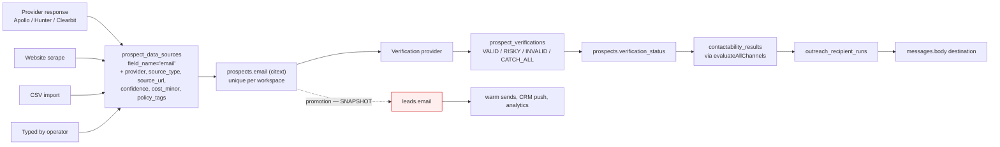

# 17 · Data Lineage

For each value a customer must be able to trust: where it originates, how it is transformed, what
becomes authoritative, and where the chain breaks today.

---

## 1 · Email address



**Traceable end to end on the cold side.** `prospect_data_sources` is a genuinely good provenance
model: every field carries its provider, source type, source URL, confidence, cost and — crucially
— `policy_tags`, so a data-use restriction travels *with the value* into the send decision.

**The chain breaks at promotion.** `promote_reviewed_prospect()` copies `p.email` into
`leads.email` and sets no link back. Because `leads.promoted_from_prospect_id` is never written
([04 · 4.2](04-database-audit.md)), a lead's email address has **no traceable origin at all** —
you cannot answer "where did this come from?" for any promoted lead.

The columns to fix it already exist and are already indexed. It is a four-line change to the SQL
routine.

## 2 · Phone number

`prospects.phone_e164` ← provider or operator → `prospect_verifications` (channel PHONE) →
`contactability_results`.

Warm side: `leads.phone` (as typed) and `leads.phone_normalized` (E.164, written by
`normalisePhone`), plus `leads.telephone` — a **secondary landline that is explicitly never used
as a messaging destination**, documented in a column comment. That distinction is well modelled.

**Break:** `promote_reviewed_prospect()` writes `phone` from `p.phone_e164` and leaves
`phone_normalized` **null**. Duplicate detection reads `phone_normalized`; `sendManualMessage`
falls back to `normalisePhone(lead.phone)`, so messaging still works, but duplicate detection
silently stops seeing promoted leads.

## 3 · Company

```
Google Places / Apollo / registry
  → prospect_companies (dedupe_key unique per workspace, domain unique where present)
  → prospect_data_sources rows per field
  → prospects.company_id
  ✗ promotion drops it entirely
  → leads.company_name  (null forever)
```

`leads` has no `company_id`. The V4 design gives prospects a real company entity with dedupe and
provenance; leads get a free-text name that promotion does not even populate. A promoted lead
therefore has **no company at all**, and the Leads list column for it is always empty for sourced
leads.

**Two options, and the choice is a product decision:**

| Option | Implication |
|---|---|
| Copy `prospect_companies.name` into `leads.company_name` at promotion | Minimal. A snapshot, consistent with the rest of the promotion model |
| Add `leads.company_id` referencing `prospect_companies` | Richer — the Lead drawer could show the sourced company record, its domain and its provenance. But it couples the warm entity to a table named for the cold domain |

Recommendation: do the first now (it is part of the P0 promotion fix), consider the second when
company-level reporting is required.

## 4 · Name and job title

`first_name` / `last_name` / `role_title` on `prospects`, with `role_classification`
(`DECISION_MAKER · INFLUENCER · GATEKEEPER · USER · UNKNOWN`) derived at sourcing stage 9 and
feeding the score.

`leads` has `first_name` / `last_name` and **no role**. So the decision-maker classification —
which cost money to obtain and drove the score — is discarded at promotion. Whether a lead is
talking to the person who can say yes is exactly what a salesperson wants to know.

## 5 · Lead source and attribution

Four independent origin columns exist on `leads`:

| Column | Meaning | Written by |
|---|---|---|
| `source_id` → `lead_sources` | ad platform | `lead_source.poll` |
| `intake_method` | how it arrived (`MANUAL`, `META`, `WEBFORM`, `CLIENTTURN_SOURCING`, `API`, …) | Add Lead wizard, MCP |
| `created_via` | which mechanism (`MANUAL_WIZARD`, `INBOUND`, `IMPORT`, `SOURCING`, `API`, `TEST`) | Add Lead wizard, MCP |
| `intake_detail` | operator free text, with a column comment stating it **never grants permission on its own** | Add Lead wizard |

Plus `source_campaign_id`, `sourcing_run_id`, `agent_id`, `promoted_from_prospect_id` — **all four
null for every sourced lead**, because promotion writes none of them.

Marketing attribution is a separate, working chain: `marketing_sessions` → `marketing_events` →
`affiliate_clicks` → `affiliate_attributions` → `affiliate_referrals` → `affiliate_commissions`.
That one is complete and is exported by `/api/exports/attribution`.

**Finding:** `intake_method` and `created_via` overlap substantially (`IMPORT`/`IMPORT`,
`API`/`API`, `MANUAL`/`MANUAL_WIZARD`, `CLIENTTURN_SOURCING`/`SOURCING`). Two columns, two
vocabularies, one fact. `v4-queries.ts:292` groups analytics by `intake_method`; nothing groups by
`created_via`. **Deprecate `created_via`**, or define precisely what each means and make the
difference visible in the UI.

## 6 · Lead score / prospect grade

```
scoring stage 10 (deterministic, versioned)
  → prospect_scores { score_version, total_score, grade, factor_json, explanation }
  → prospect_score_factors (per-factor breakdown)
  → prospects.score, prospects.grade  (denormalised current values)
  → /app/find-leads/scoring/[prospectId] renders the explanation
  ✗ not carried to leads
```

**Excellent on the cold side.** The arithmetic and the grade bands live in
`prospects/scoring.ts`, the version is stored with every score, and there is a dedicated page that
explains a score against the policy that produced it. This is what "users must be able to trust
where information came from" looks like when it is done properly.

Leads have no score at all — which is defensible (a lead is qualified, not graded) — but the
prospect grade that justified contacting them is not visible on the lead either.

## 7 · Contactability

```
relationship_type + subscriber_type + jurisdiction
  + prospect_data_sources.policy_tags (provider licence)
  + contact_permissions (recorded consent)
  + suppression_entries
  + compliance_policy_versions (the pack)
  → canSend() → PolicyDecision { outcome, reasonCode, policyVersion, requirements }
  → contactability_results (current)  +  compliance_decisions (audit, with evidence snapshot)
```

**Fully traceable — for cold sends only.** A warm send produces no decision record at all, so
"why was this SMS allowed?" is unanswerable. See [11](11-compliance-permission-mesh.md).

Also: a promoted lead gets **no `contact_permissions` row**, so its lawful basis is UNKNOWN from
the moment it becomes a lead — the relationship type that justified the cold contact is not
carried across either.

## 8 · Qualification

```
qualification_questions + qualification_options + qualification_rules   (config)
  → inbound message
  → AI answer_extraction (candidate value + confidence)      [assist only]
  → qualification/engine.ts evaluate()                        [decides]
  → qualification_answers (per question, with the raw text)
  → leads.qualification_state + leads.qualification_reason (jsonb array of rule hits)
```

**Complete and correct.** `qualification_reason` stores the rule trail, so a decision can be
explained. AI supplies a candidate; the deterministic engine decides; low confidence produces
REVIEW. This is exactly what CLAUDE.md resolved-conflict 1 requires.

## 9 · Conversion attribution

```
leads.won_at / booked_at  →  analytics v4-queries, v4-extras
bookings                  →  outreach_campaign_bookings() for campaign attribution
prospects.promoted_to_lead_id → the only prospect→conversion link
```

**Two breaks:**

1. `won_at` can be null on a WON lead (MCP path) — [16 · S2.1](16-state-machines.md). Every
   conversion number silently under-reports.
2. Because promotion never writes `source_campaign_id` or `sourcing_run_id`, a won customer
   cannot be attributed to the campaign or the search run that produced them. The whole point of
   the acquisition product is to answer "which search paid for itself", and that question is
   currently unanswerable.

## 10 · The lineage scorecard

| Value | Origin recorded | Transformations recorded | Authoritative field clear | Survives promotion |
|---|---|---|---|---|
| Prospect email | ✅ | ✅ | ✅ | ⚠️ copied, unlinked |
| Prospect phone | ✅ | ✅ | ✅ | ⚠️ copied, not normalised |
| Company | ✅ | ✅ | ✅ | ❌ lost |
| Name | ✅ | ✅ | ✅ | ✅ |
| Job title / role class | ✅ | ✅ | ✅ | ❌ lost |
| Lead source | ⚠️ four columns | n/a | ⚠️ | ❌ lost |
| Score / grade | ✅ versioned, explained | ✅ | ✅ | ❌ lost |
| Contactability | ✅ cold only | ✅ cold only | ✅ | ❌ lost |
| Qualification | ✅ | ✅ | ✅ | n/a |
| Conversion | ⚠️ | ⚠️ | ⚠️ | n/a |

**Every red cell in the right-hand column is the same bug.** Fixing
`promote_reviewed_prospect()` — the P0 in [04](04-database-audit.md) — closes seven of them at
once. That is why it is the first item in the remediation plan.
