# 21 · Consolidation and Migration Plan

Twelve phases. Each has a scope, a migration, the code that changes, what could break, how success
is proved, and how to roll back. **Nothing here has been executed** — this audit was discovery
only.

Ordering principle: **correctness before consolidation, and consolidation before deletion.** In
particular, the event bus comes *after* the service-layer work, because emitting events from
three competing implementations of `assignLead` would triple the bug rather than fix it.

---

## Phase 0 · Baseline

**Goal:** be able to prove that later phases changed nothing they should not.

- Snapshot the production schema (`pg_dump --schema-only`) and row counts per table.
- Record current values for every metric the customer sees: reply rate, delivery rate,
  conversion rate, sourcing used, communication used — per workspace. **Several of these are about
  to change** (Phase 5), and the before/after must be explainable.
- Extend the test suite with characterisation tests for the behaviour being preserved:
  `updateLeadStatus` side effects, `assignLead` side effects, warm send guard outcomes,
  `checkSuppression` results.
- Add the two missing mechanical tests now, because they catch regressions in every later phase:
  1. every internal `/app/settings?…` link resolves to a real section id;
  2. every mutating server action calls `requireRole` or `requireWorkspace`.

**Rollback:** n/a.

---

## Phase 1 · Fix promotion — P0-1, P0-2

**Existing.** `promote_reviewed_prospect()` inserts `status='new'` against an uppercase-only CHECK
constraint, and writes none of the lineage columns `0038` added.

**Problem.** Prospect → Lead promotion fails on every call, in both the manual and the automatic
path, and the error is reported as an unrelated business rule.

**Canonical replacement.** A corrected routine that writes `'NEW'`, `phone_normalized`,
`promoted_from_prospect_id`, `promoted_at`, `company_name` (joined from `prospect_companies`),
`source_campaign_id`, `sourcing_run_id`, `intake_method='CLIENTTURN_SOURCING'`,
`created_via='SOURCING'`, `relationship_type`, `subscriber_type`, and inserts a
`contact_permissions` row for the new lead.

**Migration.** `create or replace function` — no data migration. Optionally backfill
`promoted_from_prospect_id` on existing leads from `prospects.promoted_to_lead_id` (there should be
none, since promotion has never succeeded — confirm that against production before assuming it).

**Code changes.** `supabase/migrations/00XX_fix_promotion.sql`. Also stop
`find-leads/actions.ts:914` and `outreach/campaigns/replies.ts:249` from swallowing the error into
a misleading message — surface the database error code.

**Compatibility.** Nothing depends on promotion failing.

**Tests.** A real-database test that promotes a replied prospect and asserts: lead exists with
`status='NEW'`; `promoted_from_prospect_id` set; conversation and every message re-stamped with
`lead_id`; prospect `CONVERTED`; a second call returns the same lead id; a suppressed prospect
raises; a prospect with `replied_at IS NULL` raises.

**Rollback.** Restore the previous function body. Leads created in the interim are valid.

---

## Phase 2 · One suppression list — P0-3

**Existing.** `contact_suppressions` (warm) and `suppression_entries` (cold), never joined.

**Canonical replacement.** `suppression_entries`.

**Migration.**
1. Backfill: insert every `contact_suppressions` row into `suppression_entries`, routing
   `normalized_contact` to `email` or `phone_e164` by shape, mapping `channel` (`all` → `ALL`).
2. Rename `contact_suppressions` to `contact_suppressions_legacy`; create a view named
   `contact_suppressions` over `suppression_entries` with the old column names so existing readers
   keep working.
3. Repoint the three warm readers (`jobs/handlers/shared.ts:280`, `leads/actions.ts:400`,
   `campaigns/queries.ts`) and the four warm writers at `checkSuppression()` / `suppress()`.
4. Drop the view and the legacy table.

**Compatibility.** The view keeps steps 1–3 non-breaking. Step 4 is the only irreversible one and
comes a release later.

**Tests.** SMS `STOP` blocks a subsequent cold email to the same person. A cold-email opt-out
blocks a subsequent warm SMS. A platform-scope row (`business_id is null`) blocks both. An expired
row blocks neither.

**Rollback.** Steps 1–3 reverse by repointing readers; the legacy table still holds its rows until
step 4.

---

## Phase 3 · One implementation per action — P0-4

**Existing.** `assignLead` ×3, `updateLeadStatus` ×2, `setNeedsAttention` ×2.

**Canonical replacement.** `lib/leads/actions.ts`, with an added parameter:

```ts
type Actor =
  | { type: "user"; userId: string }
  | { type: "copilot"; userId: string; sessionId: string }
  | { type: "mcp"; userId: string; clientId: string }
  | { type: "agent"; agentId: string }
  | { type: "system" };
```

`requireRole()` stays for `type: "user"`; the other actors arrive pre-authorised by their gateway
and pass their resolved role. `recordAudit()` already accepts `actorType`.

**Code changes.** `copilot/tool-service.ts` `assignLead`/`markAttention` and `mcp/handlers.ts`
`assign_lead`/`update_lead_status`/`create_lead` become adapters. Delete the direct
`db.from("leads").update(...)` calls. Correct the false claim in the `mcp/gateway.ts` header once
it is true.

**Data repair migration.** For leads whose `status` implies a timestamp that is null, set it from
`updated_at`; set `automation_active=false` for WON and LOST; clear `needs_attention` for LOST.

**Belt and braces.** Add a trigger that stamps `won_at`/`booked_at`/`qualified_at`/`lost_at` on
transition. A second code path cannot forget a trigger.

**Compatibility.** MCP and Copilot responses keep their shapes. Behaviour changes — more side
effects now happen — which is the point.

**Tests.** A parity suite: perform each action through all four doors and assert the same rows
change, the same events fire and the same audit rows appear. This suite is the acceptance
criterion for the whole audit.

**Rollback.** Adapters revert to inline writes; the data repair is harmless either way.

---

## Phase 4 · One contactability gate — P1-2

Call `policy/service.evaluate()` from `jobs/send-core` with `campaignType: "WARM"` (or
`"REACTIVATION"` for `campaign.send`), so every send writes a `compliance_decisions` row.

**Compatibility risk — the highest in the plan.** The warm rule set could block sends that
currently go out (a lead with no `contact_permissions` row evaluates to UNKNOWN). Mitigate:

1. Run in **shadow mode** first — evaluate, record the decision, ignore the outcome, and report
   the delta between what policy would have done and what the current guard did.
2. Only after the delta is understood and the WARM pack tuned, make the outcome binding.
3. Phase 1 gives promoted leads a `contact_permissions` row; do a one-off backfill for existing
   leads from `intake_method`/`relationship_type`.

**Tests.** Shadow-mode delta is zero for leads with a recorded permission. Quiet hours reschedule
rather than drop. An opted-out lead is blocked identically by both engines.

**Rollback.** Shadow mode is inert by construction; the binding switch is one flag.

---

## Phase 5 · One metric definition — P0-5

SQL functions for `reply_rate`, `delivery_rate`, `qualification_rate`, `booking_rate`,
`conversion_rate`, taking `(business_id, from, to)` and optional campaign/channel filters. Numerator
and denominator per the definition already published in `analytics/v4-metrics.METRICS`: **distinct
recipients**, denominator **delivered** not sent, `null` on an empty denominator.

Repoint: `analytics/v4-queries`, `analytics/v4-extras`, `dashboard/queries`,
`campaigns/reactivation-types`, `leads/queries`, `billing/usage-service`,
`copilot/tool-service.getAnalytics`, `/api/analytics/export`. Delete `analytics/queries.ts` after
moving `getAttributionRows` out.

**Do this together with the `.limit(50000)` fix** — the same queries are involved, and aggregating
in SQL removes both the inconsistency and the silent truncation.

**Compatibility.** **Customer-visible numbers will move.** Requires a release note explaining the
correction. Keep the old figures available for one release for comparison.

**Tests.** Golden-dataset tests: a fixed set of messages and leads, with every metric asserted to
an exact value, computed once and asserted from every surface.

---

## Phase 6 · One acquisition campaign UI — P1-9

Delete `campaign-builder.tsx`, `campaign-controls.tsx` and the three superseded actions in
`outreach/actions.ts` (keep `createSenderIdentityAction`). `campaigns-view.tsx` links to the
wizard. No data migration.

**Tests.** Every campaign state transition still reachable from the campaign detail page.

---

## Phase 7 · Usage and billing — P0-6, P1-6, P1-7

1. Record `usage_events` with metric `email_sent` at cold dispatch, and call
   `assertCapacity("email_sent")` before the campaign slot claim.
2. Rewrite `getV4Usage` as a SQL `sum()`.
3. Make the Billing page read `getV4Usage` rather than counting `prospects` and `messages` rows,
   so the displayed meter and the enforced meter are the same number.
4. Register `variant_generation` in the prompt registry and route it through `runTask()`.
5. Move the V3 plan booleans into `plan_entitlements`.

**Compatibility.** Step 3 changes the displayed sourcing usage — likely **downward**, since it
stops counting non-READY prospects. Step 1 introduces enforcement where there was none: some
workspaces may hit a limit they have been silently exceeding. **Check current usage against plan
limits before enabling enforcement**, and grant `business_entitlement_grants` where a customer has
been sold something the meter would now block.

**Tests.** Send N cold emails, assert N `usage_events` rows and that N+1 past the hard limit is
refused without overage and permitted with it.

---

## Phase 8 · Event bus — P2-1, P2-2, P2-3

Rename `automation_events` to `domain_events`, add the envelope from
[15 · D](15-event-catalogue.md), add an `event_deliveries` table, add one `events.dispatch` job
handler and a `type → job type` subscription registry. Thread `correlation_id` through
`enqueue()`. Merge `mcp_audit_logs` and `copilot_actions` into `audit_log` behind `actor_type`.

Migrate one consumer first — the notification on `lead.replied` is the smallest useful one — and
only then move others.

**Tests.** Redelivering an event is a no-op. A causation chain deeper than N is refused. A
consumer that throws does not lose the event.

---

## Phase 9 · Inbox — P1-4, P1-5

Widen `sendManualMessage` to accept `channel: "email"` and a prospect subject; widen
`canReplyOn`. Then **decide** on Messenger/Instagram/LinkedIn: build ingestion, or remove the tabs
and the eight dead columns. Do not ship the current state.

---

## Phase 10 · MCP and Copilot — P1-3

Build the approval queue reader: an admin or workspace surface listing `mcp_approvals`, with
approve/reject actions that execute the parked tool through the canonical action from Phase 3.
Implement or remove Copilot's `createSearchSession` and `startSourcingRun`. Add rate limiting to
`/api/mcp`.

---

## Phase 11 · Integrations — P1-1

Implement the Meta Lead Ads adapter (OAuth + webhook + poller), or remove Meta from the catalogue,
the onboarding step, the Dashboard health strip and the agent source list. **Do one or the other**
— the current state promises a connection the product cannot make.

Derive the Connections "Connect" affordance from adapter registration rather than the catalogue,
so Salesforce, Calendly and Google Calendar stop offering a button that lands on a JSON error.

---

## Phase 12 · Deletion

Only now, and only in the order in [20 · §7](20-dead-code-register.md). Everything marked
DEPRECATE FIRST gets one release with a dated comment before removal.

---

## Sequencing summary

```mermaid
gantt
  dateFormat X
  axisFormat %s
  section Correctness
  P0 Baseline + tests        :0, 1
  P1 Fix promotion           :1, 2
  P2 One suppression list    :2, 4
  P3 One action per concept  :3, 6
  section Consistency
  P4 One contactability gate :6, 9
  P5 One metric definition   :7, 10
  P6 One campaign UI         :9, 10
  P7 Usage and billing       :10, 12
  section Architecture
  P8 Event bus               :12, 15
  P9 Inbox                   :13, 16
  P10 MCP and Copilot        :15, 17
  P11 Integrations           :16, 18
  section Cleanup
  P12 Deletion               :18, 19
```



Phases 1–3 are the ones that change whether the product works. Everything after 3 is worth doing
and none of it is urgent by comparison.
