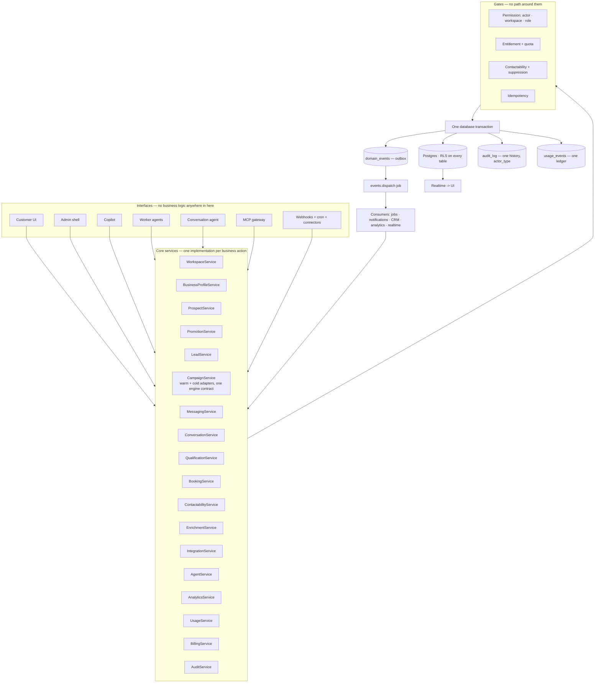

# 22 · Final Target Architecture

What ClientTurn should be when the plan in [21](21-consolidation-migration-plan.md) is complete.
This is deliberately close to what exists — the good abstractions stay, the competing
implementations collapse into them.

---

## 1 · The one diagram



## 2 · The eleven principles, and how each is met

| Principle | Target state | Change from today |
|---|---|---|
| **One factual entity** | `prospects` and `leads` remain separate lifecycles, linked by `promoted_from_prospect_id`, with the promotion snapshot complete | Phase 1 |
| **One business action** | `lib/<domain>/actions.ts` is the only implementation; every interface passes an `Actor` | Phase 3 |
| **Multiple interfaces** | UI, Copilot, agents, MCP and webhooks are adapters | Phase 3, 10 |
| **One event, many consumers** | `domain_events` outbox drained by the existing job queue | Phase 8 |
| **One usage ledger** | `usage_events`; `usage_counters` derived; `cost_events` stays separate as *provider cost* | Phase 7 |
| **One permission system** | `business_members.role` → `requireRole` / RLS / MCP live-role, already true | already met |
| **One audit history** | `audit_log` with `actor_type` | Phase 8 |
| **One conversation model** | `conversations` + `messages`, cross-channel, lead and/or prospect | **already met — do not touch** |
| **One campaign engine** | Two engines behind one contract (see §3) | Phase 6, partially |
| **One contactability engine** | `policy/service.evaluate()` on every outbound path | Phase 2, 4 |
| **One integration framework** | `integrations/oauth.ts` + adapter registries | **already met** |

## 3 · Where the audit deliberately does **not** consolidate

Redundancy and similarity are not the same thing. These stay separate, with reasons.

| Kept separate | Why |
|---|---|
| **`campaigns` (warm bulk) and `outreach_campaigns` (cold sequenced)** | Different audience source (existing leads vs approved prospects), different lawful basis, different budget model (send-rate vs per-contact provider cost), different sender model (carrier number vs warmed mailbox identity), different optimisation (none vs A/B experiments). Merging them would produce one table with two disjoint halves of nullable columns. **What should be shared is the *contract*** — enrol → schedule → guard → send → classify reply → stop — expressed as a `CampaignEngine` interface with two implementations |
| **Follow-Up as a lead lifecycle automation, not a campaign** | It has no audience; it is per-lead, triggered by lead state. Making it a campaign type would require inventing an audience of one |
| **Reactivation as a campaign type, not a domain** | Already correct — `0022` adds columns to `campaigns` and creates no new tables |
| **`prospects` and `leads`** | Different relationship to the business, different lawful basis, different lifecycle. The `leads` copy is a deliberate immutable snapshot |
| **Conversation agent and worker agents** | One answers a message within a bounded turn; the other runs on a schedule and orchestrates engines. Rename, do not merge |
| **`usage_events` and `cost_events`** | Customer usage and provider cost are different facts with different owners (customer vs platform) and different visibility (`/admin/economics` is admin-only by design) |
| **`contactability_results` and `compliance_decisions`** | Current state vs immutable audit trail. The classic and correct split |
| **Affiliate tenancy** | Partners are not workspace members. Separate auth, separate RLS predicates, separate portal. Correct |
| **Two dedupe rules** (`prospects/dedupe.ts`, `leads/add-lead/duplicate-check.ts`) | Different inputs and different tolerance for a false positive |

## 4 · The `Actor` type — the single most important new abstraction

```ts
export type Actor =
  | { type: "user";        userId: string; role: Role }
  | { type: "copilot";     userId: string; role: Role; sessionId: string }
  | { type: "mcp";         userId: string; role: Role; clientId: string }
  | { type: "agent";       agentId: string; businessId: string }
  | { type: "integration"; provider: string }
  | { type: "system";      reason: string };
```

Every core service takes `(input, actor)`. It buys four things at once:

1. **One implementation per action** — the reason the three `assignLead`s exist is that each door
   resolved its own identity, so each wrote its own function.
2. **One audit history** — `actor_type` is already a column on `audit_log`.
3. **Correct permission checks** — the gateway authorises, the service enforces.
4. **Answerable questions** — "who changed this?" has one place to look.

## 5 · Target answers to the fifty questions

The audit is complete when the documentation answers these. It does:

| Question | Where |
|---|---|
| Where does this data originate? | [17](17-data-lineage.md) |
| Which table owns it? | [03](03-canonical-data-model.md), [04](04-database-audit.md) |
| Which pages display it? | [01](01-route-page-inventory.md) |
| Which actions mutate it? | [13](13-page-action-button-audit.md) |
| Which agent / Copilot / MCP can mutate it? | [05 · B](05-global-system-mesh.md), [10](10-ai-copilot-mcp-mesh.md) |
| Which integrations consume or create it? | [09](09-integration-mesh.md) |
| What events does it generate? | [15](15-event-catalogue.md) |
| What usage does it consume? | [12](12-usage-billing-mesh.md) |
| What permissions protect it? | [11 · Part 2](11-compliance-permission-mesh.md) |
| What compliance gate applies? | [11 · Part 1](11-compliance-permission-mesh.md) |
| What analytics depend on it? | [18 · D3](18-duplication-bloat-register.md) |
| What happens if it fails? | [08 · D](08-agent-automation-mesh.md), [16](16-state-machines.md) |
| What happens if it happens twice? | [13 · §3](13-page-action-button-audit.md) |
| Why does this entity / page / table exist? | §6 and §7 below |

## 6 · Every page has a purpose

| Area | Page / tab | Purpose | Canonical entity | Primary actions | Necessary? | Recommendation |
|---|---|---|---|---|---|---|
| Dashboard | `/app` | One screen answering "is this working, and what needs me" | none — aggregate | navigate | yes | **KEEP + FIX** — use the metric registry |
| Agents | `/app/agents` | Configure and watch background workers | `agents` | save, control | yes | KEEP |
| Agents | `/app/agents/[id]` ×7 tabs | Per-agent run history, queue, sources, activity | `agent_runs`, `agent_queue_items` | control | yes | KEEP |
| Agents | `/app/agents/new` | Create an agent | `agents` | saveAgent | yes | **SIMPLIFY** — a form, not a 4-step wizard |
| Inbox | `/app/inbox` | Every conversation in one place | `conversations` | read, archive, reply, agent handoff | yes | **KEEP + FIX** — email reply, prospect reply, and either build or remove the three social tabs |
| Leads | `/app/leads` | The warm pipeline | `leads` | 12 actions | yes | KEEP |
| Leads | `/app/leads/import` | Bulk warm intake with a lawful-basis decision | `lead_imports` | createImport, commitImport | yes | **KEEP + FIX** — per-row classification |
| Find Leads | `?view=discover` | Conversational search planning | `search_sessions` | 8 actions | yes | KEEP |
| Find Leads | `?view=prospects` | Review queue before contact | `prospects` | 9 actions | yes | KEEP |
| Find Leads | `?view=intent` | Intent categories and monitors | `intent_*` | 4 actions | yes | KEEP |
| Find Leads | `?view=campaigns` | Acquisition campaigns | `outreach_campaigns` | wizard + detail | yes | **MERGE** — remove the second builder |
| Find Leads | `/search/[id]`, `/runs/[id]`, `/scoring/[id]` | Session, run progress, score explanation | — | control | yes | KEEP — the scoring page is a model of explainability |
| Find Leads | `/campaigns/new`, `/campaigns/[id]` | Wizard and detail | `outreach_campaigns` | 13 actions | yes | KEEP |
| Follow-Up | `?view=follow-up` ×4 tabs | The per-lead sequence | `automation_*` | 6 actions | yes | KEEP |
| Follow-Up | `?view=qualification` | Question and rule config | `qualification_*` | publish | yes | KEEP |
| Reactivation | `/app/reactivation` | Warm bulk campaigns | `campaigns` | 7 actions | yes | KEEP |
| Reactivation | `/new` | 3-step wizard | `campaigns` | createCampaign | yes | **KEEP + FIX** — server draft |
| Analytics | `/app/analytics` ×4 views | The numbers | none — aggregate | export | yes | **KEEP + FIX** — one metric definition, SQL aggregation |
| Settings | 5 sections | Configuration | many | 40 actions | yes | KEEP |
| Help / Support | `/app/help`, `/app/support` | Articles and tickets | `support_*` | 8 actions | yes | KEEP |
| Admin | 8 destinations | Platform operations | many | 40 actions | yes | KEEP — good operator toolkit |
| Affiliates | 8 destinations | Partner portal | `affiliate_*` | 20 actions | yes | KEEP |
| Marketing | 14 pages | Acquisition | none | contact sales | yes | KEEP |
| Settings | `/settings/{billing,connections,team,workspace}` | Legacy link redirects | — | — | yes | KEEP |
| Dev | `/dev/*` | Component harnesses, 404 in production | — | — | yes | KEEP |

**No page is recommended for deletion.** Every route has a purpose. The failures are in wiring,
not in information architecture — which is a genuinely good result for a product this size.

## 7 · Every entity has a purpose

Abbreviated; the full 174-row register is [04 · §2](04-database-audit.md).

| Entity | Purpose | Owner domain | Created by | Read by | Mutated by | Events | Necessary? |
|---|---|---|---|---|---|---|---|
| `businesses` | tenant | Identity | signup | everything | settings | workspace.* | yes |
| `leads` | warm conversion record | Lead | intake, promotion | leads, inbox, analytics, CRM | LeadService | lead.* | yes |
| `prospects` | pre-relationship candidate | Prospecting | sourcing, wizard, import | find-leads, outreach | ProspectService | prospect.* | yes |
| `prospect_companies` | deduped company | Prospecting | sourcing | find-leads | ProspectService | — | yes |
| `prospect_data_sources` | field-level provenance | Governance | every provider write | scoring, policy, lineage | append-only | — | **yes — best table in the schema** |
| `conversations` / `messages` | the one thread model | Communication | ingest, dispatch, manual | inbox, leads, prospects, analytics | MessagingService | message.* | yes |
| `campaigns` / `campaign_contacts` | warm bulk | Outreach | reactivation wizard | reactivation | CampaignService | campaign.* | yes |
| `outreach_campaigns` + 8 tables | cold sequenced | Outreach | wizard | find-leads | CampaignService | campaign.* | yes |
| `automation_*` | per-lead follow-up | Outreach | follow-up editor | follow-up | FollowUpService | automation.* | yes |
| `qualification_*` | deterministic qualification | Sales | editor | engine | QualificationService | qualification.* | yes |
| `contact_permissions` / `contactability_results` / `compliance_decisions` / `suppression_entries` | the compliance record | Governance | policy service | policy service, UI | ContactabilityService | — | yes |
| `usage_events` | the one ledger | Billing | every metered action | billing, budget, admin | append-only | usage.recorded | yes |
| `jobs` | background work | Platform | enqueue | worker, admin | queue | — | yes |
| `audit_log` | the one history | Governance | every action | admin, drawers | append-only | — | yes |
| `domain_events` (from `automation_events`) | the outbox | Platform | every action | dispatcher | append-only | — | **yes — currently write-only** |
| `usage_reservations`, `outreach_runs`, `icp_segments`, `business_playbooks`, `lead_import_mappings`, `ai_prompt_versions`, `mcp_scopes`, `external_entity_links`, `sync_conflicts`, `sync_runs` | — | — | nothing | nothing | nothing | — | **review — [20 · §4](20-dead-code-register.md)** |

## 8 · Every action has a backend

The full matrix is [13](13-page-action-button-audit.md). After Phase 3 every row reads:

| UI action | Tool / action | Service | DB mutation | Event | Audit | Usage | Status |
|---|---|---|---|---|---|---|---|
| any | one canonical action | one core service | one transaction | one `domain_events` row | one `audit_log` row with `actor_type` | one `usage_events` row where metered | WORKING |

Today, 27 rows have no UI action, 8 have more than one action for the same concept, and 2 have an
action whose service call fails. That gap is the work.
